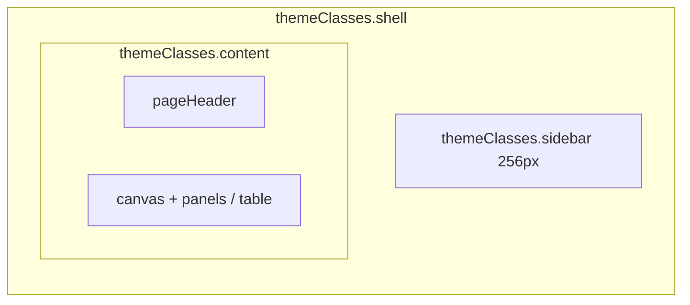
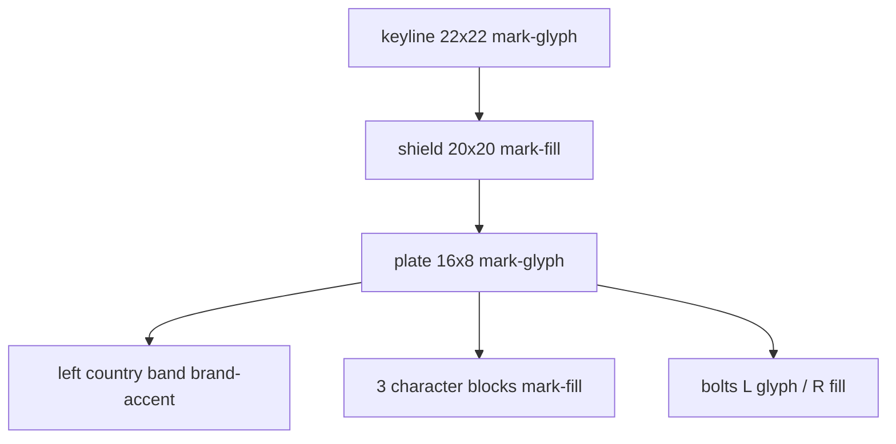
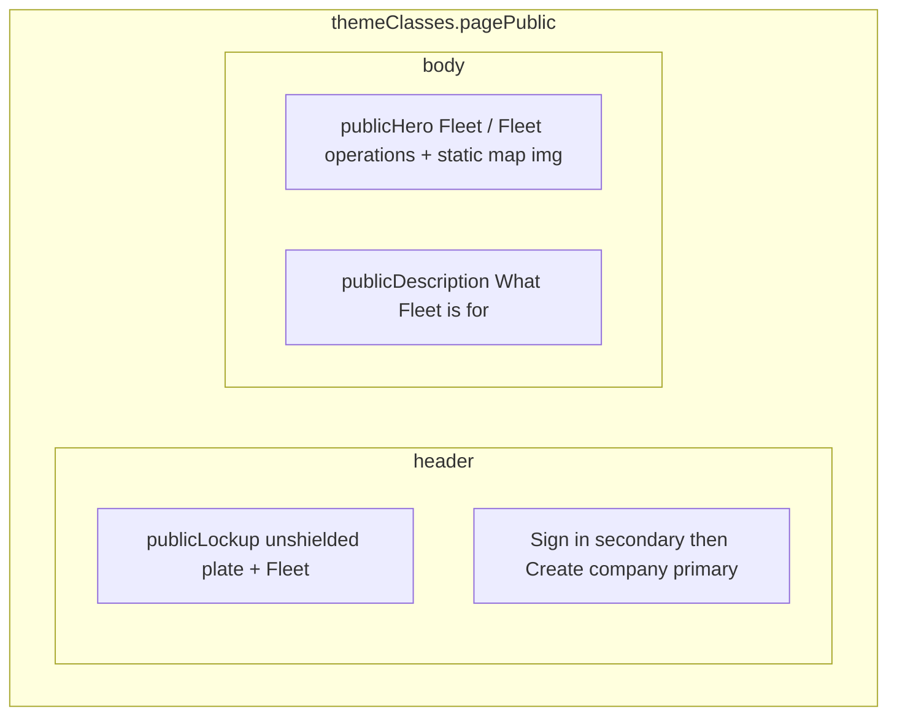
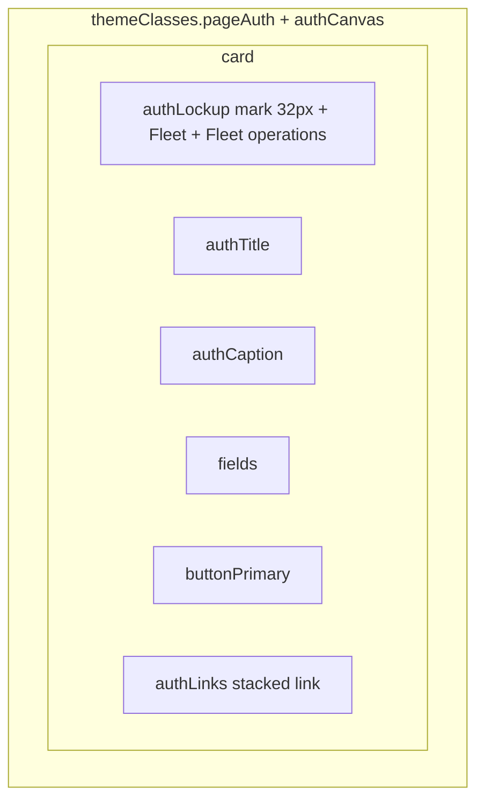

# Shared patterns — enterprise operations console

Reuse on every in-scope screen. Tokens: [semantic.json](../tokens/semantic.json). Classes: [tailwind.theme.ts](../tailwind.theme.ts). **Never put hex in class lists.**

Visual north star: calm B2B ops (Workday / ServiceNow / Linear ops) — navy/slate, dense type, hairline structure, one raised plane on a sunken canvas. Not a marketing site. Not consumer fintech neon.

Product name is **Fleet** (sentence case). Personality is disciplined, operational, trustworthy — lockup + mark + type + navy, not a fantasy name and not shouting `FLEET`.

## Density

| Surface | Density | Padding | Type |
| --- | --- | --- | --- |
| Web Owner/Admin | Compact | `contentPadCompact` (`px-content-gutter-compact py-3`) | Page title `pageTitle`; body `text-label` in tables |
| Mobile Owner/Admin | Comfortable | `contentPadComfortable` | Page title `pageTitleMobile`; list `listRow` |
| Web driver | Compact | `contentPadCompact`; modest column (not Owner full-bleed tables) | Minimal chrome — **no** Owner sidebar |
| Mobile driver | Comfortable | Same as mobile Owner padding | Minimal chrome — **no** Owner tab bar |

## Authenticated chrome — web (Owner/Admin)

Full-bleed canvas. **Do not** max-width the main column at 960px. Tables and KPI rows use the remaining viewport after the sidebar.



| Region | Spec |
| --- | --- |
| Sidebar | `w-sidebar` (256px) `bg-sidebar` with 2px top `border-t-brand-bar border-t-brand-accent`. Optional collapse to `w-sidebar-collapsed` (64px) — mark + tooltip name; honor reduce-motion (instant width). |
| Lockup | `sidebarLockup` height `h-app-bar` (56px). Same product lockup as auth: `brandMark` 24×24 + `sidebarProduct` “Fleet” (`text-title font-semibold tracking-tight`). Meta line `sidebarMeta` is **role** only: “Owner” or “Admin”. Not a second product name, not an unlabeled square. Collapsed: mark only, tooltip “Fleet”. |
| Nav | Items: Home, Drivers, Vehicles, Security. Owner also: Admins (after Vehicles). Driver never sees this sidebar. **Do not** style nav with `link` / underline. |
| Nav item | Height `min-h-hit`, `navItem`. **US-31:** each item is **icon + label** (not icon-only when expanded). Icon `navIcon` 20px outline, `currentColor`, `aria-hidden`. Metaphors: [nav-icons.md](nav-icons.md). Hover `navItemHover` must be obvious (`bg-sidebar-hover` + `text-nav-fg-selected`; pressed on RN). Selected `navItemSelected` (left 2px `border-brand` + selected fill + `font-semibold`). Focus-visible `navItemFocus` (`shadow-ring`). Selected is **not** color-only: selected fill + font-semibold + current page title match. Collapsed 64px: icon only + tooltip/accessible name. |
| Nav urgency (US-28) | **Vehicles item only** (Owner/Admin). Fleet-wide worst-wins over non-null **`insurance_on`, `inspection_on`, `road_tax_on`** only (not `registration_on`), UTC `daysUntil` (A20, A22). **Red** if any section `daysUntil < 7` (0–6 or overdue). **Orange** if no red and any section `daysUntil = 7`. **None** otherwise. Does **not** change list/detail 30-day badges (A1). Not on Home/Drivers/Admins/Security. Not on Driver chrome. Company-scoped only. Icon inherits `text-nav-urgency-fg` with the fill — no extra urgency badge on the glyph. |
| Content canvas | `content` `bg-canvas`. Gutter `contentPadCompact`. No card-on-card gray soup — canvas is sunken; **one** raised plane per region (KPI row, table wrap, form panel). |
| Page header | `pageHeader` min 56px. Left: `pageTitle` + optional `pageSubtitle`. Right: `pageHeaderActions` — secondary then primary. Actions stay in the header, not a floating FAB. |
| Toolbar | On list pages only, under the header: `toolbar` height 44px. First slice: **no search** (not in BA). May hold count caption (`caption` + tabular-nums) and nothing else. Do not invent filters. |

**Mobile Owner/Admin chrome**

| Region | Spec |
| --- | --- |
| App bar | Safe-area top + `appBarMobile` (56px content). Leading: `brandMark` 24px + `appBarProduct` “Fleet”. Screen title `pageTitleMobile` after the lockup, or replace the wordmark with the screen title on inner pages (mark always stays). Trailing primary as `buttonIcon` or text `buttonPrimary` if space. |
| Tabs | Safe-area bottom + `tabBarMobile`. Owner/Admin: Home, Drivers, Vehicles, More. More → Security (TOTP); Owner also Admins from More or Home. Tab control: `tabItem` / selected `tabItemSelected` (`text-brand font-semibold` + 2px top `border-brand`) — not color-only. Hit `min-h-hit`. Do not use `link` underline on tabs. **US-32:** each tab is **icon above label** (`gap-0.5`). Same metaphors as web for Home/Drivers/Vehicles; More = horizontal dots. Icon `navIcon` 20px, tint = label color, decorative (`aria-hidden` / not exposed). Spec: [nav-icons.md](nav-icons.md). |
| Tab urgency (US-28) | Same rules and tokens as web Vehicles nav. Apply only to the **Vehicles** tab. Other tabs never take urgency fill. Density stays comfortable (`tabBarMobile` + `min-h-hit`). Vehicles tab icon uses `nav-urgency-fg` with urgency fill — no second badge. |
| Content | Full width, `contentPadComfortable`, keyboard avoiding. |

### Driver shell (web + mobile) — E7 retired

Drivers may complete **invite accept / set password**, **subsequent sign-in**, and **minimal home** on **web and mobile**. Owner/Admin fleet chrome stays **E8** denied ([denied.md](denied.md) US-14).

| Region | Spec |
| --- | --- |
| Web | **Not** `themeClasses.shell` + sidebar. Top **driver app bar** only: `h-app-bar`, `bg-surface-raised`, `border-b border-divider`, 2px top `brand-accent` bar; `brandMark` 24px + `appBarProduct` “Fleet” + `pageTitle` “Home” (or screen title). Content: single identity `panel` + Sign out. **No** nav items, **no** Vehicles urgency, **no** KPI row, **no** tables. |
| Mobile | `appBarMobile` lockup (mark + “Fleet”) then Home. **No** tab bar to Vehicles/Drivers/More. Sign out on home. **No** Vehicles urgency chrome (US-28). |
| Invite accept | Unauthenticated auth canvas on **both** surfaces — [driver-invite-accept.md](driver-invite-accept.md). Not driver home chrome; not Owner shell. Token from query/deep link. |
| Parallel sessions (US-30) | No multi-device banner on driver chrome. |

### Vehicles nav / tab urgency (US-28) — states & stacking

**Tokens (prefer these; do not paint hex or badge pastels on the rail):**

| Role | Semantic | Class (web sidebar) | Class (mobile tab) |
| --- | --- | --- | --- |
| Critical fill (`daysUntil < 7`) | `nav-urgency-critical` | `navItemUrgencyCritical` | `tabItemUrgencyCritical` |
| Critical hover/pressed | `nav-urgency-critical-hover` | `navItemUrgencyCriticalHover` | `tabItemUrgencyCriticalHover` |
| Soon fill (`daysUntil = 7`) | `nav-urgency-soon` | `navItemUrgencySoon` | `tabItemUrgencySoon` |
| Soon hover/pressed | `nav-urgency-soon-hover` | `navItemUrgencySoonHover` | `tabItemUrgencySoonHover` |
| Urgency label | `nav-urgency-fg` | always with urgency fill | always with urgency fill |
| Selected + urgency edge | — | `navItemUrgencySelected` (left 2px `border-nav-urgency-fg` + semibold; **replaces** `navItemSelected` fill/`border-brand`) | `tabItemUrgencySelected` (top 2px `border-nav-urgency-fg` + semibold; **replaces** `tabItemSelected` brand edge) |
| Focus | `ring` | `navItemFocus` on top | `tabItemFocus` on top |

**Why not `danger-subtle` / `warning-subtle`:** those are pastel chips for light/dark **content** badges. On `bg-sidebar` navy they wash out and fail non-text contrast. Urgency uses **solid** critical/soon fills + inverse `nav-urgency-fg` so AA holds on navy rail **and** raised mobile tab bar.

**Stacking order (highest wins for background):**

1. Focus ring (`navItemFocus` / `tabItemFocus`) — always additive, never drops urgency fill.
2. Urgency hover/pressed fill (critical or soon).
3. Urgency default fill (critical over soon — worst-wins at data layer; UI never shows both).
4. Non-urgency selected (`navItemSelected` / `tabItemSelected`) — only when urgency = **none**.
5. Non-urgency hover (`navItemHover`) — only when urgency = **none**.
6. Base `navItem` / `tabItem`.

When urgency is active, **do not** layer `bg-sidebar-selected` / `bg-sidebar-hover` under the urgency fill (muddy double paint). Selected remains distinguishable via **semibold + 2px edge in `nav-urgency-fg`** + page title match + `aria-current`.

**State matrix — Vehicles item only**

| Urgency × chrome | Default | Hover / pressed | Selected | Selected + hover | Focus-visible |
| --- | --- | --- | --- | --- | --- |
| **None** | `navItem` / `tabItem` | `navItemHover` / tab press dim via platform | `navItemSelected` / `tabItemSelected` | selected + hover navy | + `navItemFocus` / `tabItemFocus` |
| **Orange** (soon) | base + `…UrgencySoon` | `…UrgencySoonHover` | soon fill + `…UrgencySelected` | soon hover + `…UrgencySelected` | urgency fill + focus ring |
| **Red** (critical) | base + `…UrgencyCritical` | `…UrgencyCriticalHover` | critical fill + `…UrgencySelected` | critical hover + `…UrgencySelected` | urgency fill + focus ring |

Collapsed sidebar (64px): same fill on the mark/icon hit target; tooltip / accessible name still carries urgency phrase (below).

**A11y (not color-only)**

| Condition | Accessible name (web link / tab) |
| --- | --- |
| None | `Vehicles` |
| Orange | `Vehicles, expiry in 7 days` |
| Red | `Vehicles, critical expiry within 7 days` |

- Visible label stays **Vehicles**; urgency is fill + name (and optional collapsed tooltip with the same phrase).
- Do **not** rely on red/orange alone. Do **not** invent a second badge on the nav item in this slice.
- `aria-current="page"` (or platform selected) when selected, **in addition to** the urgency name.
- Contrast: `nav-urgency-fg` on critical/soon fills must meet **AA for text** (≥4.5:1 caption/label). Fill vs `sidebar` / tab bar surface must meet **non-text UI ≥ 3:1** so the block is perceivable on navy and on `surface-raised`.
- Reduce-motion: no pulse/blink on urgency; static fill only.
- Screen reader: announce name on focus/land; do not live-region flash on every poll unless product later requires it.

**Out of scope for urgency chrome:** list/detail `badgeWarning` / `badgeExpired` (30-day A1), owner-home KPI tiles, Driver app, public/auth chrome.

## Product identity — Fleet lockup

Same lockup on auth and sidebar. Do not invent a product name. Do not shout `FLEET` as an overline.

### Wordmark

- Copy: **Fleet** (sentence case).
- Type: `font-sans text-title font-semibold tracking-tight` (`authWordmark` / `sidebarProduct` / `appBarProduct`).
- Never all-caps product overline. KPI/table overlines stay uppercase for **sections**, not the product.

### Mark — Fleet registration plate (SVG, 24px and 32px)

Canonical geometry: [mark.md](mark.md).

**Name:** Fleet registration plate.  
**Why it reads at 24px:** the product’s primary identity object is a **license plate** (vehicles are listed and tracked by plate). A landscape plate with a left jurisdiction band and three character blocks is still 2–4 solid shapes at 24px; it cannot collapse to a minus. A single bar on a square is forbidden.

Same **shielded** SVG on auth, sidebar, and mobile app bar. Public landing header uses a **different** unshielded plate (`brandMarkPublic`) — [mark.md](mark.md). **SVG only** — do not rebuild the mark from stacked `span`s / NativeWind bars (that is what produced the dash). No illustration library, no photos, no letter “F” monogram, no vehicle silhouette, no animation (reduce-motion: static).

#### Surfaces and contrast

| Surface | Treatment |
| --- | --- |
| Auth card (`surface-raised`, light or dark) | Navy `mark-fill` shield on the card. 1px `mark-glyph` keyline is present but invisible on light cards; keep it so one asset works everywhere. |
| Web sidebar (`sidebar` = navy.900 / dark navy.950) | Same navy `mark-fill` would sink into the rail. The **1px `mark-glyph` keyline** is the contrasting frame (white ring on navy). Do not invert the shield fill on sidebar — one geometry, one fill recipe. |
| Mobile app bar (`surface-raised`) | Same as auth: shield on a light/dark raised bar. |
| Public landing header (`surface-raised`) | **Unshielded** plate only. No keyline, no navy shield. `brandMarkPublic` 40×20. Contrast via `mark-plate-face` + `mark-fill` edge. Not this table’s shielded recipe. |

Glyph (`mark-glyph` / `mark-fill` / `brand-accent`) vs fill must stay WCAG AA (non-text UI ≥ 3:1; character blocks are `mark-fill` on `mark-glyph` ≈ 11:1 light).

#### Geometry (shielded: one viewBox, two sizes)

ViewBox **`0 0 24 24`**. Draw at **24×24** (`brandMark`, sidebar + mobile app bar) or **32×32** (`brandMarkAuth`). Do not retune coordinates at 32 — scale the SVG. Public header uses a **separate** 40×20 unshielded viewBox — [mark.md](mark.md).



| Layer | Shape | x | y | w | h | rx / r | Fill token |
| --- | --- | --- | --- | --- | --- | --- | --- |
| Keyline | rect | 1 | 1 | 22 | 22 | rx=5 | `mark-glyph` |
| Shield | rect | 2 | 2 | 20 | 20 | rx=4 | `mark-fill` |
| Plate face | rect | 4 | 8 | 16 | 8 | rx=1.5 | `mark-glyph` |
| Country band | path (left of plate, rounded left to match plate) | — | — | — | — | — | `brand-accent` |
| Left bolt | circle | cx=5.75 | cy=12 | — | — | r=0.9 | `mark-glyph` |
| Block 1 | rect | 8.5 | 10 | 2.25 | 4 | rx=0.4 | `mark-fill` |
| Block 2 | rect | 11.5 | 10 | 2.25 | 4 | rx=0.4 | `mark-fill` |
| Block 3 | rect | 14.5 | 10 | 2.25 | 4 | rx=0.4 | `mark-fill` |
| Right bolt | circle | cx=18.25 | cy=12 | — | — | r=0.9 | `mark-fill` |

Country band path (rounded left corners of the plate, square right at x=7.5):

```
M 5.5 8 H 7.5 V 16 H 5.5 A 1.5 1.5 0 0 1 4 14.5 V 9.5 A 1.5 1.5 0 0 1 5.5 8 Z
```

Canonical SVG (map `fill="…"` to CSS/`fill-mark-*` / `fill-brand-accent`; never hex):

```svg
<svg xmlns="http://www.w3.org/2000/svg" viewBox="0 0 24 24" width="24" height="24" aria-hidden="true">
  <rect x="1" y="1" width="22" height="22" rx="5" fill="mark-glyph" />
  <rect x="2" y="2" width="20" height="20" rx="4" fill="mark-fill" />
  <rect x="4" y="8" width="16" height="8" rx="1.5" fill="mark-glyph" />
  <path fill="brand-accent" d="M5.5 8H7.5V16H5.5A1.5 1.5 0 0 1 4 14.5v-5A1.5 1.5 0 0 1 5.5 8Z" />
  <circle cx="5.75" cy="12" r="0.9" fill="mark-glyph" />
  <rect x="8.5" y="10" width="2.25" height="4" rx="0.4" fill="mark-fill" />
  <rect x="11.5" y="10" width="2.25" height="4" rx="0.4" fill="mark-fill" />
  <rect x="14.5" y="10" width="2.25" height="4" rx="0.4" fill="mark-fill" />
  <circle cx="18.25" cy="12" r="0.9" fill="mark-fill" />
</svg>
```

Auth: same markup, `width="32" height="32"`. Web: inline SVG. Mobile: `react-native-svg` with the same viewBox and shapes (`Rect` / `Path` / `Circle`). Wrapper classes `brandMark` / `brandMarkAuth` are **size only** — do not paint `bg-mark-fill` on the wrapper (the shield lives in the SVG).

#### Forbidden

- Horizontal bar / 2px accent on the **top edge of a solid plate** (reads as a minus).
- Letter “F” monogram.
- Vehicle or convoy silhouettes.
- Photos, illustration packs, animated mark.
- A second inverted-fill variant for sidebar (use the keyline).

### Lockup composition

Horizontal: mark + 12px gap + stack (wordmark “Fleet”; caption **Fleet operations** on auth only via `authCaptionLockup`). Sidebar omits “Fleet operations”; `sidebarMeta` is role. Auth uses **shielded** `brandMarkAuth` (32px). Sidebar and mobile app bar use **shielded** `brandMark` (24px). Public landing header uses **unshielded** `brandMarkPublic` (40×20) + `publicWordmark` only.

### Accent bar
, `sidebar`, and `publicHeader` (`border-t-brand-bar`). Same language — not a third accent
2px `brand-accent` along the **top** of `authCard` and `sidebar` (`border-t-brand-bar`). Inside the mark, `brand-accent` is the **left country band** only — not a 2px strip on the plate top. Not on buttons, tables, or body text. Navy remains the brand.

### Voice

Short, operational. Keep existing BA captions. Tighten only if they were generic chrome, not story copy.

- Auth supporting: “Sign in to manage your fleet.” / “Sign in to continue.” / “Create the first Owner account for your company.”
- Empty: one fact + one action (“No vehicles yet.” / “Add a vehicle to track compliance dates.”).
- Denied: calm, no alarm chrome.
- Do not add slogans.

## Unauthenticated chrome — two distinct systems

Do **not** collapse these. User lock: public header is **not** on sign-in, sign-up, or password pages.

| Chrome | Pages | What it is |
| --- | --- | --- |
| **Public landing chrome** | [landing.md](landing.md) only (US-17–26) | Full-width sticky header + canvas **hero + one description**. Web only. Auth canvas unchanged (no hero). |
| **Auth canvas** | Sign-in, sign-up, password, TOTP challenge, driver invite accept | Centered `authCard`. Lockup **inside** the card. **No** global header. |

Authenticated Owner/Admin shell (sidebar) is a third system — not used while unsigned-in.

Authenticated **driver** shell (web top bar / mobile app bar only) is a **fourth** system — never reuse Owner sidebar or tabs for drivers (US-14 / E8).

## Public landing chrome (web only)

Not a marketing site. Not auth canvas. Not Owner home.



| Rule | Spec |
| --- | --- |
| Where | Public landing **only**. Never on [sign-in.md](sign-in.md), [sign-up.md](sign-up.md), [password-reset.md](password-reset.md), TOTP, or signed-in shell. |
| Header | `publicHeader`: sticky top, `h-app-bar` (56px), full width, `bg-surface-raised` + `border-b border-divider` + 2px top `brand-accent` bar — **same** accent language as `authCard` / `sidebar`, not a third bar. Stay visible (US-18). Reduce-motion: no hide-on-scroll. **Unchanged** — no extra header CTAs. |
| Mark | **Unshielded** plate `brandMarkPublic` (40×20). No navy shield. Geometry and contrast: [mark.md](mark.md) public-header variant. Accessible name **Fleet**; mark `aria-hidden`. |
| Wordmark | `publicWordmark` **Fleet**. Caption **Fleet operations** is **not** in the header (hero copy only). |
| Actions | Right: `buttonSecondary` Sign in, then `buttonPrimary` Create company. Hit 44px. No Vehicles / Drivers / due-soon. Header-only — **no** duplicate hero CTAs. |
| Body | **Hero** (`publicHero`: h1 **Fleet** + caption **Fleet operations** + static street-map **image** on `publicHeroMap`) then **one** description `panel` (`publicDescription`). Identity copy **moved into** the hero — do not keep `publicIdentity` and a hero. No records (US-26). No feature grid, pricing, testimonials, KPI/table. |
| Map | Static `img` only (US-24). Not live GPS, not slippy tiles, not vehicle pins. Fail → hide image; rest of page remains (E18). |
| Auth | Auth canvas **does not** inherit hero or description. |
| Sidebar | None. |
| Mobile | No public landing in this slice. |

## Auth canvas

Not a naked title+form on `bg-surface`. **No public header.** Lockup stays inside the card (shielded mark 32).



| Rule | Spec |
| --- | --- |
| Backdrop | `authCanvas` — centered, `bg-canvas`, vertical center on web; mobile: top-aligned under safe area + `py-4`. |
| Card | `authCard` — single raised panel, max `max-w-auth-card` (420px), 2px top `brand-accent` bar. |
| Lockup | `authLockup`: `brandMarkAuth` + `authWordmark` “Fleet” + `authCaptionLockup` “Fleet operations”. Same mark as sidebar. **Do not** use `authMark` / `FLEET` overline. |
| Title | `authTitle`. Supporting sentence `authCaption**No** public-landing hero or static map image on auth. `. |
| Form | Labels above fields. Primary full width. |
| Secondary actions | Stack in `authLinks`. Each is `link` (underline at rest) + `min-h-hit`. **Forgot password**, **Create company**, **Already have an account? Sign in**, **Back to sign in** — never faint `caption` text. Hover `linkHover`; focus-visible `linkFocus` (keep underline); pressed `linkPressed`. |
| Calm | No neon, no gradient hero, no social buttons. |

## Data display: table vs rows

| Context | Pattern | Do not |
| --- | --- | --- |
| Web lists (Drivers, Vehicles, Admins, Due soon) | `tableWrap` + sticky `tableHeader` + `tableRow` 44px | Stack of `raised` cards |
| Web KPIs | `kpi` tiles in a row (gap-2), caption + tabular count | Giant padded gray cards |
| Web forms | Single `panel` (`p-3`), fields stacked gap-2 | Nested cards per field |
| Mobile lists | `listRow` 56px, hairline `border-divider`, **not** each row a raised card | Card-on-card |
| Mobile KPIs | Same `kpi` tokens, stacked full width gap-1.5 | |
| Empty | `emptyState`: `sectionTitle` + one `caption` sentence + one `buttonPrimary` when the user can create. No illustration. | |

Table rules (web):

- Header sticky, `tableHeaderCell` overline uppercase, not body weight.
- Cells `tableCell` 13px; dates/counts `tableCellNum` + `tabular-nums`.
- Row hover `tableRowHover`; selected/pressed `tableRowSelected`; focus-visible `shadow-ring` on the row or first cell control.
- Rows that navigate: whole-row hover `tableRowHover`. Primary identity cell (vehicle **`Make Model`**, plate when plate is primary, or email) uses `tableCellLink` — **no underline** at rest; hover `tableCellLinkHover` (`text-link`) on that cell only. On vehicle lists, plate stays secondary `tableCellMuted`. Do not underline every cell.
- Horizontal overflow: table scrolls inside `tableWrap`; do not shrink type below `text-table`.
- Status: badge **plus** text (e.g. “Expired” / “Due soon” / “Can sign in”). Never color-only.

## Links vs nav vs buttons

| Kind | Classes | At rest | Do not |
| --- | --- | --- | --- |
| Inline / auth text link | `link` + `linkHover` + `linkFocus` + `linkPressed` | Brand + underline + offset 2px; `min-h-hit` | Color-only; caption weight |
| Muted inline (rare) | `linkMuted` | Secondary + underline; still a link | Auth secondaries |
| Disabled link | `linkDisabled` | Disabled color, **no** underline, no motion | Animate underline |
| Sidebar / tabs | `navItem` / `tabItem` + selected | Fill, weight, 2px brand edge; **US-31/32** icon+label (`navIcon`, decorative) | `text-link` underline; icon-only expanded nav/tabs |
| Vehicles urgency (US-28) | `navItemUrgency*` / `tabItemUrgency*` | Solid critical/soon fill + `nav-urgency-fg` + accessible name; icon inherits fg | Badge `*-subtle` pastels; color-only; other nav items; urgency chip on glyph |
| Table identity cell | `tableCellLink` | Primary text, no underline; row hover + optional brand on hover | Underline every column |
| Button-as-link | Use `buttonGhost` or `buttonSecondary` | Button chrome | Mix `link` onto a filled button |

**Visited:** omit. A muted visited brand is not reliably AA on both themes; do not add `linkVisited`.

Reduce-motion: no underline grow/slide; hover is color + weight only.

## Components

| Name | Use | Classes |
| --- | --- | --- |
| Field | Label + input + caption/error | `label` + `input`; hover `inputHover`; focus `inputFocus`; error `inputError` + `errorText` |
| Primary | Submit / create | `buttonPrimary`; hover `buttonPrimaryHover`; pressed `buttonPrimaryPressed`; disabled `buttonDisabled`; focus `buttonFocus` |
| Secondary | Cancel / back | `buttonSecondary` + `buttonSecondaryHover` |
| Danger | Disable login / turn off TOTP / hard-delete confirm | `buttonDanger` + `buttonDangerHover` |
| Ghost / icon | Header overflow, tab icons | `buttonGhost` / `buttonIcon` — still `min-h-hit` `w-hit` |
| KPI tile | Home counts | `kpi` + `kpiCaption` + `kpiValue`. Whole tile is a control, 44pt min. |
| Table | Web lists | `tableWrap` / `tableHeader` / `tableRow` / `tableCell` |
| List row | Mobile driver/vehicle/admin | `listRow`; chevron optional `text-text-secondary` |
| Expiry badge | Due ≤30 days (list/detail only) | `badgeWarning` copy “Due soon” |
| Expired badge | Date past (list/detail only) | `badgeExpired` copy “Expired” |
| Nav/tab urgency | Vehicles chrome US-28 (`daysUntil` 7 / &lt;7) | `navItemUrgency*` / `tabItemUrgency*` — not badges |
| Neutral badge | Login status | `badgeNeutral` |
| Banner error | Page-level | `bannerDanger` |
| Banner offline | “You are offline.” | `bannerWarning` |
| Skeleton | Loading | `skeleton` bars matching final layout (KPI row / table rows / form fields). Instant if reduce-motion. |
| Sheet | Confirm disable / turn off TOTP / **any delete** | Overlay `bg-surface-overlay` + `raised` `shadow-overlay` panel. Actions 44pt. **Separate copy and confirm labels per flow** — never one sheet for disable and delete. **US-40 / A41:** every **delete** of a user-visible asset or record uses this sheet; first trigger opens confirm only. Hard-delete body stresses irreversible remove; side-image clear stresses photo removed from vehicle (re-upload possible); disable stresses profile kept. Detail: [drivers.md](drivers.md), [vehicles.md](vehicles.md). |
| Image viewer | **View-only** side photo (US-42–US-44) | **Not** a confirm sheet and **not** the clear-photo dialog. Filled slot only. Web: centered `vehicleSideViewerDialog` over `vehicleSideViewerOverlay` (`bg-surface-overlay` + `shadow-overlay`). Mobile: **full-screen** `vehicleSideViewerScreen` (canvas), not a bottom sheet — reserved bottom sheet language for destructive confirm. Zoom +/− required; pinch optional on mobile. Dismiss: Close, Escape (web), backdrop (web). Zoom resets on open. No crop/edit/save. Detail: [vehicles.md](vehicles.md#side-image-viewer-us-42us-44). |
| Inline link | Auth secondaries, in-copy actions | `link` (underline at rest); `linkHover`; `linkFocus` (ring **and** underline); `linkPressed`; `linkMuted`; `linkDisabled` |
| Table cell link | Plate / name / email in a navigating row | `tableCellLink` + row `tableRowHover`. Identity cell only. |
| Shielded plate | Auth, sidebar, mobile app bar | `brandMark` / `brandMarkAuth` + shielded SVG (`fill-mark-fill` `fill-mark-glyph` `fill-brand-accent`). Decorative: `aria-hidden`. |
| Public plate | Public landing header only | `brandMarkPublic` + unshielded SVG (`fill-mark-plate-face` `stroke-mark-fill` `fill-mark-fill` `fill-brand-accent`). Never on auth. |
| Auth lockup | Auth cards only | `authLockup` + `authWordmark` + `authCaptionLockup`. **No** `publicHeader`. **No** landing hero. |
| Public lockup | Public landing header only | `publicLockup` + `publicWordmark`. |
| Public hero | Public landing body only | `publicHero` / `publicHeroWide` + `publicHeroCopy` + `publicHeroTitle` + `publicHeroCaption`. Not on auth. |
| Static map image | Public landing hero only | `publicHeroMapStack` + `publicHeroMap` + `publicHeroMapImage`. Static `img`. Not a map SDK. |
| Public description | Public landing body only | `publicDescription` + `publicDescriptionTitle` + `publicDescriptionBody`. One panel. |

Button sizes: default compact height 44px (`min-h-hit`) for a11y. Horizontal padding `px-2`. Do not ship 32px web buttons that fail 44pt.

## Required states (every page)

| State | Treatment |
| --- | --- |
| Default | Canvas + chrome + content |
| Loading | Skeletons **in the same regions** as the final layout; primary shows busy label, not a blank spinner page |
| Empty | Title + one sentence + one CTA when the user can create |
| Error | Inline field errors and/or `bannerDanger`; keep entered values |
| Offline | `bannerWarning` “You are offline.” Disable submit; keep read-only lists if already shown |
| Denied | [denied.md](denied.md) — no data leak |
| Permission-denied | Same as denied; do not use `danger` chrome for authorization |
| Success | Stay on flow or return to list; no toast-only confirmation for password change |

## Accessibility

- Contrast AA: `text-primary` on `canvas` / `surface-raised`; `text-inverse` on `brand` / `danger` (light **and** dark — dark uses brighter `danger`/`warning` **foreground** on dark `*-subtle` surfaces, not pastel-on-pastel inverted chips). Links: `link` on `surface-raised` / `canvas` must stay AA with underline (never color-only).
- Hit target ≥ 44×44pt (`min-h-hit` / `w-hit` for icon buttons and text links).
- Focus-visible: `shadow-ring` (`ring`) 2px; never remove outline without replacement; never remove link underline on focus.
- Labels: visible `label` on every input; errors referenced by the field; live region for banners.
- VoiceOver / web name: **Name** column on each page. Mark accessible name: “Fleet”.
- Reduce motion: no entrance, no sidebar spring, no underline animation; badges/banners instant.
- Do not clip Dynamic Type; stack label above value on phone; table may horizontal-scroll rather than clip.
- Status never color-only: badge text + (where needed) date name.

## Copy language

Fleet terms: company, Owner, Admin, driver, vehicle, license plate, insurance, inspection, country of registration, road tax. No dispatch / trip / **ops tracking map** / search / SMS MFA chrome in this slice. **Exception — public landing only:** a **static** street-map **image** in the hero (US-24). Not live tracking UI.
