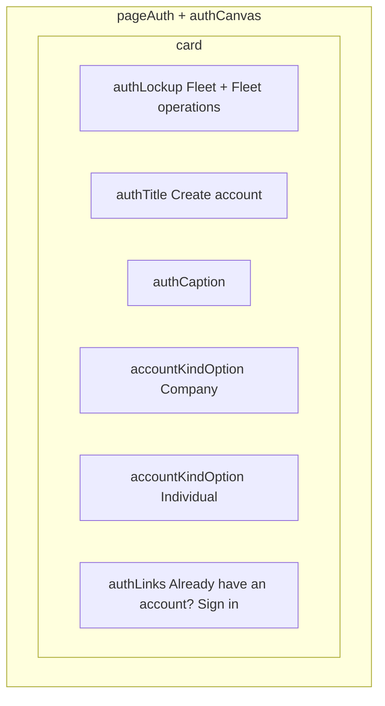

# Choose account kind

**Stories:** US-77, US-85 (entry), US-01 / US-78 (next step)  
**Rules:** 117–120, 128; A82–A83  
**Surfaces:** Web compact; mobile comfortable — **same IA**.  
**Purpose:** Unsigned-in person picks **Company** or **Individual** **before** registration fields. Not a marketing page. Not signed-in shell.  
**Chrome:** Unauthenticated [auth canvas](_patterns.md). No sidebar. **No public landing header** — lockup stays inside `authCard`.

Route name is Architect (`/sign-up`, `/create-account`, `/account-kind`, etc.). This spec is the **chooser** only.

## Layout

- Web: vertically centered `authCanvas`; card `max-w-auth-card`.
- Mobile: safe-area top; card full width inside `px-2`.
- **No** email/password on this screen. **No** company legal fields.
- Options are **two full-width choice controls** stacked `gap-2` — not a radio list buried under a Continue button (one tap continues).
- Order: **Company** first, then **Individual** (org path first; personal second).

## Component inventory

| Piece | Spec |
| --- | --- |
| Lockup | Existing `authLockup` / `brandMarkAuth` / `authWordmark` / `authCaptionLockup` |
| Title | `authTitle` **Create account** |
| Caption | `authCaption` — “Choose how you will use Fleet.” |
| Company option | `accountKindOption` (see below) |
| Individual option | `accountKindOption` |
| Sign-in escape | `authLinks` + `link` “Already have an account? Sign in” → [sign-in.md](sign-in.md) |

### `accountKindOption` (reuse, no new color tokens)

Full-width control on the card. Prefer a single raised choice row (not nested `authCard` inside card).

| Part | Class / token |
| --- | --- |
| Hit target | `min-h-hit` minimum; comfortable **≥ 56px** row height on mobile (`listRow`-like), web same min |
| Chrome | `bg-surface-raised` is already the card — option uses hairline `border border-border` + `rounded-md` + `px-3 py-2`; hover `bg-canvas` or subtle `navItemHover`-equivalent on raised surface; focus-visible `shadow-ring` / `buttonFocus` |
| Title | `label` / `text-label font-semibold` — **Company** or **Individual** |
| Supporting | `caption` + `text-text-secondary` under title (one line each) |
| Affordance | Optional trailing chevron decorative (`aria-hidden`); whole row is the control |
| Pressed | Platform press dim; reduce-motion: no slide animation |

Do **not** use `buttonPrimary` for both (two primaries). Do **not** use `link` underline for the whole option. Do **not** invent illustrated icons or product-mark variants per kind.

## Copy (locked)

| Element | Copy |
| --- | --- |
| Screen / title | **Create account** |
| Caption | **Choose how you will use Fleet.** |
| Company title | **Company** |
| Company supporting | **Register an organization. Manage drivers and vehicles.** |
| Individual title | **Individual** |
| Individual supporting | **Personal account. Manage your own vehicles only.** |
| Sign-in link | **Already have an account? Sign in** |

- Do **not** invent slogans, billing, or “free forever”.
- Do **not** say “convert later” (kind immutable — A89 / E79).

## Navigation (design intent)

| Action | Next |
| --- | --- |
| Company | [sign-up.md](sign-up.md) Company path (US-01) |
| Individual | [individual-sign-up.md](individual-sign-up.md) (US-78) |
| Sign in | [sign-in.md](sign-in.md) |
| From landing **Create account** | This screen (US-85) |
| Deep link skipping chooser | Allowed if Architect exposes direct Company / Individual routes; chooser remains default from landing + sign-in “Create account” |

## States

| State | UI |
| --- | --- |
| Default | Both options enabled; no selection chrome required (tap = navigate) |
| Loading | N/A (static chooser). If session probe runs: keep card; do not flash Owner shell |
| Offline | Options stay tappable (next screen owns submit/offline). Optional non-blocking `bannerWarning` “You are offline.” only if product already shows offline on auth — do not block reading the chooser |
| Error | N/A product data |
| Signed-in | **Out of this page** — do not show chooser; send to role home |
| Permission-denied | N/A |

No busy state on the options unless navigation is slow — then disable both briefly without skeleton-swapping the card.

## Token usage

| Role | Token | Class |
| --- | --- | --- |
| Backdrop / card | canvas / surface-raised | `pageAuth` `authCanvas` `authCard` |
| Lockup | mark-* / text-primary | `authLockup` `brandMarkAuth` `authWordmark` `authCaptionLockup` |
| Title / caption | text-primary / text-secondary | `authTitle` `authCaption` |
| Option chrome | border / ring | `border-border` + focus ring utilities already used by buttons |
| Option title | text-primary | `label` + semibold |
| Option supporting | text-secondary | `caption` |
| Link | link | `authLinks` + `link` / `linkHover` / `linkFocus` / `linkPressed` |

**No new color or spacing tokens.** Optional `themeClasses.accountKindOption` alias only if FE wants a named bundle — pure composition of existing utilities.

## A11y

| Control | Name |
| --- | --- |
| Screen | Create account |
| Company | Company. Register an organization. Manage drivers and vehicles. |
| Individual | Individual. Personal account. Manage your own vehicles only. |
| Sign in | Already have an account? Sign in |

- Each option is a **button** or **link** with the accessible name above (title + supporting, or `aria-describedby` on supporting).
- Focus order: Company → Individual → Sign in.
- Hit ≥ 44×44pt; supporting text may wrap — do not clip.
- Contrast AA on title/caption vs card.
- Reduce-motion: instant navigation; no card flip.

## Forbidden

- Collecting email/password on the chooser.
- Third kind, billing tier, or “team” option.
- Public landing header / hero on this route.
- Owner sidebar flash.
- Hex, magic spacing, illustrated mascots.
