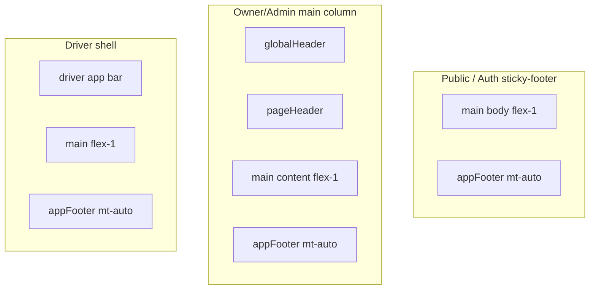

# Application footer — web chrome (US-100–US-103)

**Stories:** US-100–US-104  
**Rules:** [business-rules.md](../../docs/business-rules.md) 151–156 (A105–A110, E87–E89)  
**Chrome base:** [_patterns.md](_patterns.md)  
**Density:** Web compact  
**Surfaces:** **Web only** — public (`/`, `/pricing`), auth canvas, Owner/Admin shell, driver minimal shell. **Not** Expo mobile.

**Purpose:** Calm product identity + copyright at page end. Presentational only — no nav replacement, no PII, no version badge. **Terms** → `/terms` and **Privacy** → `/privacy` on every web footer variant (US-106, US-108).

## Out of scope (explicit)

| Out | Why |
| --- | --- |
| Expo / mobile tab-bar footer | A105, E88 |
| Other legal stubs beyond Terms/Privacy | A107, E87 |
| App version, git SHA, env badge | A108 |
| Tenant name, user email, company in footer | A106 |
| Changing Global Header, side nav, public header CTAs | A110 |
| Signed-in Pricing footer link | US-104 — use Billing |

## Anatomy

| Region | Spec |
| --- | --- |
| `appFooter` | Full width of its column. `border-t border-divider`, `bg-surface-raised`. Compact vertical pad (`py-2`) + horizontal gutter matching parent (`px-content-gutter-compact` or public content max width). |
| `appFooterInner` | Public: `max-w-public-content mx-auto` + gutter. Auth / OA / driver: full width of parent pad. Flex row wrap: identity left, links right (`justify-between gap-2 items-center`). |
| Identity | `appFooterCopy`: caption density — **© {YYYY} Fleet** (calendar year at render). Product name **Fleet** sentence case. Optional leading plain “Fleet” is **not** required if copyright line already includes Fleet. |
| Links (Should/Must) | `appFooterNav` session-aware (US-104, US-106, US-108): **all variants:** **Terms** → `/terms`, **Privacy** → `/privacy`. **unsigned-in / auth:** **Home** → `/`, **Pricing** → `/pricing`. **Owner/Admin:** **Home** → `/home`, **Billing** → `/billing` (no Pricing). **Driver:** **Home** → `/driver` (no Pricing/Billing). Use `themeClasses.link` + `focus-visible:shadow-ring`. `min-h-hit`. |
| Landmark | Native `<footer>` with accessible name via content; no duplicate product mark required (header owns mark). |

## Placement by chrome

| Chrome | Parent pattern | Footer |
| --- | --- | --- |
| Public landing / pricing | Root `min-h-screen flex flex-col`; body `flex-1` | After `publicBody`, `mt-auto` |
| Auth (`AuthShell`) | Root `min-h-screen flex flex-col`; canvas centers card `flex-1` | After canvas, full width, `mt-auto` |
| Owner/Admin `AppShell` | Main column `flex flex-col min-h-screen`; `main` `flex-1` | After `main`, still in main column (not under sidebar) |
| Driver `DriverShell` | Page `min-h-screen flex flex-col`; `main` `flex-1` | After `main` |

## States & a11y

| State | Spec |
| --- | --- |
| Default | Always visible when chrome mounts; no loading skeleton for footer. |
| Short page | Sticky-footer: stays at viewport bottom via parent flex + `mt-auto`. |
| Long page | Flows after content. |
| Focus | Links show `shadow-ring` on focus-visible. |
| Contrast | Caption on `surface-raised` / canvas edge; use semantic `text-text-secondary` and `text-link`. |
| Reduced motion | No motion on footer. |

## Tokens / classes

| Class | Role |
| --- | --- |
| `appFooter` | Footer shell surface + top divider + pad |
| `appFooterInner` | Inner flex row |
| `appFooterCopy` | Copyright caption |
| `appFooterNav` | Link cluster gap |

No hex. Reuse `link`, `caption` density where composed.
