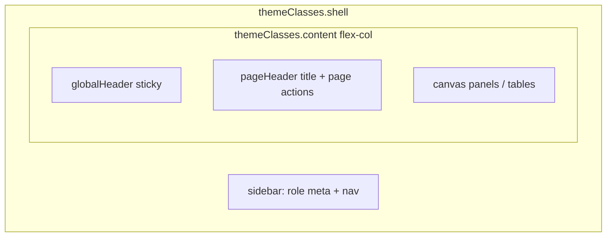
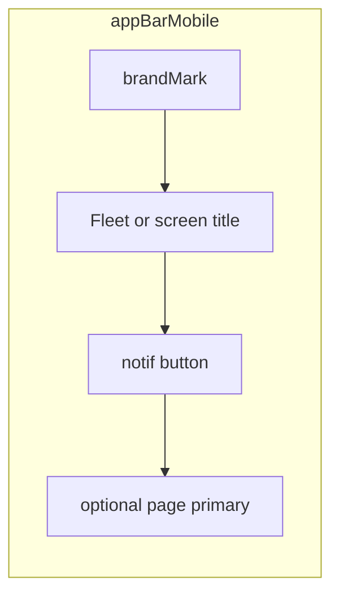

# Global Header — Owner/Admin (US-68–US-76)

**Stories:** US-68–US-76  
**Rules:** [business-rules.md](../../docs/business-rules.md) 101–116 (A70–A81, E68–E72)  
**Chrome base:** [_patterns.md](_patterns.md) authenticated Owner/Admin shell  
**Mark:** [mark.md](mark.md) shielded plate  
**Bell glyph:** [nav-icons.md](nav-icons.md) § Chrome glyphs  
**Density:** Web compact; mobile comfortable  
**Surfaces:** Management roles **web + mobile** only — **Company** Owner/Admin **and** **Individual** Owner (US-79/US-81).  

**Purpose:** One shared chrome strip for product identity + in-app compliance notifications. Complements US-28 Vehicles nav urgency; does **not** replace list/detail 30-day badges (A1) or nav orange/red rules. Individual menu items are **that tenant’s** vehicles only (A87).

## Out of scope (explicit)

| Out | Why |
| --- | --- |
| Driver shell, public landing, auth canvas | Rules 101, 110; E68 |
| Full notifications **page**, preferences, mute, mark-all-read | A73; menu only |
| OS push / email / SMS | A81 / Won't |
| Registration-date alerts | A13, A74; rule 106 |
| Invented event types (handover, invite, mileage) | MVP = compliance only |
| Changing Home/Drivers/Vehicles/Admins/Security destinations or role gating | US-68 |
| Dual product lockup (sidebar **and** header mark) | Resolved below — header owns identity |
| Hex in class lists / one-off colors | Tokens only |

---

## 1. Dual lockup resolution (US-69)

**Decision: single product lockup in Global Header.** Sidebar does **not** repeat mark + “Fleet”.

| Region | Product mark + wordmark | Other |
| --- | --- | --- |
| **Global Header** (web + mobile) | **Owns** shielded `brandMark` 24px + “Fleet” | Notification control trailing |
| **Web sidebar** | **No** mark, **no** “Fleet” wordmark | Top strip = **role only** (`sidebarMeta`: “Owner” / “Admin”); then nav |
| **Web sidebar collapsed (64px)** | **No** mark | Nav icons only; tooltips unchanged (US-28 Vehicles phrases stay) |
| **Auth / public / driver** | Unchanged | Not this slice |

BA allows temporary dual lockup; Design **rejects** dual for a calm enterprise console (one identity plane). Temporary dual is **not** the target FE state.

Accessible product name remains **Fleet** (wordmark). Mark is decorative (`aria-hidden`).

---

## 2. Layout

### Web — shell anatomy



| Region | Spec |
| --- | --- |
| `globalHeader` | Sticky top of **main column** (not over sidebar). Height `h-app-bar` (56px). `bg-surface-raised` + `border-b border-divider`. **No** second `brand-accent` top bar on this strip — accent stays on **sidebar** (and auth/public). `z-20` so content scrolls under it; notification menu sits above (`z-30`). |
| Leading lockup | `globalHeaderLockup`: `brandMark` + `globalHeaderProduct` “Fleet” (`gap-1.5`). Not a Home link required this slice (optional later). Hit area may be non-interactive identity. |
| Trailing | `globalHeaderActions`: **only** the notification `buttonIcon` this slice (page primaries stay on `pageHeader`). |
| `pageHeader` | **Unchanged role:** page title + subtitle + page-level actions (Add vehicle, etc.). Sits **under** Global Header inside padded content. Do **not** merge page title into Global Header (header must stay the **same** region on every OA page — US-68). |
| Sidebar top | `sidebarRole` / existing `sidebarMeta` in a `h-app-bar`-aligned strip: role label only. Nav items below. |

**As-is note:** [app-shell.tsx](../../apps/web/components/app-shell.tsx) currently uses a 48px title bar and a text “Fleet” in the sidebar. Design target replaces that with Global Header + pageHeader split and role-only sidebar strip — FE implements against this spec.

### Mobile — app bar = Global Header affordances

| Region | Spec |
| --- | --- |
| App bar | Safe-area top + `appBarMobile` (56px content) **is** the Global Header surface. |
| Leading | `brandMark` 24 + wordmark **or** screen title after mark on inner pages (existing pattern). Mark **always** stays (US-69). |
| Trailing | Notification `buttonIcon` **before** any page primary (Add). Order: **Notifications → page primary**. Both `min-h-hit`. |
| Tabs | Unchanged (US-32 + US-28). No notification control on the tab bar. |



---

## 3. Notification control (US-70, US-74)

| Property | Spec |
| --- | --- |
| Control | `buttonIcon` + `buttonGhost` hover/focus (`buttonFocus` / `shadow-ring`). Glyph: **bell** outline, `navIcon` 20px, `currentColor`, decorative `aria-hidden`. |
| Placement | Web Global Header trailing; mobile app bar trailing (before page primary). |
| Hit | `h-hit w-hit` (44×44). Always visible when OA signed-in chrome is shown (rule 104). |
| Default (0 items) | Bell only; **no** badge/dot. |
| Unread cue (Should, ≥1 MVP items) | **Count badge** on the control — **not** color-only. |
| Badge visual | `notifBadge`: `bg-danger` + `text-text-inverse` + `text-caption` + `font-semibold` + `font-tabular tabular-nums`. Position: top-end of hit target, optically inset. Min size ≥ 18px; padding `px-0.5`. |
| Count copy | Exact count **1–50** (feed cap A80). If API ever returns more without cap client-side, still show **50** max listed; badge uses listed count. |
| Dot alternative | **Do not** ship dot-only in MVP — count is the non-color-only cue. (BA allows “count or dot”; Design picks **count**.) |
| Open state | `aria-expanded=true`; optional `bg-hover` on button while menu open. |

### Accessible names (button)

| Condition | Name |
| --- | --- |
| 0 items | `Notifications` |
| n ≥ 1 | `Notifications, {n} compliance alerts` |
| Menu open | Same name; expanded state via `aria-expanded` / platform |

Do **not** rely on red badge alone. Reduce-motion: no badge pulse.

---

## 4. Notification menu anatomy (US-71–US-73)

### Platform chrome

| Surface | Pattern | Classes / elevation |
| --- | --- | --- |
| **Web** | **Popover** anchored to the bell (end-aligned under header). Not a full-page route. | `notifMenuPopover`: `bg-surface-raised` + `border border-border` + `rounded-lg` + `shadow-overlay`. Width `w-notif-menu` (**480px**; shrinks with `max-w-[min(480px,calc(100vw-2rem))]` on narrow viewports). Do **not** use `w-full` inside the bell hit target — that collapses the menu to ~44px. Max height ~min(420px, 70vh); list scrolls inside. |
| **Mobile** | **Bottom sheet** (same family as confirm sheets — not full-screen viewer). | Overlay `bg-surface-overlay` + `notifMenuSheet` raised panel from bottom; safe-area bottom. Grab/handle optional; **Close** text control required. |

**Do not** use the side-image viewer full-screen pattern for this menu.  
**Do not** use a second floating page title bar inside the menu.

### Open / close (US-71)

| Action | Result |
| --- | --- |
| Activate bell (closed) | Opens menu; focus moves to menu title or first focusable |
| Activate bell (open) | Closes menu; focus returns to bell |
| Web: Escape, outside click, explicit Close | Closes |
| Mobile: Close, backdrop dismiss, sheet dismiss gesture | Closes |
| Route change (OA page navigation) | **Must** close (no orphaned open state) |
| Only one instance | Opening never stacks two menus |

Focus trap while open (web). `role="dialog"` (or equivalent) + `aria-modal` on mobile sheet; web popover: `role="dialog"` **or** labelled `role="menu"` **with** non-menu states (empty/loading/error) — prefer **`role="dialog"`** + labelled-by title for all states (simpler a11y matrix). Items are buttons/links inside the dialog, not required to be `menuitem` if dialog pattern is used consistently.

Reduce-motion: open/close **instant** (no slide spring).

### Menu chrome structure

```text
notifMenuHeader
  title: “Compliance alerts”   (sectionTitle / label semibold)
  optional Close (buttonGhost / buttonIcon “Close”)
notifMenuBody
  loading | empty | error | list
notifMenuFooter (optional, only if capped)
  caption if 50 shown and more may exist: “Showing 50 most urgent.”
```

Title is **not** “Notifications” alone in the panel — MVP content is compliance-only; header title **Compliance alerts** sets expectation (rule 106). Bell a11y name stays “Notifications, …”.

### List item (vehicle + section) — US-72

One row per **vehicle + section** in window (insurance | inspection | road tax only).

| Slot | Content | Token / class |
| --- | --- | --- |
| Primary | `{Make} {Model}` (single space) | `label` / `text-label font-medium text-text-primary` |
| Secondary | Plate | `caption` `text-text-secondary` |
| Section | “Insurance” \| “Inspection” \| “Road tax” | `caption` or overline small |
| Status | Badge **plus** text | `badgeExpired` “Expired” if past; `badgeWarning` “Due soon” if within 30 days including today (same copy language as owner-home / vehicles list) |
| Date | Tabular date string | `font-tabular tabular-nums` `caption` |
| Affordance | Whole row is one control (Should navigate) | `notifMenuItem` min height `min-h-list-row` (56) mobile / `min-h-table-row` (44) web; hover `bg-hover`; focus `shadow-ring` |

```text
┌─────────────────────────────────────────┐
│ {Make} {Model}                          │
│ {plate}                                 │
│ Insurance  [Expired]  12 Jan 2026       │
└─────────────────────────────────────────┘
```

**Ordering (Should, A76):**  
1. Expired / overdue first  
2. Then soonest `daysUntil` ascending  
3. Stable tie-break: section order Insurance → Inspection → Road tax; then plate / id  

**Cap:** Max **50** rows (A80). If truncated, footer caption above — do **not** imply zero remaining.

**Not shown:** `registration_on`; vehicles with all three compliance dates null or all >30 days out; other companies.

### States (US-73)

| State | UI |
| --- | --- |
| **Loading** | Header real; body 4–5 `skeleton` rows (title bar + line widths matching primary/secondary). No fake plates. |
| **Empty** | `emptyState` compact inside menu: title “No compliance alerts.” sentence “Insurance, inspection, and road tax are clear for the next 30 days.” **No** primary CTA (create vehicle lives on pages). |
| **Error** | `bannerDanger` inline in body + `buttonSecondary` “Try again”. No fabricated rows (E69). |
| **Offline** | Treat as unavailable: `bannerWarning` “You are offline.” + disabled retry or retry that fails closed — no silent stale success required (E71). |
| **Populated** | Scrollable list; badge on bell matches item count (≤50). |

Empty is **not** an error (E70). Closing and reopening may refresh; Architect owns fetch timing.

---

## 5. Navigate target (US-75)

**One consistent target on web and mobile:**

| From item for vehicle `id` | Navigate to |
| --- | --- |
| Web | `/vehicles/{id}` — existing Owner/Admin **edit/detail** vehicle experience (same as home due-row and vehicles list identity links) |
| Mobile | Same app route segment for vehicle edit/detail (e.g. `/(owner)/vehicles/[id]` or whatever FE already uses for list → edit). **Same resource**, not a new “notification detail” screen |

| Rule | Spec |
| --- | --- |
| On activate | Close menu, then navigate |
| Missing / other company | Normal vehicle not-found or denied (E72); no cross-tenant data |
| Section deep-link | **Out of scope** this slice — land on vehicle; user sees A1 badges on dates. Do not invent `?section=insurance` unless Architect adds it later |
| Registration-only | Never an item |

---

## 6. Token usage

| Role | Token / class | Notes |
| --- | --- | --- |
| Header surface | `globalHeader` | raised + divider; height `app-bar` |
| Lockup | `globalHeaderLockup` `globalHeaderProduct` `brandMark` | Shielded mark |
| Bell control | `buttonIcon` + `notifButton` | currentColor glyph |
| Count badge | `notifBadge` | `danger` fill + inverse text — **with** count digits |
| Menu surface | `notifMenuPopover` / `notifMenuSheet` | `shadow-overlay` |
| Menu width | `spacing.notif-menu` → `w-notif-menu` | 480px web (viewport-capped) |
| Row | `notifMenuItem` | hover/focus |
| Status chips | `badgeWarning` `badgeExpired` | Reuse; never color-only |
| Skeletons | `skeleton` | |
| Overlay scrim (mobile) | `surface-overlay` | |

**No new semantic colors.** Reuse `danger` / `warning` / surfaces already in theme.

---

## 7. Accessibility

| Control | Name / behavior |
| --- | --- |
| Header region | Optional `banner` / labelled region “Fleet” |
| Mark | `aria-hidden`; name from wordmark “Fleet” |
| Notification button | Names in §3; `aria-expanded`; `aria-controls` → menu id |
| Menu | Accessible name “Compliance alerts”; focus trap; Escape closes (web) |
| List item | `"{Make} {Model}, {plate}, {section}, {Expired\|Due soon}, {date}"` |
| Try again | “Try again” |
| Close | “Close” |
| Status | Badge text + date name — never color alone |
| Contrast | Badge inverse on `danger` AA; menu text primary on raised AA |
| Hit targets | All controls ≥ 44×44pt |
| Reduce motion | No pulse on badge; menu open/close instant |

---

## 8. Relationship matrix

| Feature | Global Header notifications | US-28 Vehicles nav | List/detail A1 badges |
| --- | --- | --- | --- |
| Window | ≤30 days or past (rule 19) | day 7 orange / &lt;7 red | ≤30 days or past |
| Sections | insurance, inspection, road tax | same three | same three (+ registration shown but **not** warned) |
| Grain | vehicle **+ section** rows | one nav item fill | per date cell |
| Chrome | header bell + menu | sidebar / tab fill | content |
| Removes the other? | **No** | **No** | **No** |

---

## 9. Engineering follow-ups (no app code here)

1. **Architect** — notification list contract (company-scoped compliance items, ordering, cap 50, authz); confirm navigate = existing `GET` vehicle OA path; whether count is derived client-side from same payload.  
2. **Backend** — feed endpoint or documented client derive-from-vehicles; tenancy; no registration; no push.  
3. **Frontend** — shell: Global Header region; sidebar role-only; bell + popover/sheet; states; badge count; item → `/vehicles/{id}`; close on navigate; zero impact on driver/public/auth.  
4. **Frontend** — migrate as-is 48px title bar and sidebar “Fleet” text to this chrome.  
5. **Design tokens** — `notif-menu` spacing + `themeClasses` listed in [tailwind.theme.ts](../tailwind.theme.ts).

**Next specialist: Senior Software Architect.**
