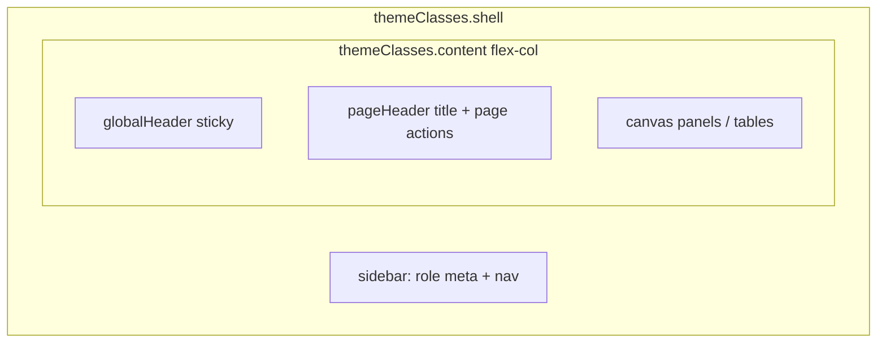
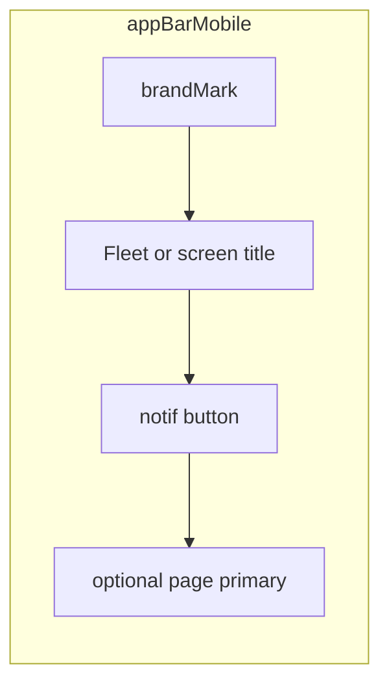

# Global Header — Owner/Admin (US-68–US-76)

**Stories:** US-68–US-76  
**Rules:** [business-rules.md](../../docs/business-rules.md) 101–116 (A70–A81, E68–E72)  
**Chrome base:** [_patterns.md](_patterns.md) authenticated Owner/Admin shell  
**Mark:** [mark.md](mark.md) shielded plate  
**Bell glyph:** [nav-icons.md](nav-icons.md) § Chrome glyphs  
**Density:** Web compact; mobile comfortable  
**Surfaces:** Management roles **web + mobile** only — **Company** Owner/Admin **and** **Individual** Owner (US-79/US-81).  

**Purpose:** One shared chrome strip for product identity + in-app **notification menu** (compliance dates, **service** approaching/due, Company **open_out**). Complements US-28 Vehicles nav urgency and [service-due.md](service-due.md); does **not** replace list/detail 30-day badges (A1) or nav orange/red rules. Individual menu items are **that tenant’s** vehicles only (A87). Drivers: **no** OA header (US-76 / US-109).

**Stories addendum:** US-109 (service items), US-111 (open_out items). Cap **50**; urgency-first order below.

## Out of scope (explicit)

| Out | Why |
| --- | --- |
| Driver shell, public landing, auth canvas | Rules 101, 110; E68; driver open-Out = [driver-home.md](driver-home.md) / [handover.md](handover.md) |
| Full notifications **page**, preferences, mute, mark-all-read | A73; menu only |
| OS push / email / SMS | A81 / Won't; US-109–111 in-app only |
| Registration-date alerts | A13, A74; rule 106 |
| Invite, mileage, generic “handover history” noise | Not menu kinds; **open_out** is custody-open only (US-111) |
| Individual **open_out** items | N/A — no company driver handover ops (US-111) |
| Changing Home/Drivers/Vehicles/Admins/Security destinations or role gating | US-68 |
| Dual product lockup (sidebar **and** header mark) | Resolved below — header owns identity |
| Hex in class lists / one-off colors | Tokens only |

---

## 1. Dual lockup resolution (US-69)

**Decision: single product lockup in Global Header.** Sidebar does **not** repeat mark + “Fleet”.

| Region | Product mark + wordmark | Other |
| --- | --- | --- |
| **Global Header** (web + mobile) | **Owns** shielded `brandMark` 24px + “Fleet” | Notification control trailing |
| **Web sidebar** | **No** mark, **no** “Fleet” wordmark | Top strip = **role only** (`sidebarMeta`: “Owner” / “Admin”); then nav |
| **Web sidebar collapsed (64px)** | **No** mark | Nav icons only; tooltips unchanged (US-28 Vehicles phrases stay) |
| **Auth / public / driver** | Unchanged | Not this slice |

BA allows temporary dual lockup; Design **rejects** dual for a calm enterprise console (one identity plane). Temporary dual is **not** the target FE state.

Accessible product name remains **Fleet** (wordmark). Mark is decorative (`aria-hidden`).

---

## 2. Layout

### Web — shell anatomy



| Region | Spec |
| --- | --- |
| `globalHeader` | Sticky top of **main column** (not over sidebar). Height `h-app-bar` (56px). `bg-surface-raised` + `border-b border-divider`. **No** second `brand-accent` top bar on this strip — accent stays on **sidebar** (and auth/public). `z-20` so content scrolls under it; notification menu sits above (`z-30`). |
| Leading lockup | `globalHeaderLockup`: `brandMark` + `globalHeaderProduct` “Fleet” (`gap-1.5`). Not a Home link required this slice (optional later). Hit area may be non-interactive identity. |
| Trailing | `globalHeaderActions`: **only** the notification `buttonIcon` this slice (page primaries stay on `pageHeader`). |
| `pageHeader` | **Unchanged role:** page title + subtitle + page-level actions (Add vehicle, etc.). Sits **under** Global Header inside padded content. Do **not** merge page title into Global Header (header must stay the **same** region on every OA page — US-68). |
| Sidebar top | `sidebarRole` / existing `sidebarMeta` in a `h-app-bar`-aligned strip: role label only. Nav items below. |

**As-is note:** [app-shell.tsx](../../apps/web/components/app-shell.tsx) currently uses a 48px title bar and a text “Fleet” in the sidebar. Design target replaces that with Global Header + pageHeader split and role-only sidebar strip — FE implements against this spec.

### Mobile — app bar = Global Header affordances

| Region | Spec |
| --- | --- |
| App bar | Safe-area top + `appBarMobile` (56px content) **is** the Global Header surface. |
| Leading | `brandMark` 24 + wordmark **or** screen title after mark on inner pages (existing pattern). Mark **always** stays (US-69). |
| Trailing | Notification `buttonIcon` **before** any page primary (Add). Order: **Notifications → page primary**. Both `min-h-hit`. |
| Tabs | Unchanged (US-32 + US-28). No notification control on the tab bar. |



---

## 3. Notification control (US-70, US-74)

| Property | Spec |
| --- | --- |
| Control | `buttonIcon` + `buttonGhost` hover/focus (`buttonFocus` / `shadow-ring`). Glyph: **bell** outline, `navIcon` 20px, `currentColor`, decorative `aria-hidden`. |
| Placement | Web Global Header trailing; mobile app bar trailing (before page primary). |
| Hit | `h-hit w-hit` (44×44). Always visible when OA signed-in chrome is shown (rule 104). |
| Default (0 items) | Bell only; **no** badge/dot. |
| Unread cue (Should, ≥1 MVP items) | **Count badge** on the control — **not** color-only. |
| Badge visual | `notifBadge`: `bg-danger` + `text-text-inverse` + `text-caption` + `font-semibold` + `font-tabular tabular-nums`. Position: top-end of hit target, optically inset. Min size ≥ 18px; padding `px-0.5`. |
| Count copy | Exact count **1–50** (feed cap A80). If API ever returns more without cap client-side, still show **50** max listed; badge uses listed count. |
| Dot alternative | **Do not** ship dot-only in MVP — count is the non-color-only cue. (BA allows “count or dot”; Design picks **count**.) |
| Open state | `aria-expanded=true`; optional `bg-hover` on button while menu open. |

### Accessible names (button)

| Condition | Name |
| --- | --- |
| 0 items | `Notifications` |
| n ≥ 1 | `Notifications, {n} alerts` |
| Menu open | Same name; expanded state via `aria-expanded` / platform |

Do **not** rely on red badge alone. Reduce-motion: no badge pulse. Count = listed feed size after merge/cap (≤50), all kinds.

---

## 4. Notification menu anatomy (US-71–US-73)

### Platform chrome

| Surface | Pattern | Classes / elevation |
| --- | --- | --- |
| **Web** | **Popover** anchored to the bell (end-aligned under header). Not a full-page route. | `notifMenuPopover`: `bg-surface-raised` + `border border-border` + `rounded-lg` + `shadow-overlay`. Width `w-notif-menu` (**480px**; shrinks with `max-w-[min(480px,calc(100vw-2rem))]` on narrow viewports). Do **not** use `w-full` inside the bell hit target — that collapses the menu to ~44px. Max height ~min(420px, 70vh); list scrolls inside. |
| **Mobile** | **Bottom sheet** (same family as confirm sheets — not full-screen viewer). | Overlay `bg-surface-overlay` + `notifMenuSheet` raised panel from bottom; safe-area bottom. Grab/handle optional; **Close** text control required. |

**Do not** use the side-image viewer full-screen pattern for this menu.  
**Do not** use a second floating page title bar inside the menu.

### Open / close (US-71)

| Action | Result |
| --- | --- |
| Activate bell (closed) | Opens menu; focus moves to menu title or first focusable |
| Activate bell (open) | Closes menu; focus returns to bell |
| Web: Escape, outside click, explicit Close | Closes |
| Mobile: Close, backdrop dismiss, sheet dismiss gesture | Closes |
| Route change (OA page navigation) | **Must** close (no orphaned open state) |
| Only one instance | Opening never stacks two menus |

Focus trap while open (web). `role="dialog"` (or equivalent) + `aria-modal` on mobile sheet; web popover: `role="dialog"` **or** labelled `role="menu"` **with** non-menu states (empty/loading/error) — prefer **`role="dialog"`** + labelled-by title for all states (simpler a11y matrix). Items are buttons/links inside the dialog, not required to be `menuitem` if dialog pattern is used consistently.

Reduce-motion: open/close **instant** (no slide spring).

### Menu chrome structure

```text
notifMenuHeader
  title: “Alerts”   (sectionTitle / label semibold)
  optional Close (buttonGhost / buttonIcon “Close”)
notifMenuBody
  loading | empty | error | list
notifMenuFooter (optional, only if capped)
  caption if 50 shown and more may exist: “Showing 50 most urgent.”
```

Panel title **Alerts** (compliance + service + open_out). Bell a11y stays “Notifications, …”. Registration still never an item (rule 106).

### List kinds — US-72 + US-109 + US-111

Shared row chrome: `notifMenuItem` min height `min-h-list-row` (56) mobile / `min-h-table-row` (44) web; hover `bg-hover`; focus `shadow-ring`. Whole row one control.

#### Kind: `compliance` (vehicle + section) — US-72

One row per **vehicle + section** in window (insurance | inspection | road tax only). Custom expirations Could (US-89) unchanged if present.

| Slot | Content | Token / class |
| --- | --- | --- |
| Primary | `{Make} {Model}` | `label` / `text-label font-medium text-text-primary` |
| Secondary | Plate | `caption` `text-text-secondary` |
| Kind label | “Insurance” \| “Inspection” \| “Road tax” | `caption` |
| Status | Badge **plus** text | `badgeExpired` **Expired**; `badgeWarning` **Due soon** (≤30 days incl. today) |
| Meta | Tabular date | `font-tabular` `caption` |

```text
│ {Make} {Model}                          │
│ {plate}                                 │
│ Insurance  [Expired]  12 Jan 2026       │
```

#### Kind: `service` (vehicle) — US-109

One row per qualifying vehicle (not per distance/days split). Buckets match [service-due.md](service-due.md).

| Slot | Content | Token / class |
| --- | --- | --- |
| Primary | `{Make} {Model}` | `label` |
| Secondary | Plate | `caption` |
| Kind label | **Service** | `caption` |
| Status | Badge **plus** text | Due/overdue: `badgeExpired` **Due** / **Overdue**; approaching: `badgeWarning` **Approaching** |
| Meta | Distance and/or days reason; **unit label** when distance-based (mi/km from vehicle country) | `font-tabular` `caption` |

```text
│ {Make} {Model}                          │
│ {plate}                                 │
│ Service  [Approaching]  1,250 km left   │
│ Service  [Overdue]  by days             │
```

**Individual Owner:** service items **allowed** for own vehicles only. **Driver:** no menu.

#### Kind: `open_out` (vehicle) — US-111

**Company Owner/Admin only.** Absent for Individual (N/A). One row per company vehicle with active open Out (In not done; not voided).

| Slot | Content | Token / class |
| --- | --- | --- |
| Primary | `{Make} {Model}` | `label` |
| Secondary | Plate | `caption` |
| Kind label | **Open out** | `caption` |
| Status | Badge **plus** text | `badgeWarning` **Out open** (not color-only) |
| Meta | Driver identity when known; else omit or “Driver unavailable” | `caption` |

```text
│ {Make} {Model}                          │
│ {plate}                                 │
│ Open out  [Out open]  driver@co.com     │
```

No optional extra OA “open out board” this slice — menu item is the Must cue (BA optional board skipped).

### Ordering (Must urgency-first; cap 50)

Single merged list, max **50** (A80). If truncated, footer “Showing 50 most urgent.”

1. **Urgent block first:** compliance **Expired**; service **Due/Overdue**; all **open_out**  
2. **Soon block next:** compliance **Due soon**; service **Approaching**  
3. Within block: sooner/worse first (dates ascending; service least `distance_remaining` / most overdue; open_out by oldest Out when known)  
4. Tie-break: kind order `open_out` → `service` → `compliance`; compliance sections Insurance → Inspection → Road tax; then plate / id  

**Not shown:** `registration_on`; non-qualifying compliance; service omit rules from service-due; open_out for Individual or other companies; other companies’ rows.

### States (US-73)

| State | UI |
| --- | --- |
| **Loading** | Header real; body 4–5 `skeleton` rows (title bar + line widths matching primary/secondary). No fake plates. |
| **Empty** | `emptyState` compact: title “No alerts.” sentence “No compliance, service, or open-out items need attention.” **No** primary CTA. |
| **Error** | `bannerDanger` inline in body + `buttonSecondary` “Try again”. No fabricated rows (E69). |
| **Offline** | `bannerWarning` “You are offline.” + disabled retry or retry that fails closed (E71). |
| **Populated** | Scrollable list; badge on bell matches item count (≤50). |

Empty is **not** an error (E70). Closing and reopening may refresh; Architect owns fetch timing. open_out / service rows **drop** when Out closes or service no longer qualifies (refresh).

---

## 5. Navigate targets (US-75 + US-109 + US-111)

| Kind | Web | Mobile |
| --- | --- | --- |
| `compliance` | `/vehicles/{id}` edit/detail | Same vehicle OA route |
| `service` | `/vehicles/{id}` preferred; `/service-due` allowed if no stable id | Same |
| `open_out` | `/vehicles/{id}` **Handovers** tab when tab exists; else vehicle detail | Same resource + handovers tab if any |

| Rule | Spec |
| --- | --- |
| On activate | Close menu, then navigate |
| Missing / other company | not-found or denied (E72); no cross-tenant data |
| Compliance section deep-link | **Out of scope** — land on vehicle; A1 badges visible |
| Registration-only | Never an item |
| No new notification-detail route | Reuse existing OA paths only |

---

## 6. Token usage

| Role | Token / class | Notes |
| --- | --- | --- |
| Header surface | `globalHeader` | raised + divider; height `app-bar` |
| Lockup | `globalHeaderLockup` `globalHeaderProduct` `brandMark` | Shielded mark |
| Bell control | `buttonIcon` + `notifButton` | currentColor glyph |
| Count badge | `notifBadge` | `danger` fill + inverse text — **with** count digits |
| Menu surface | `notifMenuPopover` / `notifMenuSheet` | `shadow-overlay` |
| Menu width | `spacing.notif-menu` → `w-notif-menu` | 480px web (viewport-capped) |
| Row | `notifMenuItem` | hover/focus |
| Status chips | `badgeWarning` `badgeExpired` | Reuse for all kinds; never color-only |
| Skeletons | `skeleton` | |
| Overlay scrim (mobile) | `surface-overlay` | |

**No new semantic colors.** Reuse `danger` / `warning` / surfaces already in theme. **No** `badgeApproaching` / `badgeOpenOut` tokens.

---

## 7. Accessibility

| Control | Name / behavior |
| --- | --- |
| Header region | Optional `banner` / labelled region “Fleet” |
| Mark | `aria-hidden`; name from wordmark “Fleet” |
| Notification button | Names in §3; `aria-expanded`; `aria-controls` → menu id |
| Menu | Accessible name **Alerts**; focus trap; Escape closes (web) |
| `compliance` item | `"{Make} {Model}, {plate}, {section}, {Expired\|Due soon}, {date}"` |
| `service` item | `"{Make} {Model}, {plate}, Service, {Due\|Overdue\|Approaching}, {reason with unit}"` |
| `open_out` item | `"{Make} {Model}, {plate}, Open out, Out open, {driver if any}"` |
| Try again | “Try again” |
| Close | “Close” |
| Status | Badge text + meta — never color alone |
| Contrast | Badge inverse on `danger` AA; menu text primary on raised AA |
| Hit targets | All controls ≥ 44×44pt |
| Reduce motion | No pulse on badge; menu open/close instant |

---

## 8. Relationship matrix

| Feature | Global Header menu | Service due board | US-28 Vehicles nav | List A1 badges | Driver open-Out |
| --- | --- | --- | --- | --- | --- |
| Compliance window | ≤30d or past | — | day 7 / &lt;7 | ≤30d or past | — |
| Service | approaching + due items | full board | — | — | — |
| Open out | Company menu items | — | — | — | Hub + handover cue (no OA bell) |
| Grain | kind-specific rows | one row / vehicle | nav fill | date cells | driver self only |
| Removes others? | **No** | **No** | **No** | **No** | **No** |

---

## 9. Engineering follow-ups (no app code here)

1. **Architect** — feed contract: kinds `compliance` \| `service` \| `open_out`; urgency order; cap 50; Individual omits open_out; authz/tenancy; navigate targets above.  
2. **Backend** — items + drop rules on In/void/service clear; no push/email.  
3. **Frontend** — menu rows by kind; badge count; close on navigate; driver chrome untouched.  
4. **Frontend** — open_out → Handovers tab when implemented.  
5. **Tokens** — reuse only; no new colors ([tailwind.theme.ts](../tailwind.theme.ts)).

**Next specialist: Senior Software Architect.**
