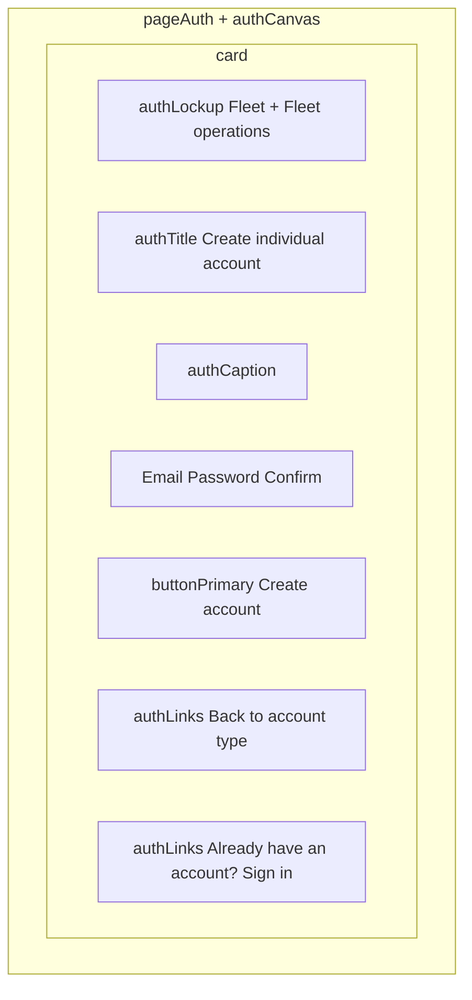

# Individual sign-up

**Stories:** US-78 (US-77 entry; US-79 post-success shell)  
**Rules:** 120–121, 124, 128; A83, A86, A90; E1/E73/E74  
**Surfaces:** Web compact; mobile comfortable — same IA.  
**Purpose:** Create **`account_kind = individual`** tenant + sole **Owner** with **email + password only**. No registration number, VAT, or company address.  
**Chrome:** Unauthenticated [auth canvas](_patterns.md). No sidebar. **No public landing header** — lockup inside `authCard`.

**Entry:** [account-kind.md](account-kind.md) → Individual. Landing dual CTA may deep-link here (US-85). Do **not** show company legal fields on this path (E73 scope is email/password only).

## Layout

- Web: centered `authCanvas`; card `max-w-auth-card`.
- Mobile: safe-area; full-width card in `px-2`; keyboard avoiding — scroll card, do not cover submit.
- Shorter than Company sign-up — no address lookup UI.

## Fields

| Field | Class | Notes |
| --- | --- | --- |
| Email | `label` + `input` | Email keyboard; required |
| Password | `label` + `input` | Secure; `caption` “At least 8 characters.” |
| Confirm password | `label` + `input` | Mismatch → `inputError` + `errorText` |
| Submit | `buttonPrimary` full width | Busy “Creating…”; hover `buttonPrimaryHover` |

**Must not appear:** Registration number, VAT number, Address, address lookup (Company-only — [sign-up.md](sign-up.md)).

## States

| State | UI |
| --- | --- |
| Default | Empty fields in `authCard` |
| Loading (submit) | Submit busy “Creating…”; fields disabled; form stays (no skeleton swap) |
| Password &lt; 8 (E73) | Password `inputError` + `errorText` “Password must be at least 8 characters.” No tenant |
| Email missing (E73) | Email `inputError` + `errorText` (e.g. “Email is required.”). No tenant |
| Confirm mismatch | Confirm `inputError` + `errorText` “Passwords do not match.” |
| Duplicate email (E1 / E74) | `bannerDanger` in card + email `inputError`: “This email cannot be used.” No tenant |
| Offline | `bannerWarning` “You are offline.”; submit `buttonDisabled` |
| Success | Signed in as **Individual Owner** → [owner-home.md](owner-home.md) **Individual** shell (no Drivers/Admins) |

- Field failures use `inputError` + `errorText` except duplicate email may combine banner + field.
- Server remains source of truth for uniqueness and password policy.

## Token usage

| Role | Token | Class |
| --- | --- | --- |
| Backdrop / card | canvas / surface-raised | `pageAuth` `authCanvas` `authCard` |
| Lockup | mark-fill | `authLockup` `brandMarkAuth` `authWordmark` “Fleet” `authCaptionLockup` “Fleet operations” |
| Title | text-primary | `authTitle` |
| Supporting | text-secondary | `authCaption` — “Create a personal account to track your vehicles.” |
| Fields | border / focus / danger | `label` `input` `inputFocus` `inputError` `errorText` `caption` |
| Links | link | `authLinks` + `link` / `linkHover` / `linkFocus` / `linkPressed` |

No new tokens. No hex. No company legal fields.

## A11y

| Control | Name |
| --- | --- |
| Screen | Create individual account |
| Email | Email |
| Password | Password |
| Confirm | Confirm password |
| Submit | Create account |
| Back | Back to account type |
| Sign-in | Already have an account? Sign in |

- Password: `secureTextEntry`; errors in a live region.
- Focus first field on web. `inputFocus` / `buttonFocus` rings.
- Safe area; keyboard avoiding.
- Reduce-motion: no decorative motion.

## Copy (locked)

| Element | Copy |
| --- | --- |
| Title | **Create individual account** |
| Caption | **Create a personal account to track your vehicles.** |
| Password hint | **At least 8 characters.** |
| Submit | **Create account** |
| Busy | **Creating…** |
| Back | **Back to account type** → [account-kind.md](account-kind.md) |
| Sign-in | **Already have an account? Sign in** |
| Duplicate email | **This email cannot be used.** |
| Offline | **You are offline.** |

## Post-success (US-78 / US-82)

- Land in **Individual Owner** management shell — [_patterns.md](_patterns.md) Individual subset.
- **No** Drivers nav/tab, **no** Admins entry, **no** driver-ops home.
- Vehicles + Home + Security (TOTP) only — [owner-home.md](owner-home.md), [vehicles.md](vehicles.md), [totp-settings.md](totp-settings.md).

## Forbidden

- Company legal fields or “upgrade to company” CTA (out of slice).
- Public landing header on this route.
- Auto-enrolling drivers or Admins.
- Hex / magic spacing / second product name.
