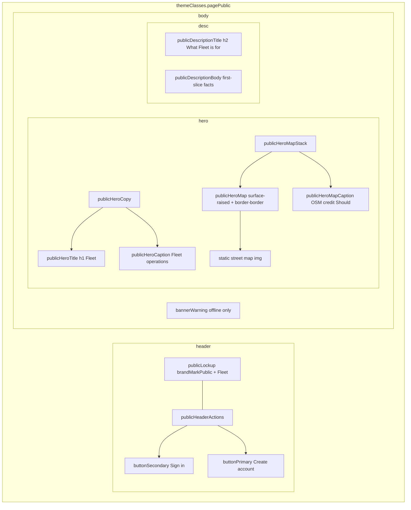

# Public landing (web)

**Stories:** US-17, US-18, US-19, US-20, US-21, US-22, **US-23, US-24, US-25, US-26**, **US-85** (Should — dual create entry)  
**Rules:** 117–120 (account kinds); grandfather existing = company is data (US-84), not landing UI  
**Surface:** Web compact only. **No** mobile marketing landing.  
**Purpose:** Unsigned-in identity + entry. Not a marketing site. Not Owner/Admin home. No vehicle records, driver admin, or due-soon.  
**Chrome:** [Public landing chrome](_patterns.md) — **not** auth canvas, **not** authenticated shell.

Route (`/` vs `/landing`) is Architect. This spec is the unsigned-in web entry only.

## Purpose and density

| | |
| --- | --- |
| Density | Web compact. Header height `h-app-bar` (56px). Body gutter `contentPadCompact` (`px-content-gutter-compact`). |
| Personality | Ops console entry (Workday / ServiceNow / Linear ops). One raised-plane language. **This page only:** hero + static map + **three value cards** + **Company/Individual path cards** + description panel. Still no neon, gradient overlay, glassmorphism, testimonials, fake KPI metrics, live tables, or slippy maps. |
| Identity | Product **Fleet** (sentence case). Caption **Fleet operations** in hero. Optional one-line lead under caption (product facts, not a slogan shout). Do not shout `FLEET`. |
| Actions | Header: **Pricing** link, **Sign in**, **Create account** (chooser). Hero may repeat **Create account** + **View pricing** (same destinations). Path cards link **Create company** / **Create personal account**. No dual primary in header. |

User request **overrides** prior “no hero / no illustrations” **for this landing page only**. First-slice “maps out of visual scope” still means **ops tracking UI**. The static landing image is in scope here; live GPS / slippy maps are not.

## Layout

| Region | Spec |
| --- | --- |
| Page | `pagePublic` — `bg-canvas`, full viewport. No sidebar. No Owner nav. |
| Header | `publicHeader`: sticky `top-0`, `h-app-bar` (56px), full width. `bg-surface-raised` + `border-b border-divider` + 2px top `border-t-brand-bar border-t-brand-accent` (same accent language as `authCard` / `sidebar` — not a third bar). Stay visible while on this page (US-18). Reduce-motion: **no** hide-on-scroll. **Unchanged** from US-17–22. |
| Header left | `publicLockup`: unshielded plate `brandMarkPublic` (`aria-hidden`) + `publicWordmark` **Fleet**. Accessible name of the lockup is **Fleet**. Not a link to a marketing home; this page **is** the public entry. |
| Header right | `publicHeaderActions`: **Sign in** then **Create account**. Secondary then primary. Both `min-h-hit` (44px). **Create account** opens kind chooser (US-77/US-85) — not Company form only. No Vehicles / Drivers / due-soon. Header CTAs stay header-only (rules 30–37). |
| Body | `publicBody` `bg-canvas`. Compact gutter. **Large web:** content column `max-w-public-content` (**1200px**) centered (`mx-auto`); header bar full-bleed with matching `publicHeaderInner`. Stack: offline banner → hero → value cards → paths → description. **No records** (US-26). |
| Hero | `publicHero` — **one** region (US-23). Existing identity **Fleet** / **Fleet operations** **moves into the hero**. Do **not** keep a duplicate identity block **and** a hero with the same words. No second CTA row. |
| Hero copy | `publicHeroCopy`. Headline **Fleet** (`publicHeroTitle`, **h1**). Supporting line **Fleet operations** (`publicHeroCaption` — existing caption, not a new slogan). |
| Hero map | Beside copy at tablet+ (`publicHeroWide`: copy left, map right). Stack copy-then-map on narrow (`publicHero` column). Map sits on `publicHeroMap`: `surface-raised` + `border-border` hairline + `shadow-raised` — **one raised plane**, not a floating marketing screenshot. No gradient overlay. |
| Description | One `publicDescription` (`panel`) **below** the hero (US-25). `publicDescriptionTitle` (**h2**) + `publicDescriptionBody`. Generic first-slice language only. Not a feature grid, pricing, or testimonials. |

## Component inventory

| Piece | Reuse vs new |
| --- | --- |
| `buttonPrimary` / `buttonSecondary` / `buttonFocus` | Reuse — **header only** |
| `bannerWarning` | Reuse (offline only) |
| `skeleton` | Reuse — header lockup bars; hero map may skeleton. **Never** Owner KPI/table skeletons |
| `panel` / `sectionTitle` / `body` / `caption` | Reuse — description uses `publicDescription*` aliases of panel + section + body |
| Shielded `brandMark` / `brandMarkAuth` | **Do not use** on this page |
| `brandMarkPublic` + public plate SVG | Existing — [mark.md](mark.md) public-header variant |
| `publicHeader` / `publicLockup` / `publicWordmark` / `publicHeaderActions` | Existing chrome — **do not restyle** |
| `publicIdentity` / `publicIdentityTitle` / `publicIdentityCaption` | **Retired.** Identity copy now lives in `publicHeroCopy`. Do not render both. |
| `publicHero` / `publicHeroWide` / `publicHeroCopy` / `publicHeroTitle` / `publicHeroCaption` | **New** hero regions |
| `publicHeroMapStack` / `publicHeroMap` / `publicHeroMapImage` / `publicHeroMapSkeleton` / `publicHeroMapCaption` | **New** — static **img** frame + credit under the plane, not a map SDK |
| `publicDescription` / `publicDescriptionTitle` / `publicDescriptionBody` | **New** — one fact panel |
| Auth card / sidebar / table / KPI / live map | **Forbidden** on this page |

## Token usage

| Role | Token | Tailwind class |
| --- | --- | --- |
| Page canvas | `canvas` | `pagePublic` `publicBody` |
| Header surface | `surface-raised` | `publicHeader` |
| Header hairline | `divider` | `border-b border-divider` |
| Accent bar | `brand-accent` | `border-t-brand-bar border-t-brand-accent` |
| Wordmark | `text-primary` | `publicWordmark` |
| Public plate enamel | `mark-plate-face` | `brandMarkPlateFace` |
| Public plate edge / ink | `mark-fill` | `brandMarkPlateEdge` `brandMarkFill` |
| Country band | `brand-accent` | `brandMarkAccent` |
| Public mark size | `mark-public` × `mark-public-width` | `brandMarkPublic` |
| Sign in | secondary button | `buttonSecondary` `buttonSecondaryHover` `buttonFocus` |
| Create account | primary button | `buttonPrimary` `buttonPrimaryHover` `buttonFocus` |
| Hero title | `text-primary` | `publicHeroTitle` |
| Hero caption | `text-secondary` | `publicHeroCaption` |
| Map frame | `surface-raised` + `border` | `publicHeroMap` |
| Map max height | `hero-map` (320px) | `max-h-hero-map` / `h-hero-map` |
| Map credit | `text-secondary` | `publicHeroMapCaption` (`caption`) |
| Description panel | `surface-raised` + `border` | `publicDescription` |
| Description title | `text-primary` | `publicDescriptionTitle` (`sectionTitle`) |
| Description body | `text-primary` | `publicDescriptionBody` (`body`) |
| Offline | `warning` / `warning-subtle` | `bannerWarning` |
| Loading placeholder | `disabled-surface` | `skeleton` `publicHeroMapSkeleton` |

Never hex in class lists. Never `bg-sidebar` on this header. Do not invent a map color system (no tile palette, no GPS pin tokens).

## Static open-map image (US-24)

Decorative / public-entry visual. **Not** live GPS. **Not** an interactive map product. **Not** company vehicles or pins (rule 32 / A26).

| Rule | Spec |
| --- | --- |
| Medium | Treat as an **`img`** (or equivalent) of a street map. Architect hosts a **static asset**. Do **not** spec Mapbox / Google JS SDK, Leaflet, or slippy tiles as the hero. |
| Alt | `alt="Static street map"` — informative enough that it is a map image. Must **not** say “your fleet” / “live tracking” / “vehicles”. Not `aria-hidden` (it is the hero visual). Not a long description of streets (BA Q5). |
| Pins / overlays | **None.** No vehicle markers, geofence polygons, cluster dots, or “live” badges. |
| Fail (E18) | Image fail → hide the image (skeleton then empty). **Do not** swap in a live iframe map. Header + description remain. No records fallback. |
| Offline (E19) | Existing `bannerWarning`. Map may be missing. No records. |
| Reduce-motion | Static image. No Ken Burns, no tile animation, no parallax. |
| Aspect / size | Landscape ~2:1 or 16:9. Max height `hero-map` **320px** on compact web so it does not dominate like a consumer travel site. Image fills `publicHeroMap`; do not scale the page into a travel-site bleed. |
| Dark mode | Same image is OK (ops, not inverted map tiles). Optional 1px `border-border` remains AA. No gradient overlay. |
| Attribution (Should) | If the asset is OSM-derived, a `caption` under the image: **Map data © OpenStreetMap**. Factual credit only. Must not read as a live map of the fleet. `publicHeroMapCaption` — not a link farm. |

## States

| State | UI |
| --- | --- |
| Default | Unsigned-in. Header + hero (Fleet / Fleet operations + static map image) + one description panel. **This is the success state** for US-17 and US-23–25. No records (US-26). |
| Loading | Session-ready unknown: `publicHeader` stays; lockup is two `skeleton` bars (mark 40×20, wordmark ~80×16). Actions may skeleton as 44px pills. Hero map may use `publicHeroMapSkeleton`. Description may skeleton as two text bars inside the panel. **Never** Owner home KPI/table skeletons. Do not flash records. |
| Empty | N/A for lists. Map fail after skeleton → empty map frame (or hide frame); page is not a list. |
| Error | N/A for product data. If session check fails: stay on this landing; **do not** show vehicles/drivers/due-soon. No `bannerDanger` that implies a record load failed. Map error (E18): hide image; header + description remain. |
| Offline | `bannerWarning` “You are offline.” Header actions stay **visible**. Map may be missing (E19). Disabled submit is **auth pages’** job after navigation — do not invent a disabled landing CTA state beyond keeping the buttons visible. |
| Permission-denied | N/A — this page **is** the public entry. |
| Signed-in Owner/Admin | **Out of this page.** Do not design a signed-in public marketing view. Operational home per US-22 (Architect / [owner-home.md](owner-home.md)). |

## A11y and platform

| Control | Name |
| --- | --- |
| Screen | Fleet |
| Header lockup | Fleet (mark `aria-hidden="true"`) |
| Sign in | Sign in |
| Create account | Create account |
| Hero heading | Fleet (h1) |
| Map image | Static street map |
| Map credit | Map data © OpenStreetMap (if shown) |
| Description heading | What Fleet is for (h2) |
| Offline banner | You are offline. |

- Heading hierarchy: **h1** Fleet in the hero; **h2** description title. Header wordmark is not a second h1.
- Contrast AA: `text-primary` on `canvas` / `surface-raised`; public plate edge `mark-fill` on light header; plate face `mark-plate-face` on dark header. See [mark.md](mark.md). Map 1px `border-border` remains AA in dark.
- Hit targets ≥ 44×44pt (`min-h-hit`) — **header actions only**. Map image is not a control. Description is not a control.
- Focus-visible: `buttonFocus` (`shadow-ring`). Lockup is not a second focus stop if it is not a link. Map is not focusable.
- Reduce-motion: sticky header with **no** hide-on-scroll animation; skeletons instant; map static (no Ken Burns / tile motion).
- Safe area: web compact; honor top safe area if the webview has one — header still 56px content + safe-area inset. No keyboard on this page.
- Do not clip Dynamic Type; stack header actions under the lockup if the row cannot keep 44pt hits (narrow web). Prefer one row at dispatcher/tablet width. Hero stacks copy-then-map on narrow; description body wraps — do not clip labels.
- iOS/Android: **no** public landing in this slice. Tablet/dispatcher web uses this compact header, not Owner sidebar. Auth pages **do not** inherit this hero (US-23 / US-25).

## Copy (locked voice)

- Header wordmark: **Fleet**
- Hero h1: **Fleet**
- Hero supporting line: **Fleet operations**
- Description h2: **What Fleet is for**
- Description body (first-slice facts only — not slogans): **Create a company or a personal account. A company Owner is first; Owners and Admins manage drivers and vehicles for that company. An individual Owner manages their own vehicles only. Drivers are invited by companies. Vehicles keep license plate, insurance, inspection, country of registration, and road tax dates. Fleet warns when those dates are due soon or expired.**
- Map alt: **Static street map**
- Map credit (Should, OSM-derived): **Map data © OpenStreetMap**
- Do **not** mention live tracking, maps as a product, dispatch, trips, or geofence.
- Do not add feature, pricing, or slogan lines.
- Header actions: **Sign in** → [sign-in.md](sign-in.md) (US-20 / US-02). **Create account** → [account-kind.md](account-kind.md) (US-85 / US-77); then Company → [sign-up.md](sign-up.md) (US-01) or Individual → [individual-sign-up.md](individual-sign-up.md) (US-78).

## Forbidden on this page

- Public header on auth routes (those stay auth canvas).
- Hero / description / map image on auth pages.
- Shielded navy mark (`brandMark` / `brandMarkAuth`).
- Sidebar, Vehicles, Drivers, due-soon, KPI tiles, tables.
- Live map, pan/zoom, vehicle markers, geofence polygons, Mapbox/Google/Leaflet/slippy tiles as the hero.
- Gradient overlay on the map, neon, glassmorphism, campaign illustrations, testimonials, pricing grid, feature grid.
- Duplicate body / hero CTA pair.
- Signed-in marketing view (US-22 still applies).
- Records of any kind (US-26).
- Shouting `FLEET`. Invented slogans.
- Hex, horizontal-bar mark, inverted navy-on-white shield.
- A map color token system.
