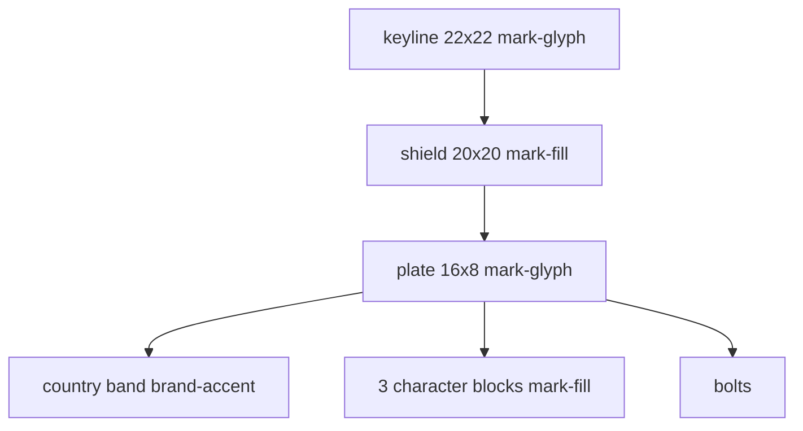
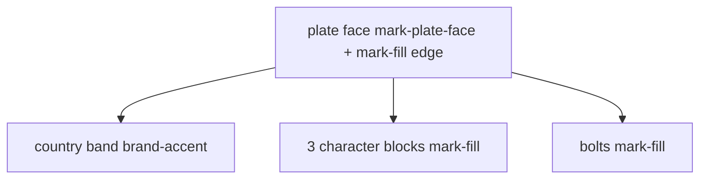

# Product mark — Fleet registration plate

**Scope:** visual identity only. Copy stays **Fleet** / **Fleet operations**.  
**Sizes:** `brandMark` 24×24 (sidebar, mobile app bar); `brandMarkAuth` 32×32 (auth); `brandMarkPublic` 40×20 (public landing header only).  
**Implementation:** SVG (web) / `react-native-svg` (mobile). Do not stack spans.

Two **assets**, not two products:

| Variant | Where | Shield |
| --- | --- | --- |
| **Shielded** (canonical) | Auth card, web sidebar, mobile app bar | Navy `mark-fill` + `mark-glyph` keyline. **Unchanged.** |
| **Public header** (US-19) | [landing.md](landing.md) header only | **No** navy shield, **no** 22×22 keyline. Licence plate only. |

## Name and intent

**Fleet registration plate.** The product’s primary identity object is a license plate — vehicles are listed, edited, and compliance-tracked by plate. At 24px the mark is a landscape plate on a navy shield: left country band + three character blocks + two bolts. That is still 2–4 solid shapes; it cannot collapse to a minus.

Personality: disciplined, operational, trustworthy B2B ops. Not marketing, not consumer neon, not a vehicle silhouette, not an “F” monogram.

## Surfaces

| Surface | Density / size | Contrast |
| --- | --- | --- |
| Auth card (`surface-raised`) | Comfortable lockup, mark 32 | Navy `mark-fill` shield on the card. Keyline is `mark-glyph` (white); on a light card it is a hairline rim, not a second identity. |
| Web sidebar (`sidebar` = navy.900 light / navy.950 dark) | Compact, mark 24 | Navy-on-navy would fail. **Do not invert fill.** The 1px `mark-glyph` keyline is the contrasting frame (white ring on the rail). Collapsed sidebar: mark only, tooltip “Fleet”. |
| Mobile app bar (`surface-raised`) | Comfortable, mark 24 | Same **shielded** asset as auth. |
| Public landing header (`surface-raised`) | Compact, unshielded plate 40×20 | **No navy shield.** Plate enamel `mark-plate-face` + navy `mark-fill` ink/edge. See public-header variant below. |

Light and dark use the same semantic fills. Reduce-motion: static. Decorative mark: `aria-hidden="true"`. Accessible name is the wordmark **Fleet**.

## Tokens

| Role | Token | Tailwind |
| --- | --- | --- |
| Shield (shielded only) | `mark-fill` | `fill-mark-fill` / `brandMarkFill` |
| Plate face, keyline, left bolt (shielded) | `mark-glyph` | `fill-mark-glyph` / `brandMarkGlyph` |
| Country band (both variants) | `brand-accent` | `fill-brand-accent` / `brandMarkAccent` |
| Character blocks, right bolt (both) | `mark-fill` | `fill-mark-fill` / `brandMarkFill` |
| Public plate enamel | `mark-plate-face` | `fill-mark-plate-face` / `brandMarkPlateFace` |
| Public plate edge | `mark-fill` (stroke) | `stroke-mark-fill` / `brandMarkPlateEdge` |
| Size 24 | `spacing.mark` | `brandMark` (`h-mark w-mark`) |
| Size 32 | `spacing.mark-auth` | `brandMarkAuth` (`h-mark-auth w-mark-auth`) |
| Public 40×20 | `spacing.mark-public` / `mark-public-width` | `brandMarkPublic` |

WCAG (shielded): character blocks are `mark-fill` on `mark-glyph` (non-text ≥ 3:1; this pair is well above AA). Country band is `brand-accent` on `mark-glyph`. Keyline is `mark-glyph` on `sidebar`.

Do not paint `bg-mark-fill` on any size wrapper — the shield lives in the **shielded** SVG only.

## Geometry (shielded)

ViewBox **`0 0 24 24`**. Draw at 24 or 32; **do not retune coordinates at 32**.



| Layer | Shape | x | y | w | h | rx / r | Fill |
| --- | --- | --- | --- | --- | --- | --- | --- |
| Keyline | rect | 1 | 1 | 22 | 22 | rx=5 | `mark-glyph` |
| Shield | rect | 2 | 2 | 20 | 20 | rx=4 | `mark-fill` |
| Plate face | rect | 4 | 8 | 16 | 8 | rx=1.5 | `mark-glyph` |
| Country band | path | — | — | — | — | — | `brand-accent` |
| Left bolt | circle | cx=5.75 | cy=12 | — | — | r=0.9 | `mark-glyph` |
| Block 1 | rect | 8.5 | 10 | 2.25 | 4 | rx=0.4 | `mark-fill` |
| Block 2 | rect | 11.5 | 10 | 2.25 | 4 | rx=0.4 | `mark-fill` |
| Block 3 | rect | 14.5 | 10 | 2.25 | 4 | rx=0.4 | `mark-fill` |
| Right bolt | circle | cx=18.25 | cy=12 | — | — | r=0.9 | `mark-fill` |

Country band path (rounded left corners of the plate, square right at x=7.5):

```
M 5.5 8 H 7.5 V 16 H 5.5 A 1.5 1.5 0 0 1 4 14.5 V 9.5 A 1.5 1.5 0 0 1 5.5 8 Z
```

### Canonical SVG

Map `fill` attributes to theme colors (`fill-mark-fill`, `fill-mark-glyph`, `fill-brand-accent`). Never hex.

```svg
<svg xmlns="http://www.w3.org/2000/svg" viewBox="0 0 24 24" width="24" height="24" aria-hidden="true">
  <rect x="1" y="1" width="22" height="22" rx="5" fill="mark-glyph" />
  <rect x="2" y="2" width="20" height="20" rx="4" fill="mark-fill" />
  <rect x="4" y="8" width="16" height="8" rx="1.5" fill="mark-glyph" />
  <path fill="brand-accent" d="M5.5 8H7.5V16H5.5A1.5 1.5 0 0 1 4 14.5v-5A1.5 1.5 0 0 1 5.5 8Z" />
  <circle cx="5.75" cy="12" r="0.9" fill="mark-glyph" />
  <rect x="8.5" y="10" width="2.25" height="4" rx="0.4" fill="mark-fill" />
  <rect x="11.5" y="10" width="2.25" height="4" rx="0.4" fill="mark-fill" />
  <rect x="14.5" y="10" width="2.25" height="4" rx="0.4" fill="mark-fill" />
  <circle cx="18.25" cy="12" r="0.9" fill="mark-fill" />
</svg>
```

Auth: same markup, `width="32" height="32"`.  
Mobile: `Svg` `viewBox="0 0 24 24"` with `Rect` / `Path` / `Circle` matching the table. Width/height 24 or 32.

## Lockup (shielded — unchanged)

Horizontal: mark + 12px gap + stack (wordmark **Fleet**; caption **Fleet operations** on auth only via `authCaptionLockup`). Sidebar omits “Fleet operations”; `sidebarMeta` is role. Auth uses `brandMarkAuth`. Sidebar and mobile app bar use `brandMark`.

Public header lockup: `brandMarkPublic` + `publicWordmark` **Fleet** only (no “Fleet operations” in the header). Caption may appear in the landing **body**. Accessible name **Fleet**; mark `aria-hidden`.

## Public-header variant — plate without navy background (US-19)

**Problem:** dropping the 22×22 keyline + 20×20 navy shield from the 24×24 asset leaves a 16×8 plate floating in a square. White `mark-glyph` face **fails** on light `surface-raised` (white on white).

**Choice (c + remap):** dedicated public-header viewBox that is still the **same plate**, drawn at `brandMarkPublic` **40×20** (2:1, matching the 16×8 plate). Do **not** scale the 16×8 plate inside a 24 box (too small). Do **not** keep a 24 square with empty chrome. Do **not** invent a horizontal bar or a second navy-on-white shield.

Same plate geometry **scaled 2.5×** from the canonical 16×8 plate (origin shifted to the plate top-left so the plate fills the 40×20 box). Relative proportions of face, country band, three blocks, and bolts **unchanged**.

### Contrast remap (required)

Shielded plate face is `mark-glyph` (white) because it sits on navy `mark-fill`. Unshielded, that white face disappears on a light header.

| Layer | Shielded token | Public-header token | Why |
| --- | --- | --- | --- |
| Keyline 22×22 | `mark-glyph` | **Omit** | That square **is** the navy-bg frame with the shield. |
| Shield 20×20 | `mark-fill` | **Omit** | US-19: no navy background. |
| Plate face | `mark-glyph` | `mark-plate-face` | Light enamel so navy ink still reads. Alias of `gray.0` in both themes — **not** a second shield. |
| Plate edge | (implied by navy shield) | `mark-fill` **stroke** 1px (`brandMarkPlateEdge`) | On **light** `surface-raised`, white enamel ≈ header; the navy edge is the ≥ 3:1 non-text contrast against the header. On **dark** `surface-raised`, light enamel vs dark header is already AA; navy stroke remains the plate outline. |
| Country band | `brand-accent` | `brand-accent` | Unchanged. |
| Left bolt | `mark-glyph` | `mark-fill` | Without the navy shield, a white bolt on white enamel vanishes. Public bolts are navy ink (same token as character blocks). |
| Character blocks | `mark-fill` | `mark-fill` | Navy ink on light enamel — same pair as shielded blocks-on-white, AA. |
| Right bolt | `mark-fill` | `mark-fill` | Unchanged. |

Do **not** invert into a navy-filled 40×20 rounded rect. Do **not** one-off hex. Token gap closed: `mark-plate-face` (semantic color) + `brandMarkPlateEdge`.

### Public geometry

ViewBox **`0 0 40 20`**. Draw only at **40×20** (`brandMarkPublic`). Do not use this viewBox on auth or sidebar.

Canonical plate was `x=4 y=8 w=16 h=8` in a 24 box. Public plate is `x=0 y=0 w=40 h=20` (scale 2.5 from that 16×8, origin at plate top-left). Band / blocks / bolts use the same ratios:

| Layer | Shape | x | y | w / r | h | rx | Fill / stroke |
| --- | --- | --- | --- | --- | --- | --- | --- |
| Plate face | rect | 0 | 0 | 40 | 20 | rx=3.75 | fill `mark-plate-face`; stroke `mark-fill` width 1 (inside) |
| Country band | path | — | — | — | — | — | `brand-accent` |
| Left bolt | circle | cx=4.375 | cy=10 | r=2.25 | — | — | `mark-fill` |
| Block 1 | rect | 11.25 | 5 | 5.625 | 10 | rx=1 | `mark-fill` |
| Block 2 | rect | 18.75 | 5 | 5.625 | 10 | rx=1 | `mark-fill` |
| Block 3 | rect | 26.25 | 5 | 5.625 | 10 | rx=1 | `mark-fill` |
| Right bolt | circle | cx=35.625 | cy=10 | r=2.25 | — | — | `mark-fill` |

Country band (rounded left of the plate, square right at x=8.75 — 7.5−4 = 3.5 in 16-wide plate → 8.75 in 40-wide):

```
M 3.75 0 H 8.75 V 20 H 3.75 A 3.75 3.75 0 0 1 0 16.25 V 3.75 A 3.75 3.75 0 0 1 3.75 0 Z
```



### Public SVG

Map fills/stroke to theme classes. Never hex. Never include keyline or shield rects.

```svg
<svg xmlns="http://www.w3.org/2000/svg" viewBox="0 0 40 20" width="40" height="20" aria-hidden="true">
  <rect x="0.5" y="0.5" width="39" height="19" rx="3.25" fill="mark-plate-face" stroke="mark-fill" stroke-width="1" />
  <path fill="brand-accent" d="M3.75 0H8.75V20H3.75A3.75 3.75 0 0 1 0 16.25V3.75A3.75 3.75 0 0 1 3.75 0Z" />
  <circle cx="4.375" cy="10" r="2.25" fill="mark-fill" />
  <rect x="11.25" y="5" width="5.625" height="10" rx="1" fill="mark-fill" />
  <rect x="18.75" y="5" width="5.625" height="10" rx="1" fill="mark-fill" />
  <rect x="26.25" y="5" width="5.625" height="10" rx="1" fill="mark-fill" />
  <circle cx="35.625" cy="10" r="2.25" fill="mark-fill" />
</svg>
```

Inset the face by 0.5 so the 1px `mark-fill` stroke sits inside the viewBox (does not clip). Band path still follows the outer plate radii so the left endcaps read as the plate, not a floating stripe.

Wrapper `brandMarkPublic` is **size only** — no `bg-mark-fill`, no `bg-sidebar`.

### Where the public variant must not appear

Auth card, password flows, TOTP, sidebar, mobile app bar keep the **shielded** canonical SVG. User lock: public header is **not** on sign-in, sign-up, or password pages.

## Forbidden

- Horizontal bar, or 2px `brand-accent` on the **top edge of a solid plate** (reads as a minus at 24/32).
- Letter “F” monogram.
- Vehicle or convoy silhouettes.
- Photos, illustration packs, animated mark.
- A second inverted-fill variant for sidebar (use the keyline).
- Painting the public plate as a navy rounded rectangle (that **is** the shield US-19 removes).
- Using shielded `mark-glyph` white face on the public header without `mark-plate-face` + `mark-fill` edge.
- Shouting `FLEET` overline.
- Hex in class lists or SVG fills.

## Do not implement here

Senior Frontend Specialist: keep existing shielded `BrandMark` on auth + sidebar + mobile; add the public SVG only on [landing.md](landing.md). Architect owns `/` vs `/landing`. Backend is not in scope.
