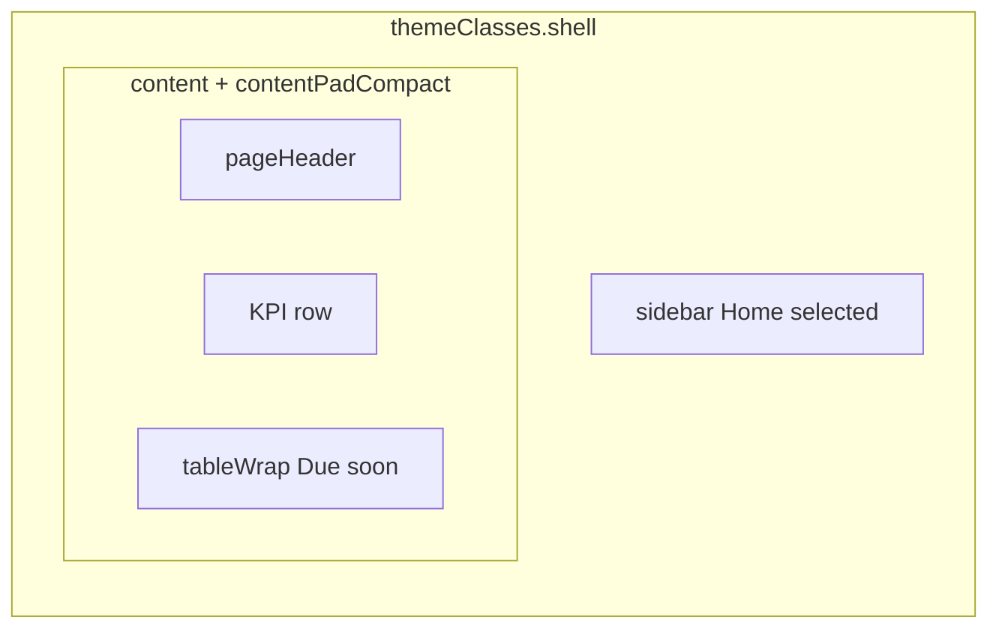

# Owner/Admin home

**Stories:** US-02, US-13 (entry + expiry awareness); **US-79 / US-81 / US-82** (Individual Owner subset)  
**Rules:** 124–125, 128; A86  
**Density:** Web compact dashboard; mobile comfortable.  
**Purpose:** After management-role sign-in: entry to allowed fleet surfaces; **not** driver UI.  
**Chrome:** Authenticated **management** shell. Sidebar / tabs **Home** selected. **Global Header** (mark + notifications) on every management page — [global-header.md](global-header.md). Due-soon table remains the content surface for compliance; header menu is the complementary alert feed (same A1 window, not registration).

**Account kind branches the shell** (not a second home product):

| Kind / role | Home KPIs | Header actions | Nav (see [_patterns.md](_patterns.md)) |
| --- | --- | --- | --- |
| **Company Owner** | Drivers, Vehicles, Admins | Secondary **Admins**; primary **Add vehicle** | Home, Drivers, Vehicles, Security, Admins |
| **Company Admin** | Drivers, Vehicles | Primary **Add vehicle** (no Admins) | Home, Drivers, Vehicles, Security |
| **Individual Owner** | **Vehicles only** (one KPI) | Primary **Add vehicle** only — **no** Admins, **no** Add driver | Home, Vehicles, Security — **no** Drivers, **no** Admins |

## Layout — web

| Region | Spec |
| --- | --- |
| Page header | `pageTitle` “Home”. `pageSubtitle`: Company Owner/Admin — role + org context, e.g. “Owner · fleet operations”; **Individual Owner** — “Owner · personal vehicles” (not “company”). Actions: **Company Owner only** `buttonSecondary` “Admins”; **never** Admins action for Individual. Always `buttonPrimary` “Add vehicle” when Vehicles is allowed (all three rows above). Do **not** offer “Add driver” primary for Individual. Company may use “Add driver” only if product already switches primary when vehicles exist and drivers are 0 — Individual **never** switches to Add driver. |
| KPI row | Flex row, `gap-2`. Tile count by kind/role (table above). Each `kpi` is a control → list. **Not** stacked gray cards. |
| KPI Drivers | **Company only.** `kpiCaption` “Drivers” + `kpiValue` tabular count. No delta. **Omit** for Individual Owner. |
| KPI Vehicles | All management roles. `kpiCaption` “Vehicles” + `kpiValue`. |
| KPI Admins | **Company Owner only.** `kpiCaption` “Admins” + `kpiValue`. Tap → Admins. Company Admin and Individual: **omit**. |
| Section | `overline` “Compliance” + `sectionTitle` “Due soon or expired” |
| Due table | `tableWrap`. Sticky header. Columns: Vehicle, Plate, Insurance, Inspection, Road tax, Registration. Vehicle primary identity is **`{Make} {Model}`** (single space) via `tableCellLink` (no underline at rest; hover brand on that cell). Plate `tableCellMuted` secondary. Date cells `tableCellNum`; if due/expired, badge + date name in cell. Whole-row hover `tableRowHover`. Row tap → vehicle edit. Same for Individual — **own tenant vehicles only**. |

Do **not** wrap the KPI row in another card. Canvas shows; tiles sit on canvas; table is the single large raised plane.

## Layout — mobile

`appBarMobile` “Home”. KPI tiles stacked `gap-1.5` full width (Individual: single Vehicles tile). Due list as `listRow` (`{Make} {Model}` title/`label`, plate `caption` muted secondary, badges wrap). Tabs: Home selected — Individual tab set has **no** Drivers (see patterns).

## States

| State | UI |
| --- | --- |
| Loading | Real header; 2–3 `skeleton` KPI tiles (same size as `kpi`); table header real; 5 `skeleton` rows matching columns |
| Empty fleet | KPI Vehicles `0`; due empty: `emptyState` title “No vehicles due soon.” sentence “Add a vehicle to track insurance, inspection, road tax, and registration.” CTA `buttonPrimary` “Add vehicle” |
| Empty drivers | **Company only.** Drivers KPI `0`; no extra empty block required on home (list page owns empty). Optional sentence in subtitle only — do not add a second empty illustration. **N/A** Individual (no Drivers KPI). |
| Error | `bannerDanger` with retry control `buttonSecondary` “Try again” |
| Offline | `bannerWarning`; cached counts/table if any |
| Unauthenticated | No records; [denied.md](denied.md) US-15 |
| Individual deep-link Drivers/Admins | Do not render those KPIs or flash Company nav — [denied.md](denied.md) Individual / E77 |

Empty due-soon with vehicles that are all >30 days: title “No vehicles due soon.” **No** CTA (or secondary “View vehicles” as `buttonSecondary` only — primary create stays in header). Prefer no duplicate primary.

## Token usage

| Role | Token | Class |
| --- | --- | --- |
| Canvas | canvas | `page` `content` |
| KPI | surface-raised | `kpi` `kpiCaption` `kpiValue` |
| Table | table-* | `tableWrap` `tableHeader` `tableRow` |
| Due | warning / danger | `badgeWarning` `badgeExpired` + text |
| Count | tabular | `font-tabular tabular-nums` |

## A11y

| Control | Name |
| --- | --- |
| Screen | Home |
| Drivers tile | Drivers, {n} — **omit control** when Individual |
| Vehicles tile | Vehicles, {n} |
| Admins tile | Admins, {n} — **Company Owner only** |
| Due row | {Make} {Model}, {plate}, {date name} expired \| due soon |
| Add vehicle | Add vehicle |

- KPI is a button; 44pt min.
- Badges not color-only.
