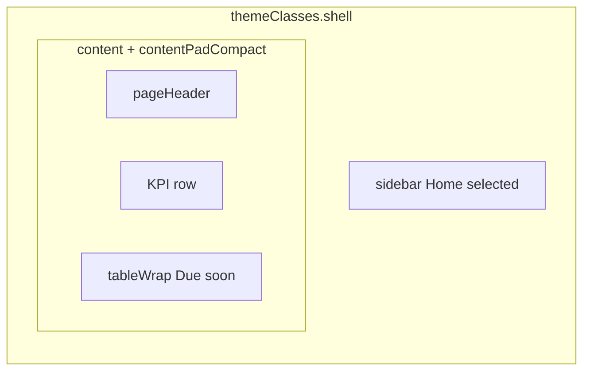

# Owner/Admin home

**Stories:** US-02, US-13 (entry + expiry awareness)  
**Density:** Web compact dashboard; mobile comfortable.  
**Purpose:** After Owner/Admin sign-in: entry to drivers and fleet; **not** driver UI.  
**Chrome:** Authenticated shell. Sidebar **Home** selected.

## Layout — web

| Region | Spec |
| --- | --- |
| Page header | `pageTitle` “Home”. `pageSubtitle` role + company context, e.g. “Owner · fleet operations”. Actions: Owner only `buttonSecondary` “Admins”; always `buttonPrimary` “Add vehicle” (or “Add driver” if vehicles exist and drivers are 0 — do not invent a third primary; default primary **Add vehicle**). |
| KPI row | Flex row, `gap-2`, 2 tiles (Owner: 3). Each `kpi` is a control → list. **Not** stacked gray cards. |
| KPI Drivers | `kpiCaption` “Drivers” + `kpiValue` tabular count. No delta. |
| KPI Vehicles | `kpiCaption` “Vehicles” + `kpiValue`. |
| KPI Admins | Owner only. `kpiCaption` “Admins” + `kpiValue`. Tap → Admins. Admin users: omit this tile. |
| Section | `overline` “Compliance” + `sectionTitle` “Due soon or expired” |
| Due table | `tableWrap`. Sticky header. Columns: Vehicle, Plate, Insurance, Inspection, Road tax, Registration. Vehicle primary identity is **`{Make} {Model}`** (single space) via `tableCellLink` (no underline at rest; hover brand on that cell). Plate `tableCellMuted` secondary. Date cells `tableCellNum`; if due/expired, badge + date name in cell. Whole-row hover `tableRowHover`. Row tap → vehicle edit. |

Do **not** wrap the KPI row in another card. Canvas shows; tiles sit on canvas; table is the single large raised plane.

## Layout — mobile

`appBarMobile` “Home”. KPI tiles stacked `gap-1.5` full width. Due list as `listRow` (`{Make} {Model}` title/`label`, plate `caption` muted secondary, badges wrap). Tabs: Home selected.

## States

| State | UI |
| --- | --- |
| Loading | Real header; 2–3 `skeleton` KPI tiles (same size as `kpi`); table header real; 5 `skeleton` rows matching columns |
| Empty fleet | KPI Vehicles `0`; due empty: `emptyState` title “No vehicles due soon.” sentence “Add a vehicle to track insurance, inspection, road tax, and registration.” CTA `buttonPrimary` “Add vehicle” |
| Empty drivers | Drivers KPI `0`; no extra empty block required on home (list page owns empty). Optional sentence in subtitle only — do not add a second empty illustration |
| Error | `bannerDanger` with retry control `buttonSecondary` “Try again” |
| Offline | `bannerWarning`; cached counts/table if any |
| Unauthenticated | No records; [denied.md](denied.md) US-15 |

Empty due-soon with vehicles that are all >30 days: title “No vehicles due soon.” **No** CTA (or secondary “View vehicles” as `buttonSecondary` only — primary create stays in header). Prefer no duplicate primary.

## Token usage

| Role | Token | Class |
| --- | --- | --- |
| Canvas | canvas | `page` `content` |
| KPI | surface-raised | `kpi` `kpiCaption` `kpiValue` |
| Table | table-* | `tableWrap` `tableHeader` `tableRow` |
| Due | warning / danger | `badgeWarning` `badgeExpired` + text |
| Count | tabular | `font-tabular tabular-nums` |

## A11y

| Control | Name |
| --- | --- |
| Screen | Home |
| Drivers tile | Drivers, {n} |
| Vehicles tile | Vehicles, {n} |
| Admins tile | Admins, {n} |
| Due row | {Make} {Model}, {plate}, {date name} expired \| due soon |
| Add vehicle | Add vehicle |

- KPI is a button; 44pt min.
- Badges not color-only.
