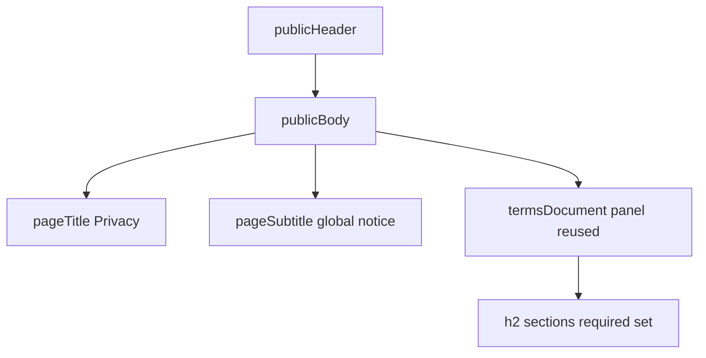

# Public Privacy notice (web)

**Stories:** US-107, US-108  
**Rules:** [business-rules.md](../../docs/business-rules.md) 168–173 (A122–A127, E97–E99)  
**Surface:** Web compact only. **No** Expo Privacy chrome.  
**Purpose:** Static product **Privacy** notice for **Fleet** global operations. Not Terms. Not DSAR portal. Not CMS.  
**Chrome:** Same public landing chrome as [landing.md](landing.md) / [terms.md](terms.md) — `pagePublic` + `publicHeader` + `publicBody` + `AppFooter` `public`.

## Purpose and density

| | |
| --- | --- |
| Density | Web compact. Header `h-app-bar`. Body via `publicBody`. |
| Personality | Same calm legal-read as Terms: raised document panel on sunken canvas. |
| Identity | **Fleet** in header lockup. Page title **Privacy**. |
| Actions | Header: **Pricing**; **Sign in**; **Create account**. No “I agree” CTA. |

## Layout

| Region | Spec |
| --- | --- |
| Page | `pagePublic` + `min-h-screen flex flex-col`. |
| Header | Same as terms/pricing: lockup → `/`; Pricing; Sign in; Create account. Privacy lives in footer, not header nav. |
| Title | `pageTitle` **Privacy**. `pageSubtitle`: e.g. “How Fleet handles personal data for global product use. Product draft — not legal advice.” |
| Document | Reuse `termsDocument` / `termsSection*` tokens (same readable measure). |
| Sections | Required set (US-107 / A124): Who we are; Scope; Personal data we process; Purposes and legal bases; Sharing and processors; International transfers; Retention; Security; Your rights; Cookies and similar technologies; Children; Changes; Contact and requests. |
| Footer | `AppFooter variant="public"` with Terms + Privacy. |
| States | No role redirect off `/privacy`. Offline banner if auth context provides it. Static body — no skeleton for copy. |
| a11y | One `h1`. Sections `h2`. Links `min-h-hit` + `shadow-ring`. |

## Copy tone

- Calm enterprise English; honest to actual Fleet data (accounts, drivers, vehicles, handovers, usage, auth sessions, email invites).
- Global ops: acknowledge users may be worldwide; transfers/processors high-level without fake entity addresses.
- Controller identity: product **Fleet** / operators placeholder until legal entity is published.
- Rights: access, correction, deletion, restriction/objection, complaint to a supervisory authority — contact path, not in-app DSAR.
- Cookies: session/auth and essential operation; no invented ad-tracking claims.
- Cross-link Terms where useful; do not duplicate full Terms.

## Tokens

Reuse `termsDocument`, `termsSection`, `termsSectionTitle`, `termsSectionBody`, `termsMeta`, `pageTitle`, `pageSubtitle`. No new hex. Optional alias not required this slice.

## Out of scope UI

DSAR form, regional policy switcher, cookie consent banner manager, PDF download, counsel letterhead, mobile native screen.
