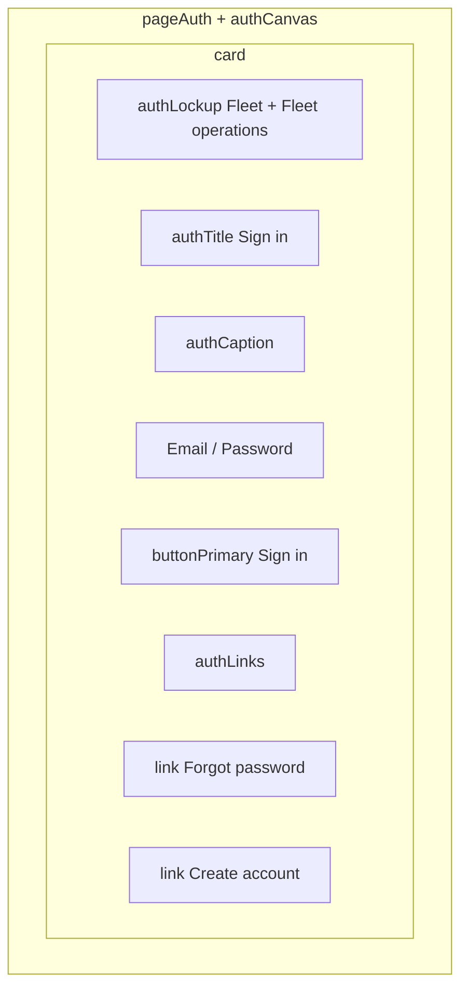

# Sign-in

**Stories:** US-02, US-09, US-10, US-29, US-30, **US-79** (Individual Owner same form)  
**Surfaces:** Web compact and mobile comfortable — **same form for all roles**. Branch after success by role + account kind (Company Owner/Admin vs Individual Owner vs driver with password already set).  
**Purpose:** Email + password. Then TOTP if Owner/Admin **or Individual Owner** has MFA; or role home if credentials valid. **Pending invited drivers cannot password-sign-in** (E31) — they use [driver-invite-accept.md](driver-invite-accept.md).  
**Chrome:** Unauthenticated [auth canvas](_patterns.md). No sidebar. **No public landing header** — lockup stays inside `authCard`.  
**US-30:** Parallel sessions (second device / web+mobile) need **no** extra chrome, device list, or “signed in elsewhere” banner.  
**E7 retired:** Drivers **may** use web for invite accept and minimal home after password is set. Owner/Admin-area denial remains **E8** / [denied.md](denied.md) US-14. Individual → Company-only areas: **E77** / denied Individual variant.

## Layout

- Extra line under the **Forgot password** link on mobile only: `caption` “Password reset is for Owners and Admins.” The link itself stays `link` (underline, `min-h-hit`), not caption-colored. **Individual Owners** use the same reset path (US-80) — caption may read “Password reset is for Owners and Admins.” still (Individual is an Owner); do not add a third role line.
- One sign-in for all roles **and both account kinds**. “**Create account**” is a `link` in `authLinks`, stacked under Forgot password — not a second primary, not faint body text. Target: [account-kind.md](account-kind.md) (US-77), not Company form only. If a driver uses it they do not gain Owner access.
- Do **not** invent a separate “driver sign-in” or “individual sign-in” route, temporary-password field, or “open your invite” primary CTA on this screen (BA does not require invite entry from sign-in). Pending drivers fail password sign-in like other bad credentials (E31 / E2 family) unless product later adds a BA-approved caption only — **do not invent driver password reset**.

## Fields

| Field | Class | Notes |
| --- | --- | --- |
| Email | `label` + `input` | Email keyboard |
| Password | `label` + `input` | Secure — one field for all roles; **not** labeled temporary |
| Submit | `buttonPrimary` full width | Busy: “Signing in…” |

## States

| State | UI |
| --- | --- |
| Default | Empty `authCard` |
| Loading | Submit busy; fields disabled |
| Wrong credentials (E2) | `bannerDanger` “Sign-in details are not correct.” Do not reveal which field. **Same UX** for wrong email, wrong Owner/Admin password, wrong driver password, **and pending driver with no password yet (E31)** — not signed in; no branch to home or invite accept from this failure alone |
| Session ended (14-day / revoke / failed refresh) | Clients **navigate to this sign-in screen** (not an in-app “Sign in required” placeholder). `bannerWarning` “Your session ended. Sign in again to continue.” |
| TOTP required | Same auth canvas; replace inner form with [totp-challenge.md](totp-challenge.md) — not fully signed in. **Drivers never** enter this step. **Individual Owner** may enter when TOTP enabled (US-80) |
| Driver subsequent (invite accepted, password set) | **Web and mobile** → [driver-home.md](driver-home.md); **no** forced change; **no** Owner/Admin chrome |
| Company Owner/Admin | [owner-home.md](owner-home.md) (after optional TOTP) — **Company** management shell (Drivers/Admins per role) |
| Individual Owner (US-79) | [owner-home.md](owner-home.md) (after optional TOTP) — **Individual** management shell: Home, Vehicles, Security only; **no** Drivers/Admins |
| Offline | `bannerWarning`; submit `buttonDisabled` |

### Driver branch matrix (US-09 / US-10)

| Condition | Mobile | Web |
| --- | --- | --- |
| Wrong email / wrong password | Wrong-credentials banner; stay on sign-in | Same |
| Pending invite, no password yet (E31) | Wrong-credentials banner; stay on sign-in — **must** use invite link/accept, not this form | Same |
| Current password OK, invite accepted | Minimal driver home | Minimal driver home (driver web shell — **no** Owner sidebar) |
| Driver + MFA prompt | Never | Never |
| Driver opens Owner/Admin URL after success | [denied.md](denied.md) US-14 / E8 | Same |

- **Retired:** “Temp OK → forced password change gate” and any copy that drivers sign in once with an Admin temporary password.
- Silent refresh has no visible UI chrome. Do not add a renewal spinner or separate renewal banner beyond the existing loading state.
- Do not invent “temporary password” field labels on sign-in.

## Token usage

| Role | Token | Class |
| --- | --- | --- |
| Backdrop / card | canvas / surface-raised | `authCanvas` `authCard` |
| Lockup | mark-fill / text-primary | `authLockup` `brandMarkAuth` `authWordmark` “Fleet” `authCaptionLockup` “Fleet operations” |
| Title | text-primary | `authTitle` |
| Caption | text-secondary | `authCaption` — “Sign in to manage your fleet.” (default shared) / “Sign in to continue.” acceptable on mobile if already shipped; **one** caption per surface, not role-split at rest |
| Links | link | `authLinks` + `link` / `linkHover` / `linkFocus` / `linkPressed` |

- No new tokens, colors, or hex values for this pass. Use existing semantic banner tokens only.

## A11y

| Control | Name |
| --- | --- |
| Screen | Sign in |
| Submit | Sign in |
| Forgot | Forgot password |
| Create | Create account |

- Error banner `accessibilityLiveRegion="assertive"`.
- Submit `min-h-hit`; focus ring `buttonFocus` / `inputFocus`.
