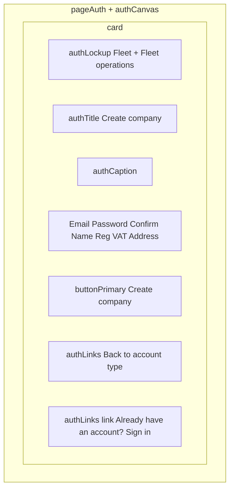

# Company sign-up

**Stories:** US-01 (after **US-77** chooses Company; landing **US-85** may deep-link)  
**Rules:** 1, 49–51, 117–119, 121; E1, E33, E34  
**Surfaces:** Web compact; mobile comfortable if creating the company on phone. Same IA.  
**Purpose:** Create **`account_kind = company`** tenant + first Owner with email, password, **company name**, **registration number**, **VAT number**, and **address**.  
**Chrome:** Unauthenticated [auth canvas](_patterns.md). No sidebar. **No public landing header** — lockup stays inside `authCard`.

**Entry:** Default from [account-kind.md](account-kind.md) → **Company**. Direct Company route allowed (Architect). **Individual** registration is a **separate** screen — [individual-sign-up.md](individual-sign-up.md). Do not merge both forms onto one page.

## Layout

- Web: vertically centered `authCanvas`; card `max-w-auth-card`. Longer form: card scrolls inside the canvas; primary stays reachable (scroll, do not cover with keyboard).
- Mobile: safe-area top, card full width inside `px-2`, not a second nested card.
- Company **name** + legal + address fields are required with Owner credentials.
- **Back to account type** in `authLinks` (`link`, `min-h-hit`) → [account-kind.md](account-kind.md). Include by default when user can still change kind before submit.

## Fields

| Field | Class | Notes |
| --- | --- | --- |
| Email | `label` + `input` | Email keyboard |
| Password | `label` + `input` | Secure; `caption` “At least 8 characters.” |
| Confirm password | `label` + `input` | Mismatch → `inputError` + `errorText` |
| Company name | `label` + `input` | Required non-empty (E33); max 120 |
| Registration number | `label` + `input` | Required non-empty (E33) |
| VAT number | `label` + `input` | Required non-empty (E33) |
| Address | `label` + `input` (multiline OK if product uses textarea styled as `input`) | Required formatted text (E33). **Manual entry always allowed.** |
| Address lookup (assist) | same Address control + optional results list | Free OSM/Nominatim-style only. Not paid maps. Not required to finish sign-up. |
| Submit | `buttonPrimary` full width | Busy “Creating…”; hover `buttonPrimaryHover` |

### Address lookup (page-local)

Assistive only — does not replace the Address field.

| Element | Spec |
| --- | --- |
| Trigger | Typing in Address **or** optional `buttonSecondary` / `buttonGhost` “Look up address” next to the field (`min-h-hit`) |
| While looking up | `caption` “Looking up address…”; do not block typing |
| Results | List under field on `bg-surface-raised` / hairline `border-border`; each row `min-h-hit`, `label` or `text-label` formatted suggestion |
| Select result | Fills Address with formatted text user can still edit |
| No results / fail (E34) | Calm `caption` or non-blocking `bannerWarning` in card: “Address lookup unavailable. Enter the address manually.” **Submit stays enabled** if Address non-empty |
| Offline lookup | Same as fail (E34); manual address still valid |
| Do not | Require lat/lon; embed slippy map; paid Places API; block submit solely because lookup failed |

## States

| State | UI |
| --- | --- |
| Default | Empty fields in `authCard` |
| Loading (submit) | Submit busy “Creating…”; fields disabled; form stays (no skeleton swap) |
| Missing required (E33) | Empty name / registration / VAT / address → that field `inputError` + `errorText` (e.g. “Company name is required.”). Company **not** created |
| Password &lt; 8 | Password `inputError` + `errorText` “Password must be at least 8 characters.” Company not created |
| Confirm mismatch | Confirm `inputError` + `errorText` “Passwords do not match.” |
| Duplicate email (E1) | `bannerDanger` in card + email `inputError`: “This email cannot be used.” Company not created |
| Lookup fail / empty (E34) | Non-blocking message above; user completes Address manually; valid submit still succeeds |
| Offline (submit) | `bannerWarning` “You are offline.”; submit `buttonDisabled` |
| Success | Company **Owner** home — Company Owner shell (Drivers + Admins available per role) |

- Field rule failures use `inputError` + `errorText`, not `bannerDanger`, except duplicate email (E1) which may combine banner + field.
- Submit client gate may require all required fields non-empty and passwords ≥ 8; server remains source of truth.

## Token usage

| Role | Token | Class |
| --- | --- | --- |
| Backdrop | canvas | `pageAuth` `authCanvas` |
| Card | surface-raised + raised | `authCard` |
| Lockup | mark-fill | `authLockup` `brandMarkAuth` `authWordmark` “Fleet” `authCaptionLockup` “Fleet operations” |
| Title | text-primary | `authTitle` |
| Supporting | text-secondary | `authCaption` — “Create the first Owner account for your company.” |
| Fields | border / focus / danger | `label` `input` `inputFocus` `inputError` `errorText` `caption` |
| Link | link | `authLinks` + `link` / `linkHover` / `linkFocus` / `linkPressed` — `min-h-hit`, underline at rest |
| Lookup fail | warning | `bannerWarning` or `caption` only (not danger) |

No new tokens. No hex.

## A11y

| Control | Name |
| --- | --- |
| Screen | Create company |
| Company name | Company name |
| Registration number | Registration number |
| VAT number | VAT number |
| Address | Address |
| Look up | Look up address |
| Suggestion | {formatted address suggestion} |
| Submit | Create company |
| Back | Back to account type |
| Sign-in link | Already have an account? Sign in |

- Password: `secureTextEntry`; errors in a live region.
- Lookup results: listbox/combobox pattern or focusable rows; Escape closes list without clearing typed address.
- Focus first field on web. `inputFocus` / `buttonFocus` rings.
- Safe area; keyboard avoiding — scroll the card, do not cover submit.
- Reduce-motion: no map animation; lookup list appears instantly.

## Related

| Path | Spec |
| --- | --- |
| Kind chooser | [account-kind.md](account-kind.md) |
| Individual (email + password only) | [individual-sign-up.md](individual-sign-up.md) |
| Public landing entry | [landing.md](landing.md) |
