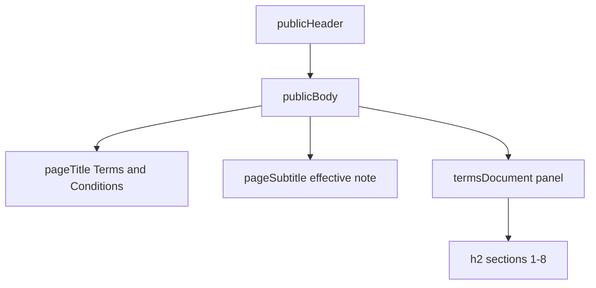

# Public Terms and Conditions (web)

**Stories:** US-105, US-106  
**Rules:** [business-rules.md](../../docs/business-rules.md) 162–167 (A116–A121, E94–E96)  
**Surface:** Web compact only. **No** Expo Terms chrome.  
**Purpose:** Static product **Terms and Conditions** for **Fleet**. Not Privacy. Not clickwrap. Not CMS.  
**Chrome:** Same public landing chrome as [landing.md](landing.md) / [pricing.md](pricing.md) — `pagePublic` + `publicHeader` + `publicBody` + `AppFooter` `public`. **Not** auth canvas, **not** authenticated shell.

## Purpose and density

| | |
| --- | --- |
| Density | Web compact. Header `h-app-bar`. Body `contentPadCompact` via `publicBody`. |
| Personality | Ops console legal-read: calm raised document panel on sunken canvas. No neon SaaS, no dense lawyer wall without hierarchy. |
| Identity | **Fleet** in header lockup. Page title **Terms and Conditions**. |
| Actions | Header: **Pricing** link; **Sign in** secondary; **Create account** primary. No “I agree” CTA on this page. |

## Layout

| Region | Spec |
| --- | --- |
| Page | `pagePublic` + `min-h-screen flex flex-col`. |
| Header | Same as pricing/landing: lockup → `/`; **Pricing** → `/pricing`; Sign in; Create account. **Terms** is not a header nav item (footer owns Terms). |
| Title | `pageTitle` **Terms and Conditions**. `pageSubtitle`: short product-owned note e.g. “Product terms for using Fleet. Not a substitute for legal advice.” |
| Document | `termsDocument` = `panel` + vertical stack `gap-3`, `max-w-prose` (or full public content width with readable measure). Single column. |
| Sections | Each section: `h2` with `sectionTitle` + one or more `body` paragraphs (`termsSection`, `termsSectionTitle`, `termsSectionBody`). Required section set (US-105 / A118): Service description; Accounts and tenancy; Acceptable use; Data and tenancy (high-level); Disclaimer; Limitation of liability; Changes to terms; Contact. |
| Meta | Optional last-updated caption under subtitle (`caption` / `text-text-secondary`). |
| Footer | `AppFooter variant="public"` including **Terms** current-capable link. |
| States | No session redirect off `/terms` for signed-in users (A117). Optional offline banner only if auth context already mounts it on public pages—prefer same Offline pattern as pricing if present. No loading skeleton for static body. No empty/error for copy. |
| a11y | One `h1`. Sections as `h2`. Focusable header/footer links `min-h-hit` + `shadow-ring`. Long page: natural scroll; skip-link not required this slice. |

## Copy tone (product draft)

- Calm enterprise English; sentence case headings matching product UI.
- Describe SaaS fleet ops: vehicles, drivers (company), compliance dates, handovers, daily usage—without inventing regulated-transport legal regimes.
- State tenant separation at a high level; **do not** replace a Privacy Policy (E94).
- Do **not** claim in-product card checkout / payment processing.
- Contact: generic product contact placeholder (e.g. support channel wording), not a fabricated law firm.

## Tokens / classes

| Class | Role |
| --- | --- |
| `termsDocument` | Raised readable document surface |
| `termsSection` | Section stack gap |
| `termsSectionTitle` | Section `h2` (alias/composition of `sectionTitle`) |
| `termsSectionBody` | Body copy in document |
| `termsMeta` | Effective / draft caption |

Reuse `pageTitle`, `pageSubtitle`, `publicBody`, `link`, `caption`. No hex.

## Out of scope UI

Privacy page, acceptance checkbox, PDF download, print-only stylesheet, multi-language switcher, CMS editor, mobile native screen.
