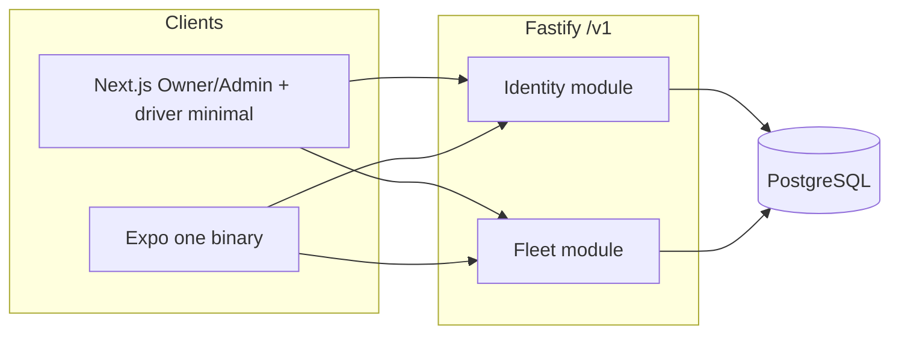
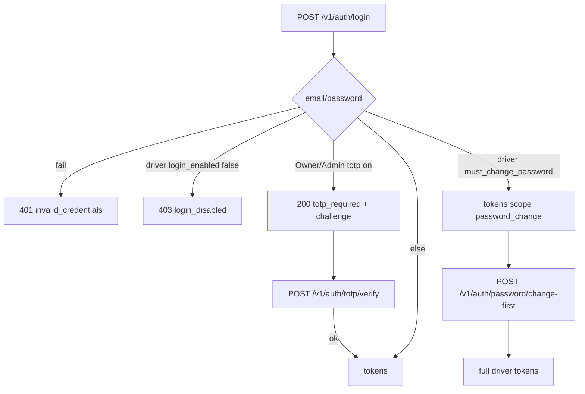

# Architecture — first slice

Senior Software Architect recommendation. No application code.

Sources: [requirements.md](requirements.md), [business-rules.md](business-rules.md), [stories.md](stories.md), [design/README.md](../design/README.md).

## 1. Context

Greenfield repo: BA + design only. No runtime, no database, no clients.

**Ask:** company tenancy, Owner/Admin auth (web + mobile) with optional TOTP, driver login on **web and mobile** with forced first password change and minimal driver home, vehicle compliance dates with expiry warnings.

**Not in this slice:** GPS ingest, dispatch, trips, geofences, document blobs, country-law catalog, SMS, second mobile binary.

Specialist defaults already in-repo (not invented here): Fastify + TypeScript API, PostgreSQL, Next.js App Router (web), Expo + NativeWind (one mobile app).

## 2. Quality attributes & constraints

| Attribute | Target this slice |
| --- | --- |
| Security | Email/password hashed at rest; TOTP secrets encrypted; no session until TOTP if enabled; driver token cannot call Owner/Admin APIs (E8); drivers may hold usable web sessions for auth + minimal home only |
| Tenancy | Every driver/vehicle/admin row scoped by `company_id`; cross-company reads/writes fail as not found or forbidden |
| Consistency | Sign-up is one transaction (company + Owner). Vehicle save is allowed with expired dates. Expiry flags are derived, not stored as source of truth |
| Latency | Interactive CRUD; no async bus required |
| Operability | Structured error codes; request id; single deployable API |
| Evolution | `vehicle.id` stable for later GPS; no ingest API now |
| Cost | One API process + one Postgres; no extra brokers |

**Constraints from BA/design:** unique email across all login identities; Owner-only Admin create; password min 8; 30-day warning window; dates only; one Expo binary role shells; drivers web + mobile for auth/minimal home only (not Owner fleet UI).

## 3. Options

### A. Modular monolith (one Fastify app, one Postgres)

One bounded context in-process: Identity, Fleet. HTTP `/v1`. Next.js and Expo are clients only.

| | |
| --- | --- |
| Benefits | Fits slice size; one auth story; transactions for sign-up; lowest ops |
| Costs | Later GPS ingest shares process until extracted |
| Coupling | UI must not own rules; all authorization in API |
| Failure | API down = all clients down |
| Wrong fit | Multi-team, independent GPS scale **today** (not the case) |

### B. Split Identity service + Fleet service + message bus

| | |
| --- | --- |
| Benefits | Isolate auth; future GPS as third service |
| Costs | Distributed sign-up, extra authz, no volume to justify |
| Failure | Partial outage, dual writes |
| Wrong fit | First slice, empty repo, no dispatch/tracking yet |

### C. BFF per client (Next.js server as API, Expo talks to another BFF)

| | |
| --- | --- |
| Benefits | Cookie sessions on web without exposing tokens |
| Costs | Duplicate rules; driver vs Owner logic drifts; E8 enforced twice |
| Wrong fit | Two clients must share US-02…US-16 |

## 4. Recommendation

**Option A.** One Fastify `/v1` API is the system of record. Next.js and Expo call it. Postgres owns data.

- **Identity:** company, principals (Owner, Admin, Driver), credentials, TOTP, sessions, password reset.
- **Fleet:** vehicles + compliance dates + optional **vehicle.mileage** + **vehicle handovers** (Out/In, damage images — [ADR-015](adr/ADR-015-vehicle-handovers.md)) (master odometer reading; unit derived from country — [ADR-014](adr/ADR-014-vehicle-mileage.md)); expiry computed on read; **optional side appearance images** (paths in Postgres, bytes in **Supabase Storage** via API **S3 gateway** / `OBJECT_STORAGE_*` — [ADR-013](adr/ADR-013-vehicle-side-images.md)).
- **No event bus.** Reserve in-process hooks later for `vehicle.created` if tracking needs it.
- **Auth:** opaque refresh + short-lived access token (see ADR-002). Same contract for web and mobile. Next.js may store refresh in httpOnly cookie as a **client** detail; API still Bearer-access.
- **Clients:** Next.js = Owner/Admin management **+** driver minimal shell. Expo = role shells after login. API enforces; UI hides Owner nav for drivers (defense in depth). Local orchestration is Turborepo on npm workspaces; Expo Metro (`npm run dev:mobile`) runs in a dedicated TTY so the QR prints ([ADR-006](adr/ADR-006-turborepo-orchestration.md)).

Revisit A→extract **Ingest** service when GPS exists (new BA + ADR), not by splitting Identity now.

## 5. Architecture sketch

**Data ownership**

| Entity | Owner module | Notes |
| --- | --- | --- |
| `company` | Identity | Created only via register |
| `principal` | Identity | `role`: `owner` \| `admin` \| `driver`; unique `email`. Hard delete (US-27) **removes** driver principal rows; not soft-delete. |
| `credential` | Identity | password hash; driver flags `must_change_password`, `login_enabled` (disable only; US-16). Removed with principal on hard delete. |
| `totp` | Identity | Owner/Admin only; enabled only after confirm |
| `session` / refresh | Identity | Access token carries `principal_id`, `company_id`, `role`, `must_change_password`. Refresh rows carry absolute `expires_at` (**14 days** from family start; US-29 / [ADR-002](adr/ADR-002-auth-sessions.md)). **Multiple families per principal** allowed (US-30: web+mobile / multi-device). Logout revokes one family. On driver hard delete: revoke all refresh for that principal; auth **fail closed** if `sub` missing ([ADR-008](adr/ADR-008-driver-hard-delete.md)). Clients silent-refresh on access expiry; forced re-auth at absolute expiry or that family’s revoke. |
| `password_reset` | Identity | Owner/Admin only |
| `vehicle` | Fleet | `company_id`; `id` UUID never recycled |

**Control flow — sign-in**

**Expiry:** Fleet read model adds `warnings[]` per vehicle. Rule: date not null AND (date < today OR date ≤ today+30). Calendar dates, **UTC date** comparison (timezone not in BA — flagged below).

**Vehicle mileage (US-45–US-50):** Optional `mileage` on vehicle row; `mileage_unit` derived on read via same country rules as driver odometer (A34). Not auto-synced from `driver_travel_selections`. Details: [ADR-014](adr/ADR-014-vehicle-mileage.md), [contracts/http-v1.md](contracts/http-v1.md).

**Sync:** All this slice is request/response. No consumers. Driver hard delete is Identity request/response only (no outbox).

**Driver hard delete (US-27):** `DELETE /v1/drivers/:id` in Identity. Owner/Admin, same company. Physical remove of driver principal; Fleet **no-op** (vehicles unchanged). Distinct from `PATCH` `login_enabled`. Details: [ADR-008](adr/ADR-008-driver-hard-delete.md), [contracts/http-v1.md](contracts/http-v1.md).

## 6. Risks & open questions

| Risk | Mitigation |
| --- | --- |
| Clients skip API checks | API is source of truth; FE only UX |
| Challenge token phishing | One-time, short TTL, bound to principal |
| Email enumeration on register | Register returns 409 `email_in_use` (BA E1 tells the user). Reset stays generic 202 |
| Refresh theft on mobile | Rotate refresh; reuse detection revokes family |
| Deleted driver keeps using access JWT | Fail closed when principal missing; revoke all refresh on delete (ADR-008) |
| GPS later on same DB | Keep `vehicle.id` UUID; do not embed telemetry on vehicle row |
| Clock / TZ for “today” | Default UTC date; revisit if BA sets company timezone |

**Still BA-open (do not invent product):** extra driver fields, company name, required vehicle fields, driver password reset, Owner count > 1. Contracts below use **email + password** and **all vehicle fields optional except make + model + plate** as implementable minimum — Backend must treat empty dates as “no warning”, matching design.

## 7. Artifacts

| File | Role |
| --- | --- |
| [adr/ADR-001-system-boundaries.md](adr/ADR-001-system-boundaries.md) | Monolith + clients |
| [adr/ADR-002-auth-sessions.md](adr/ADR-002-auth-sessions.md) | Tokens, TOTP, first-login |
| [adr/ADR-003-tenancy-principals.md](adr/ADR-003-tenancy-principals.md) | Company, roles, unique email |
| [adr/ADR-004-compliance-dates.md](adr/ADR-004-compliance-dates.md) | Dates + derived warnings |
| [adr/ADR-005-clients.md](adr/ADR-005-clients.md) | Next.js vs Expo |
| [adr/ADR-006-turborepo-orchestration.md](adr/ADR-006-turborepo-orchestration.md) | npm workspaces + Turbo; Expo QR on its own TTY |
| [adr/ADR-008-driver-hard-delete.md](adr/ADR-008-driver-hard-delete.md) | Driver hard delete vs disable; session revoke |
| [contracts/http-v1.md](contracts/http-v1.md) | Routes, bodies, error codes |

**Next specialist (US-27):** Senior Backend Specialist — Identity `DELETE /v1/drivers/:id` + session fail-closed against contract and BA AC. Fleet no-op. Do not start Next.js/Expo until that slice passes tests. Then Senior Frontend Specialist per [design/pages/drivers.md](../design/pages/drivers.md).
