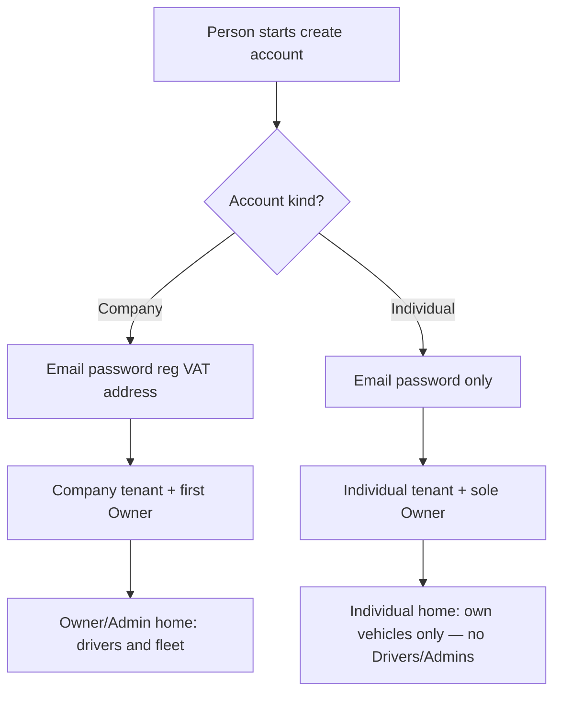
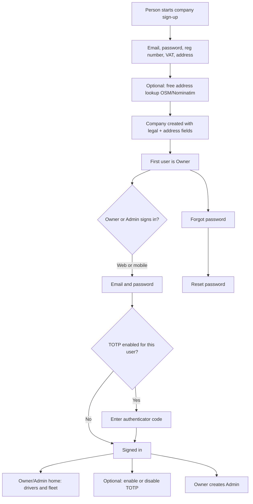
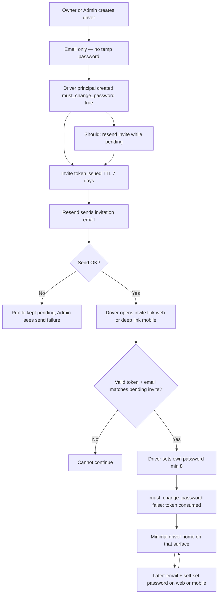
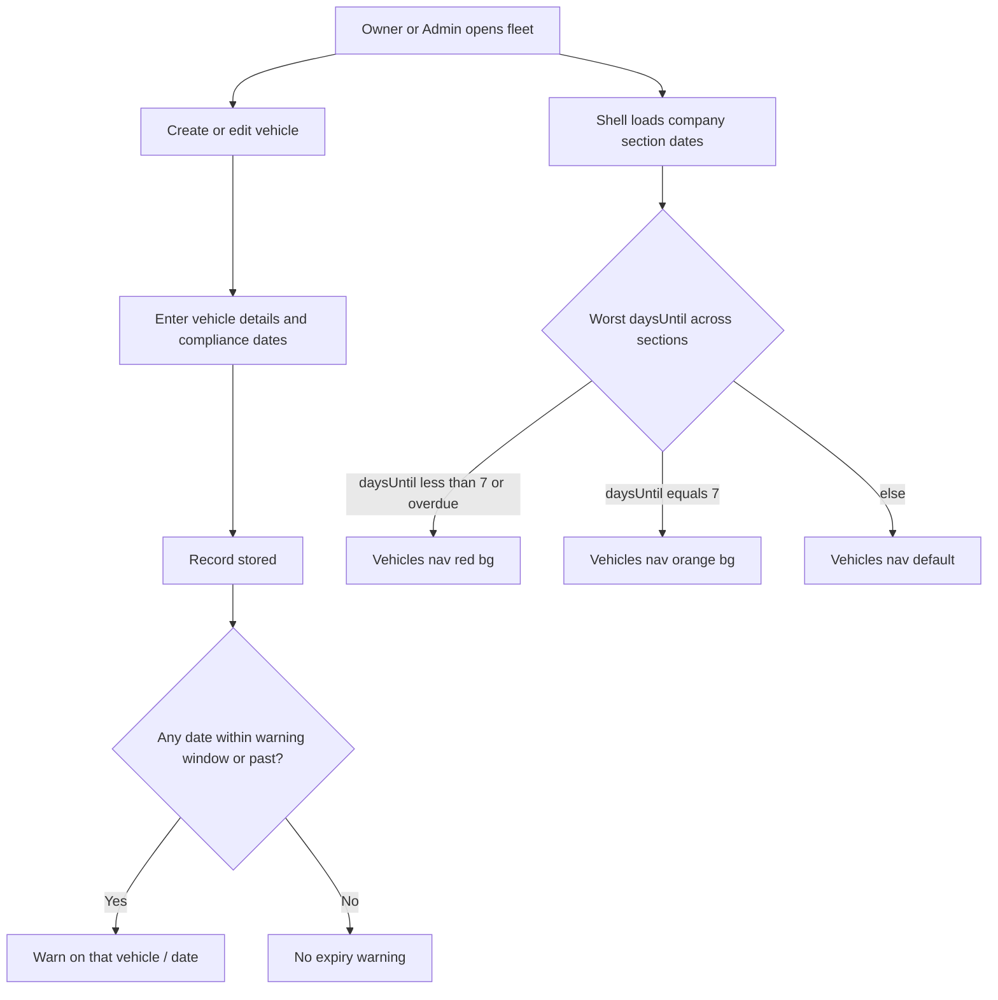

# Fleet operations — first slice

Auth, driver profiles, and vehicle records. Dispatch and live tracking are out of this slice.

## 1. Problem & outcome

**Who is hurting**  
A company that runs vehicles and drivers has no shared place to:

- Create the company (with legal registration details and address) and let Owners/Admins sign in (web and mobile), reset password, and optionally use authenticator-app MFA.
- Invite drivers by email (no Admin-set temporary password); drivers receive an invitation via **Resend**, create their own password, then sign in on **web and mobile**.
- Keep vehicle records (make/model, plate, optional current mileage/odometer reading, insurance, inspection dates, country of registration, road tax) and see when those dates are about to expire.
- Record **vehicle handovers** (**Out** when taking / **In** when returning) with mileage, next-service days/distance, optional damage notes and photos; let Owner/Admin review handover history on the vehicle.
- Let drivers log **Daily usage** in two independently savable parts — **Day Start** (open) and **End of Day** (close) — with optional **refuel amount** and **refuel at mileage**, against their **active next-travel** vehicle.
- Let **Individuals** self-register a **personal** account (not a company) and manage **their own vehicles** with compliance dates—without inviting drivers or running a multi-driver org.

**What success looks like**

- A company can register with Owner email/password plus **company registration number**, **VAT number**, and **address** (assistive free address lookup allowed); the first person is the Owner.
- Owner/Admin can sign in on **web** and **mobile**, reset password, and optionally turn TOTP MFA on or off.
- Owner can create additional Admins.
- Owner/Admin can create and edit driver profiles by **email only**; system sends an **invitation email via Resend**; driver **creates their own password** via invite accept (web + mobile). **No temporary password** for new drivers.
- If an email is **not** a pending invited driver (or valid invite), the person **cannot** continue invite accept / password setup on web or mobile.
- Owner/Admin can **hard-delete** a driver profile (permanent remove). **Disable login without delete** remains available as Should (US-16).
- After the driver accepts the invite and sets a password, later logins use that password on web or mobile (no MFA for drivers). Post-auth driver UX is **minimal home** only (not Owner/Admin fleet UI).
- Owner/Admin can create and edit vehicles and compliance **dates**; the product **warns** when insurance, inspection, road tax, or registration is within the warning window or already expired.
- Owner/Admin can optionally record **current vehicle mileage** (odometer reading) on the vehicle; unit is **Miles** or **Kilometers** from **country of registration** (same rule as driver odometer). Empty/unknown allowed. Driver next-travel odometer remains a separate selection row, but a successful travel save **also** updates vehicle current mileage (write-through).
- Owner/Admin **edit vehicle** opens with fields **prepopulated** from stored data; **create** stays blank.
- Owner/Admin can attach **optional appearance photos** of a vehicle from **four sides** (**FRONT**, **LEFT**, **RIGHT**, **BACK**): at most one image per side, replace or clear per side. Files live in **Supabase Storage**; the product stores **references** (path/URL), not file bytes in the database. **Not** insurance/inspection/tax/registration document upload.
- **Vehicles** nav (web side nav + mobile Owner/Admin tabs) shows **orange** when any company section date is **exactly 7 days** out and **red** when any is **&lt; 7 days** or overdue (fleet-wide worst-wins); list/detail keep the 30-day warnings.
- Drivers never see Owner/Admin screens; people who are not signed in cannot open fleet or driver records.
- A signed-in **driver** can **select a company vehicle for their next travel** and record the current **odometer** reading. Odometer unit is **miles or kilometres** based on the vehicle’s **country of registration** (not a free choice by the driver). Successful next-travel save **updates vehicle current mileage** so Owner/Admin list/detail reflect it (monotonic when mileage already set).
- With an active next-travel vehicle, a driver can complete **Handover Out** and **Handover In** (required mileage, next service days, next service distance; optional damages text/images). Successful handover **updates vehicle current mileage**.
- **Service approaching / due:** Owner/Admin **Service due** board and **notification menu** signal vehicles **approaching** service when remaining distance is **≤ 2000** (same unit as odometer / next_service_distance) and still list fully **due/overdue** from handover next-service days/distance. In-app only this slice (no OS push/SMS; compliance digest email not extended).
- **Open Out incomplete:** Driver who holds an **open Out** (In not done) gets a clear **driver home / handover** cue. **Company** Owner/Admin see **open_out** items in the **notification menu** (vehicle + driver when known). No OS push/email/SMS for open Out this slice. Individual open-Out path N/A.
- With an active next-travel vehicle, a driver can log **Daily usage** as **Day Start** then **End of Day** (independently savable). Day Start requires date, start place, start distance, start time (creates **open** row). End of Day requires end place, end distance, end time (closes the open row). Optional **refuel amount** and **refuel at mileage** on either save. Multiple **closed** entries per day allowed; at most one **open** per driver. **Does not** update vehicle mileage. Driver lists **own** entries (open + closed).
- Owner/Admin vehicle UI has a **third tab Handovers** (history + detail, read-only). **Drivers do not** see that tab. **Company** Owner/Admin Daily usage report + CSV include status and refuel fields (US-96).
- An unsigned-in person can choose **Company** or **Individual** account creation.
- **Company** path still creates an organization with registration number, VAT, address, and first **Owner**.
- **Individual** path creates a **personal workspace** owned by that user (Owner of an individual-kind tenant) with email/password only—**no** company legal entity fields.
- **Only Company** Owner/Admin may invite and manage **drivers**. Individuals cannot.
- Individuals may create/edit **their own vehicles** and see compliance warnings (same date fields/window as company fleet, scoped to their workspace).
- All tenants created before this slice remain **Company**.

## 2. Actors & stakeholders

| Actor | Who they are | What they do in this slice |
| --- | --- | --- |
| **Company (org tenant)** | Fleet organization with `account_kind = company`, created via **Company** sign-up | Owns drivers, vehicles, and company users. Holds registration number, VAT, and address. Not a login principal. |
| **Individual workspace (personal tenant)** | Personal tenant with `account_kind = individual`, created via **Individual** sign-up | Owns only that individual’s vehicles and sole Owner user. **No** company legal fields required. **No** drivers roster. |
| **Owner** | First user at **Company** or **Individual** sign-up | **Company Owner:** legal signup; Admins; drivers; fleet—as today; **read-only vehicle handover history**. Last Owner cannot be removed (A5). **Individual Owner:** personal signup; own vehicles only; **no** Admins; **no** driver invite/manage. Both: web + mobile sign-in, reset password, optional TOTP. |
| **Admin** | Created by a **Company** Owner only | Same operational work as Company Owner for drivers (invite, including hard-delete) and fleet; **read-only vehicle handover history**; signs in web + mobile; reset password; optional TOTP. Does not create the company. Does not create other Admins (A10). **Admin exists only on Company tenants this slice.** |
| **Driver** | Profile invited by **Company** Owner/Admin | Receives invite email (Resend); accepts invite with token + own password on **web and mobile**; later signs in with email + self-set password; **minimal driver home** including **select vehicle for next travel + odometer**, **Handover Out/In**, and **Daily usage** on the selected vehicle; no MFA; no Owner/Admin fleet admin screens or Handovers history tab. Cannot start accept if email/invite is not valid in the system. **Drivers exist only on Company tenants this slice.** |
| **Invitee (not in system)** | Person with no pending driver invite / unknown email | Must **not** be able to continue invite accept or password setup on web or mobile. |

**Not in this slice:** dispatcher, mechanic.

## 3. As-is vs to-be

**As-is:** Only company sign-up (always org + legal fields + Owner). No Individual self-registration.

**To-be — account kind choice and Individual start**

**As-is:** Product used Admin-set **temporary password** create-driver (legacy US-07) and company sign-up with email/password only. That temp-password path is **retired** for new drivers in this slice.

**To-be — company start and Owner/Admin access**

**To-be — driver invite and access**

**To-be — fleet records and expiry warning**

## 4. Scope

### In scope

Web **application footer** chrome on public, auth, Owner/Admin, and driver shells: product name + copyright; secondary links to existing public routes including **Terms** (`/terms`) and **Privacy** (`/privacy`) (US-100–US-103, US-106, US-108). Signed-in OA footer uses **Billing** (`/billing`) instead of **Pricing** (US-104). Public **Terms and Conditions** at `/terms` (US-105) and **Privacy** notice at `/privacy` (US-107)—static product copy, public chrome like `/pricing`; no API. Global operations: Privacy covers personal-data processing at a product-draft level (not lawyer-certified CMS).

Account-kind split at signup (**Company** | **Individual**); Individual self-register + personal workspace; Individual own-vehicle management (compliance-lite); Company-only driver invite/admin; grandfather existing tenants as Company. Auth + company (reg number, VAT, address + free lookup assist), Owner/Admin users, driver **invite via Resend**, driver **self-set password** on accept (web + mobile), subsequent driver login, minimal home, hard delete of driver profiles, vehicle records with compliance dates, optional **current vehicle mileage**, and expiry warnings, optional vehicle side appearance images (FRONT/LEFT/RIGHT/BACK) via Supabase Storage references, driver **Handover Out/In** (mileage, next service days/distance, optional damages text + images), Owner/Admin **Handovers** history tab on vehicle (read-only), driver **Daily usage** create + own list (gated on active next-travel).

### Commercial catalog (definition only)

Paid **pricing plans** (2 Individual + 2 Company) are defined in [pricing-plans.md](pricing-plans.md) for packaging and competitive positioning. **Metering, checkout, entitlements enforcement, and Stripe (or equivalent) are not in the current engineering slice** until a dedicated billing feature is scheduled.

### Out of scope

- Expo / mobile native footer or tab-bar footer
- Other legal pages beyond approved **Terms** (`/terms`) and **Privacy** (`/privacy`); lawyer-certified legal CMS; in-product DSAR workflow / rights portal
- Footer app version / environment badge
- Footer PII or tenant branding
- Terms or Privacy clickwrap / must-accept gate before sign-up or use

- Individual inviting or managing drivers; Admins on Individual workspaces
- Converting Individual ↔ Company; multi-Owner Individual workspaces
- Individual-as-driver operational shell (next-travel / handover / daily usage) in lieu of Owner vehicle admin
- Individual KYC, tax IDs, or required display name
- **Billing implementation** (payment provider, invoices, entitlement hard-blocks in API); marketing CMS. **Plan catalog** lives in [pricing-plans.md](pricing-plans.md). **Public pricing page** (`/pricing`, US-91–US-92) is in scope as static catalog UI only—not checkout
- Dispatch, live tracking, geofence, multi-stop trip planning. **Exception:** structured **Handover Out/In** (US-51+) and **Daily usage** day logs (US-61+) are in scope (not full dispatch)
- Edit/delete historical handovers; Owner/Admin-created handovers; driver access to Owner Handovers admin tab
- Owner/Admin Daily usage reporting/export; edit/delete of Daily usage; GPS auto-fill of places; photos on Daily usage; auto write-through of Daily usage distances to `vehicle.mileage`
- Dispatcher or mechanic roles
- Two separate mobile store listings / two apps
- Driver fleet / Owner-Admin management UI (drivers still get auth + minimal home only on web)
- Driver MFA
- Built-in legal catalog of country regulations
- Compliance **document** file upload (insurance/inspection/tax/registration PDFs or scans). **Exception:** vehicle **side appearance** images (US-35–US-39) are in scope and are not compliance documents
- SMS MFA / SMS invites
- **Temporary password** path for new drivers (retired)
- Paid maps / Google Places (or other paid geocoding) for address lookup
- Soft-delete / restore of drivers; in-product audit history for deletes; bulk driver delete; driver self-delete
- Delete of Owner/Admin users (except existing last-Owner protection only)
- Driver self-serve password reset (still A9 unless later decided)
- Global sign-out-everywhere
- mi↔km conversion when country of registration changes
- Driver direct write via fleet vehicle POST/PATCH (travel/handover write-through only)

### MoSCoW

| Priority | Item |
| --- | --- |
| **Must** | Signed-in OA footer **Billing** replaces **Pricing**; web `/billing` placeholder without checkout (US-104) |
| **Must** | Web footer on public, auth, OA shell, driver shell with **© year Fleet** (US-100–US-102) |
| **Must** | Public **Terms and Conditions** at `/terms` with required section set (US-105); no acceptance gate this slice |
| **Must** | **Terms** footer link on **all** web footer variants (public, auth, OA, driver) (US-106) |
| **Must** | Public **Privacy** notice at `/privacy` with required section set for global ops (US-107); no acceptance gate |
| **Must** | **Privacy** footer link on **all** web footer variants (US-108) |
| **Should** | Footer other secondaries: Home/Landing and Pricing or Billing per session (US-103, US-104) |
| **Won't** | Mobile/Expo footer; version badge; legal CMS; Terms/Privacy clickwrap; in-product DSAR portal |
| **Must** | Signup entry offers **Company** vs **Individual** account kind |
| **Must** | Company signup unchanged (email, password ≥8, reg, VAT, address) → company tenant + Owner |
| **Must** | Individual signup: email + password ≥8 only (no reg/VAT/company address) → personal tenant + Owner |
| **Must** | Email uniqueness across all login identities (A6) |
| **Must** | Only **Company** Owner/Admin create/invite/manage/hard-delete drivers |
| **Must** | Individual **cannot** invite drivers, open Drivers admin, or create Admins |
| **Must** | Individual Owner: own vehicles CRUD, compliance dates/warnings, optional mileage, side images, Vehicles nav urgency on **own** fleet |
| **Must** | Individual Owner: sign-in web+mobile, password reset, optional TOTP (same as Owner auth) |
| **Must** | Existing companies/users treated as **Company**; no forced re-signup |
| **Must** | Authz/tenancy on API; clients do not invent rules |
| **Should** | Landing/copy distinguishes Create company vs Create personal account |
| **Should** | Clear empty/deny when Individual hits driver-only surfaces |
| **Won't** | Individual invites drivers; Individual→Company convert; dual membership; Individual-as-Driver hybrid; paid maps; CMS |
| **Must** | Company sign-up creates company + first Owner with email, password, **company registration number**, **VAT number**, and **address** |
| **Must** | Address entry supports **assistive free lookup** (OpenStreetMap / Nominatim-style); store formatted address text (lat/lon optional) |
| **Must** | Owner/Admin sign-in on web and mobile |
| **Must** | Stay signed in on web and mobile: short-lived access tokens renew **silently** via refresh (Owner/Admin and Driver) |
| **Must** | Full re-login at most about every **14 days** per refresh-token family (or earlier on this-client sign-out / security end) |
| **Must** | Owner/Admin password reset |
| **Must** | Owner/Admin optional TOTP (authenticator app only); enable and disable |
| **Must** | Owner creates additional Admins |
| **Must** | Owner/Admin create driver by **email only**; invitation email via **Resend**; **no** temporary password |
| **Must** | Driver accepts invite (token from email link / mobile deep link), creates own password (≥ 8), then reaches minimal driver home on that surface |
| **Must** | Unknown / non-invited email **cannot** continue invite accept or password setup (web and mobile) |
| **Must** | Subsequent driver login on **web and mobile** with self-set password; minimal driver home (not Owner fleet UI) |
| **Must** | One mobile product; after login, driver vs Owner/Admin experience by role |
| **Must** | Owner/Admin create and edit vehicles: make, model, license plate, insurance, inspection needed (Admin-entered dates), country of registration, road taxes |
| **Must** | Owner/Admin optional vehicle **mileage** (current odometer reading): null allowed; if set ≥ 0 max 1 decimal |
| **Must** | Vehicle **mileage unit** derived from country of registration (A34); read-only; labels Miles / Kilometers |
| **Must** | Mileage on Owner/Admin vehicle list/detail/create/edit when present; create/edit can set or clear |
| **Must** | Country is a field on the vehicle; no regulation catalog |
| **Should** | Driver company vehicle list may show current vehicle mileage read-only |
| **Must** | Driver **Handover Out** when taking selected (active next-travel) vehicle |
| **Must** | Driver **Handover In** when returning vehicle (closes open Out) |
| **Must** | Handover required fields: mileage; next service days; next service distance (unit from country) |
| **Must** | Optional damages text + optional damage images (multi, caps) linked to handover and vehicle |
| **Must** | Out→In pairing; one open Out per vehicle; one open Out per driver; same driver closes In |
| **Must** | Successful handover updates `vehicle.mileage` (monotonic rules) |
| **Must** | Successful driver next-travel PUT updates `vehicle.mileage` from odometer (monotonic when set); drivers still cannot POST/PATCH fleet vehicles |
| **Must** | Owner/Admin third vehicle tab **Handovers**: history + detail read-only (web + mobile) |
| **Must** | Drivers cannot see Handovers history tab / company handover admin |
| **Must** | Driver home / handover shows open Out / need-In cue when driver holds open Out (US-60, US-110) |
| **Must** | Service-due board includes **approaching** (`0 < distance_remaining ≤ 2000`) and existing due/overdue (US-97) |
| **Must** | OA notification menu sources extend to **service** + **open_out** (Company); in-app only (US-109, US-111) |
| **Won't** | OS push / SMS / new email for service approaching or open Out this slice |
| **Must** | Driver **Day Start** when active next-travel exists (web + mobile); creates open Daily usage |
| **Must** | Driver **End of Day** completes open row (web + mobile); no open → reject |
| **Must** | Day Start fields: date, start place, start distance, start time; End of Day: end place, end distance, end time |
| **Must** | Optional refuel_amount + refuel_at_mileage on either save; unit L/gal from A34; no cost/type |
| **Must** | Distance unit from country (A34); end ≥ start on close; start ≥ max(vehicle.mileage, latest closed end on vehicle); end time ≥ start time same date |
| **Must** | At most one open per driver; multiple closed per day OK; driver lists own open+closed; closed immutable; open only via End of Day |
| **Must** | Daily usage does **not** update `vehicle.mileage` |
| **Must** | Offline: Day Start and End of Day submit disabled with warning |
| **Must** | Company OA Daily usage report/CSV includes status + refuel fields |
| **Should** | Driver home hub cue for Daily usage when next-travel active |
| **Must** | Store compliance dates and warn on expiry |
| **Must** | Edit vehicle form prepopulated from stored vehicle (web + mobile); create stays blank |
| **Must** | Vehicles web side nav + mobile Owner/Admin tab urgency: orange at daysUntil = 7, red when daysUntil &lt; 7 or overdue (worst-wins, company only) |
| **Must** | Driver cannot open Owner/Admin screens |
| **Must** | Unauthenticated person cannot open fleet or driver management |
| **Must** | Owner/Admin hard-delete driver profile (irreversible; ends that identity’s access) |
| **Must** | Owner/Admin optional vehicle side images: FRONT, LEFT, RIGHT, BACK; one per side; replace; clear; web + mobile |
| **Must** | Side image files in Supabase Storage; product stores references only (no DB blobs) |
| **Must** | Side images: any image type; max 5 MB each; non-image rejected; optional on create/edit |
| **Must** | Confirm modal before any delete of a user-visible asset or record (standing pattern; driver hard-delete, side-image clear, future deletes) |
| **Must** | Side-image clear (filled side): icon control opens confirm; delete runs only after confirm (web + mobile) |
| **Should** | Resend invitation for drivers still pending invite accept |
| **Should** | Disable driver login without deleting the driver profile |
| **Should** | Vehicle list compact cue when any side image exists (not a four-side gallery on the list) |
| **Won't** | Dispatch/tracking; extra roles; SMS MFA/invites; driver MFA; driver fleet UI; legal catalog; compliance document upload; multi-image per side; driver-managed vehicle images; temp password for drivers; paid maps APIs; soft-delete/restore drivers; bulk driver delete; driver self-delete; audit history for deletes; sliding extension of the 14-day session window; logout-everywhere; device/session list UI; auto-sync travel odometer → vehicle.mileage; user-chosen mileage unit; auto-convert mi↔km on country change; edit/delete historical handovers; Owner/Admin create handover; driver Handovers admin tab; damage images as side-appearance slots |

## 5. Open questions & assumptions

See [business-rules.md](business-rules.md) for numbered rules. Assumptions and open questions:

### Assumptions

| ID | Assumption |
| --- | --- |
| A1 | Expiry warning window is **30 days** for **insurance, inspection, and road tax** only. |
| A2 | Compliance **documents** (insurance/inspection/tax/registration/other files) are **in scope** (vault US-93/94; product hard cap). **Vehicle side appearance images** (FRONT/LEFT/RIGHT/BACK) remain separate and are **not** compliance documents **(A35–A40)**. |
| A3 | *(Retired)* Temp-password reuse rule. Superseded by invite + self-set password; no Admin temp password to reuse. |
| A4 | Minimum password length is **8** for all passwords in this slice (Owner/Admin, driver on invite accept). |
| A5 | Last Owner cannot be deleted/removed. |
| A6 | Email is unique per login identity (Owner, Admin, and driver). |
| A7 | Disable driver login without deleting profile is **Should**. |
| A8 | Owner/Admin only access **their company’s** drivers and vehicles. |
| A9 | Password reset in this slice is for **Owner/Admin**, not drivers, until decided. |
| A10 | Admin **cannot** create other Admins (only Owner can). |
| A11 | Vehicle save is allowed even if a date is expired or inside the warning window; warning still shows. |
| A12 | “Car inspections needed based on country regulations” means Admin **enters** inspection date(s) they believe are needed; the product does **not** compute legal due dates from country. |
| A13 | **`registration_on`** may still be stored on the vehicle but is **not** used for expiry warnings or Vehicles nav urgency. |
| A14 | No additional Owners after the first in this slice (not requested). |
| A15 | Until invite is accepted and password set, driver has **`must_change_password: true`** and **no usable password**; they cannot use driver home or complete normal password sign-in. Accept sets password and clears the flag. |
| A16 | Owner/Admin feature parity on web and mobile for auth, drivers, and fleet in this slice. |
| A23 | Driver **auth parity** web↔mobile for invite accept / set password / subsequent login / minimal home only—not fleet parity. Web post-auth is minimal shell (identity + sign-out); no vehicles, drivers admin, Admins, TOTP settings, or Owner nav. |
| A17 | Hard delete of a driver profile is **Must**, **irreversible**, and **not** soft-delete/restore in this slice. |
| A18 | No required in-product audit trail for who deleted a driver in this slice. |
| A19 | This slice has **no** driver–vehicle assignment; deleting a driver does not change vehicles. |
| A20 | Vehicles **nav** urgency bands: **red** when any section `daysUntil &lt; 7` (incl. overdue); **orange** when no red and any section `daysUntil = 7`; worst-wins. Does **not** replace the 30-day list/detail window (A1). |
| A21 | Edit vehicle **prepopulate** is Must on web and mobile Owner/Admin. |
| A22 | Nav urgency uses the **same three** section dates as rule 19 (`insurance_on`, `inspection_on`, `road_tax_on`). |
| A24 | Invite is an **opaque token** in the email link (web URL and mobile deep link). Token is **single-use** on successful accept; **TTL 7 days** from issue; **resend rotates** token and restarts TTL. |
| A25 | Accept requires a **valid, unexpired, unused** token bound to that driver email. Email shown/entered on accept must match the invited driver. Unknown emails cannot start password setup. |
| A26 | **Create-time invite send is Must.** If Resend fails after the driver profile is created, **keep the profile** in pending-invite state (`must_change_password` true) and **surface send failure** to Owner/Admin so they can retry (**Should** resend). Do not roll back the driver solely because email failed. |
| A27 | Invitation delivery channel is **email via Resend** only in this slice (no SMS). |
| A28 | No temporary password is set or shown to Admin for new drivers. |
| A29 | Company **name**, **registration number**, **VAT number**, and **address** are **required** strings on sign-up (name max 120; other caps as product limits). |
| A29a | Existing **company** tenants with empty name: **Owner** must set name via prompt; Admin not required. |
| A30 | Address **lookup** is client-side free Nominatim/OSM-style assist; user may also type free-text. Stored value is **formatted address text**; **lat/lon optional**, not required. |
| A31 | Paid geocoding / Google Places is **out of scope**. Product does not require server-side paid maps. |
| A32 | Access token is **short-lived** (product default **~15 minutes**). Absolute **refresh-family** lifetime is **14 days** from family start; refresh rotation **does not** extend `expires_at`. |
| A35 | Exactly four sides: **FRONT**, **LEFT**, **RIGHT**, **BACK**. No other side keys in this slice. |
| A36 | Side images are **optional**; create/edit may omit any or all sides. |
| A37 | **One** image per side; a new upload **replaces** the previous for that side. |
| A38 | Binary files in **Supabase Storage**; fleet record stores **reference(s)** only (path and/or URL as implemented)—**not** Postgres/file blobs in-app DB. |
| A39 | Allowed types: **any image type** (not limited to JPEG/PNG/WebP); max **5 MB** per image. **Non-image** files and oversize files rejected for that side. |
| A40 | Owner/Admin **clear** removes that side’s reference and the product **must not** keep presenting that image; storage object is removed or equivalent cleanup. **Clear of a filled side requires confirmation (A41) before the clear runs.** Drivers have **no** side-image manage UI; next-travel list does **not** require side images this slice. List gallery is **Should** presence only. |
| A41 | **Confirm-before-delete** is **Must** for in-product actions that **delete** user-visible assets or records (e.g. hard-delete driver, clear vehicle side image, and any future delete). First control activation opens confirm only; Cancel/dismiss makes no change. Does not require confirm for non-delete flows (e.g. disable login) unless those stories say so. |
| A42 | Vehicle **mileage** = optional **current odometer reading** on the fleet vehicle record. Product field label is the unit (**Miles** / **Kilometers**). API/storage concept name: **`mileage`**. |
| A43 | Driver **next-travel odometer** (`driver_travel_selections`) remains a **separate selection row**. Successful `PUT /v1/driver/travel` **does** write-through parsed odometer to `vehicle.mileage` (same transaction; monotonic when mileage set). Drivers still **cannot** POST/PATCH fleet vehicles. |
| A44 | Driver read-only display of vehicle.mileage is **Should**, not Must. |
| A45 | **Handover Out** starts open vehicle custody; **Handover In** closes it. Pair = Out → In on the same vehicle. |
| A46 | Driver may create handovers only for the vehicle of their **active next-travel selection** (US-33). No separate assignment entity this slice. |
| A47 | At most **one open Out** per **vehicle** and per **driver**. In must be by the **same driver** who created the open Out. |
| A48 | **Mileage**, **next_service_days**, **next_service_distance** are **required** on both Out and In. |
| A49 | **Damages text** optional. **Damage images** optional. Images do **not** hard-require text. |
| A50 | Damage images: **1–10** per handover; image types; **max 5 MB** each. Object storage + DB references; linked to **handover_id** and **vehicle_id**. |
| A51 | Units for handover mileage and next_service_distance derived from vehicle **country of registration** (A34)—not driver-chosen. Store value + unit at write. |
| A52 | On successful Out or In, **update `vehicle.mileage`** to the handover mileage. Travel PUT also write-throughs (A43). Daily usage does **not** (A62). |
| A53 | Monotonicity: handover mileage ≥ 0, max 1 decimal; if vehicle.mileage set, handover ≥ it; on In, ≥ paired Out mileage. |
| A54 | **next_service_days**: integer ≥ 1. **next_service_distance**: number ≥ 0, max 1 decimal. |
| A55 | Owner and Admin only see Handovers history tab + detail; Drivers cannot. History **read-only** this slice. |
| A56 | Handover damage images are **not** vehicle side appearance images and **not** compliance documents. |

| A82 | Two account kinds at signup: **company** and **individual**. Kind is chosen before or as part of sign-up and stored on the tenant. |
| A83 | **Individual** sign-up requires **email** + **password** (≥ 8) only. Registration number, VAT, and company address are **not** collected or required. |
| A84 | Individual tenant has exactly one **Owner** at creation (the registrant). **No** Admin create on Individual tenants this slice. |
| A85 | **Drivers** (invite, roster, hard-delete, disable) are **Company-only**. Individuals have no drivers list and cannot call driver-admin outcomes. |
| A86 | Individual **feature subset (Must):** auth (sign-in, reset, optional TOTP), **own vehicles** create/edit with compliance dates, expiry warnings, optional mileage, side images, Vehicles nav urgency on own vehicles. **Not** in Individual subset: Drivers admin, Admins, driver next-travel/handover/daily-usage shells. |
| A87 | Tenancy isolation still applies: principals only see data in **their** tenant (company or individual workspace) **(extends A8)**. |
| A88 | All tenants and Owner/Admin/Driver data existing before this slice are **account_kind = company**. No user action required. |
| A89 | Account kind is **immutable** after creation in this slice (no self-serve convert). |
| A90 | Product language: **Company** = org account; **Individual** = personal account; login role for both self-registered principals remains **Owner** with capabilities gated by account kind. |

### Open questions (not invented)

1. May an Admin invite/create other Admins, or only Owner? (Stories assume Owner only.)
2. Can there be more than one Owner? How is a later Owner created?
3. What driver profile fields besides email (name, phone, license number)? Invite flow does not require them this slice.
4. After invite accepted, can Owner/Admin force a new password or re-invite if the driver is locked out? (Not specified; do not invent Admin set-password.)
5. Do drivers get password reset (mobile), or only Owner/Admin reset?
6. Which vehicle fields are required vs optional?
7. One date each for insurance / inspection / road tax / registration, or start and end?
8. Where must the warning appear (list, vehicle detail, both)? Any count of “expiring soon”?
9. Exact meaning of “car inspections needed based on country regulations” if not a catalog—free-text note plus date, or dates only?
10. ~~Sign-up company fields~~ **Resolved:** company **name**, registration number, VAT, address required; legacy empty name → Owner prompt (A29a).
11. ~~Session: stay signed in?~~ **Resolved (US-29, US-30):** Stay signed in across app restarts. Short-lived access tokens renew silently via refresh. Forced re-auth only after **14 days** absolute session lifetime **per refresh-token family**, or on **that client’s** explicit sign-out / family revoke / disabled or deleted principal. **Parallel sessions allowed**. No sign-out-everywhere in this slice.
12. If TOTP enable is interrupted mid-setup, is TOTP off until confirmed?
13. Disable driver: who may re-enable (Owner only vs Admin too)? Stories assume Owner or Admin.
14. Can a driver email be the same person as an Owner/Admin email? (A6 says unique—confirm.)
15. Exact max lengths / format validation for registration number and VAT beyond non-empty required strings? (Left to sensible implementation limits; no jurisdiction-specific checksum invented.)
16. ~~Company vs Individual accounts?~~ **Resolved:** two kinds; defaults in A82–A90 / rules 117–128.
17. Individual driver invite? **No** this slice (A85).
18. Individual operational driver logs? **Out** (A86).

## 6. Next specialist

**Design Specialist** — account-kind choice; Individual sign-up; Company sign-up entry from choice; landing CTA/copy for both kinds; Individual Owner shell without Drivers/Admins. Web + mobile as applicable. Then Architect → BE → FE.