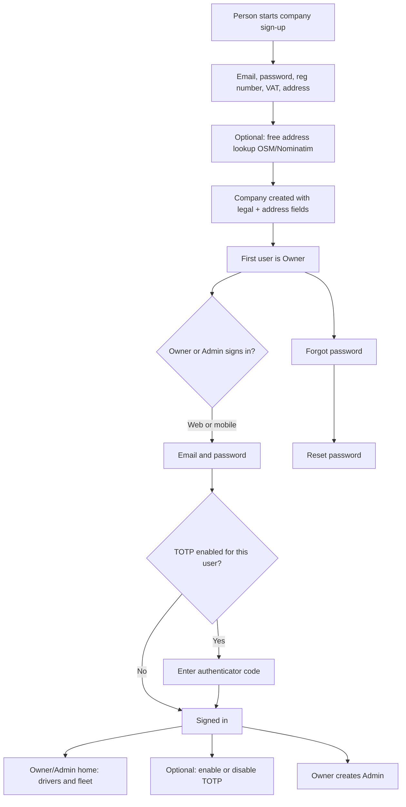
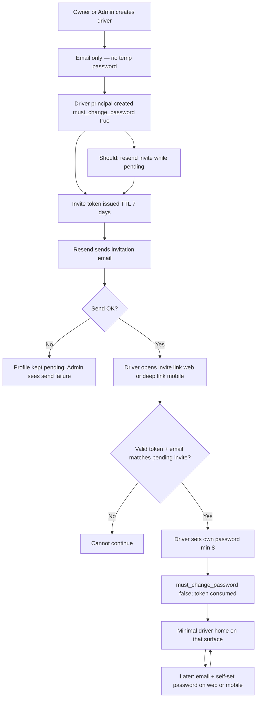
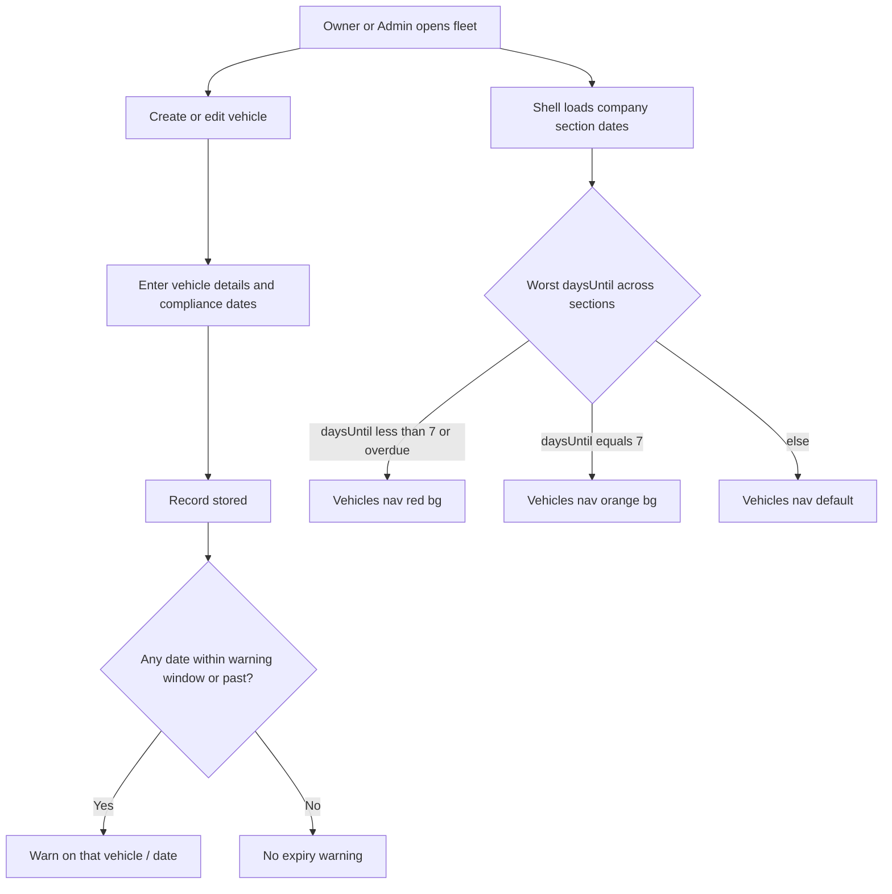

# Fleet operations — first slice

Auth, driver profiles, and vehicle records. Dispatch and live tracking are out of this slice.

## 1. Problem & outcome

**Who is hurting**  
A company that runs vehicles and drivers has no shared place to:

- Create the company (with legal registration details and address) and let Owners/Admins sign in (web and mobile), reset password, and optionally use authenticator-app MFA.
- Invite drivers by email (no Admin-set temporary password); drivers receive an invitation via **Resend**, create their own password, then sign in on **web and mobile**.
- Keep vehicle records (make/model, plate, insurance, inspection dates, country of registration, road tax) and see when those dates are about to expire.

**What success looks like**

- A company can register with Owner email/password plus **company registration number**, **VAT number**, and **address** (assistive free address lookup allowed); the first person is the Owner.
- Owner/Admin can sign in on **web** and **mobile**, reset password, and optionally turn TOTP MFA on or off.
- Owner can create additional Admins.
- Owner/Admin can create and edit driver profiles by **email only**; system sends an **invitation email via Resend**; driver **creates their own password** via invite accept (web + mobile). **No temporary password** for new drivers.
- If an email is **not** a pending invited driver (or valid invite), the person **cannot** continue invite accept / password setup on web or mobile.
- Owner/Admin can **hard-delete** a driver profile (permanent remove). **Disable login without delete** remains available as Should (US-16).
- After the driver accepts the invite and sets a password, later logins use that password on web or mobile (no MFA for drivers). Post-auth driver UX is **minimal home** only (not Owner/Admin fleet UI).
- Owner/Admin can create and edit vehicles and compliance **dates**; the product **warns** when insurance, inspection, road tax, or registration is within the warning window or already expired.
- Owner/Admin **edit vehicle** opens with fields **prepopulated** from stored data; **create** stays blank.
- **Vehicles** nav (web side nav + mobile Owner/Admin tabs) shows **orange** when any company section date is **exactly 7 days** out and **red** when any is **&lt; 7 days** or overdue (fleet-wide worst-wins); list/detail keep the 30-day warnings.
- Drivers never see Owner/Admin screens; people who are not signed in cannot open fleet or driver records.
- A signed-in **driver** can **select a company vehicle for their next travel** and record the current **odometer** reading. Odometer unit is **miles or kilometres** based on the vehicle’s **country of registration** (not a free choice by the driver).

## 2. Actors & stakeholders

| Actor | Who they are | What they do in this slice |
| --- | --- | --- |
| **Company** | The fleet organization created at sign-up | Owns drivers, vehicles, and company users. Holds registration number, VAT, and address. Not a person who logs in. |
| **Owner** | First user at company sign-up | Signs up the company (legal + address fields); signs in web + mobile; reset password; optional TOTP; creates Admins; invites/manages drivers (including hard-delete) and fleet. Last Owner cannot be removed (A5). |
| **Admin** | Created by an Owner | Same operational work as Owner for drivers (invite, including hard-delete) and fleet; signs in web + mobile; reset password; optional TOTP. Does not create the company. Does not create other Admins (A10). |
| **Driver** | Profile invited by Owner/Admin | Receives invite email (Resend); accepts invite with token + own password on **web and mobile**; later signs in with email + self-set password; **minimal driver home** including **select vehicle for next travel + odometer**; no MFA; no Owner/Admin fleet admin screens. Cannot start accept if email/invite is not valid in the system. |
| **Invitee (not in system)** | Person with no pending driver invite / unknown email | Must **not** be able to continue invite accept or password setup on web or mobile. |

**Not in this slice:** dispatcher, mechanic.

## 3. As-is vs to-be

**As-is:** Product used Admin-set **temporary password** create-driver (legacy US-07) and company sign-up with email/password only. That temp-password path is **retired** for new drivers in this slice.

**To-be — company start and Owner/Admin access**

**To-be — driver invite and access**

**To-be — fleet records and expiry warning**

## 4. Scope

### In scope

Auth + company (reg number, VAT, address + free lookup assist), Owner/Admin users, driver **invite via Resend**, driver **self-set password** on accept (web + mobile), subsequent driver login, minimal home, hard delete of driver profiles, vehicle records with compliance dates and expiry warnings.

### Out of scope

- Dispatch, trips, assignments, live tracking, geofence
- Dispatcher or mechanic roles
- Two separate mobile store listings / two apps
- Driver fleet / Owner-Admin management UI (drivers still get auth + minimal home only on web)
- Driver MFA
- Built-in legal catalog of country regulations
- Document file upload for insurance/inspection/tax/registration
- SMS MFA / SMS invites
- **Temporary password** path for new drivers (retired)
- Paid maps / Google Places (or other paid geocoding) for address lookup
- Soft-delete / restore of drivers; in-product audit history for deletes; bulk driver delete; driver self-delete
- Delete of Owner/Admin users (except existing last-Owner protection only)
- Driver self-serve password reset (still A9 unless later decided)
- Global sign-out-everywhere

### MoSCoW

| Priority | Item |
| --- | --- |
| **Must** | Company sign-up creates company + first Owner with email, password, **company registration number**, **VAT number**, and **address** |
| **Must** | Address entry supports **assistive free lookup** (OpenStreetMap / Nominatim-style); store formatted address text (lat/lon optional) |
| **Must** | Owner/Admin sign-in on web and mobile |
| **Must** | Stay signed in on web and mobile: short-lived access tokens renew **silently** via refresh (Owner/Admin and Driver) |
| **Must** | Full re-login at most about every **14 days** per refresh-token family (or earlier on this-client sign-out / security end) |
| **Must** | Owner/Admin password reset |
| **Must** | Owner/Admin optional TOTP (authenticator app only); enable and disable |
| **Must** | Owner creates additional Admins |
| **Must** | Owner/Admin create driver by **email only**; invitation email via **Resend**; **no** temporary password |
| **Must** | Driver accepts invite (token from email link / mobile deep link), creates own password (≥ 8), then reaches minimal driver home on that surface |
| **Must** | Unknown / non-invited email **cannot** continue invite accept or password setup (web and mobile) |
| **Must** | Subsequent driver login on **web and mobile** with self-set password; minimal driver home (not Owner fleet UI) |
| **Must** | One mobile product; after login, driver vs Owner/Admin experience by role |
| **Must** | Owner/Admin create and edit vehicles: make, model, license plate, insurance, inspection needed (Admin-entered dates), country of registration, road taxes |
| **Must** | Country is a field on the vehicle; no regulation catalog |
| **Must** | Store compliance dates and warn on expiry |
| **Must** | Edit vehicle form prepopulated from stored vehicle (web + mobile); create stays blank |
| **Must** | Vehicles web side nav + mobile Owner/Admin tab urgency: orange at daysUntil = 7, red when daysUntil &lt; 7 or overdue (worst-wins, company only) |
| **Must** | Driver cannot open Owner/Admin screens |
| **Must** | Unauthenticated person cannot open fleet or driver management |
| **Must** | Owner/Admin hard-delete driver profile (irreversible; ends that identity’s access) |
| **Should** | Resend invitation for drivers still pending invite accept |
| **Should** | Disable driver login without deleting the driver profile |
| **Won't** | Dispatch/tracking; extra roles; SMS MFA/invites; driver MFA; driver fleet UI; legal catalog; file upload this slice; temp password for drivers; paid maps APIs; soft-delete/restore drivers; bulk driver delete; driver self-delete; audit history for deletes; sliding extension of the 14-day session window; logout-everywhere; device/session list UI |

## 5. Open questions & assumptions

See [business-rules.md](business-rules.md) for numbered rules. Assumptions and open questions:

### Assumptions

| ID | Assumption |
| --- | --- |
| A1 | Expiry warning window is **30 days** for **insurance, inspection, and road tax** only. |
| A2 | Compliance in this slice is **date fields only**; document upload later. |
| A3 | *(Retired)* Temp-password reuse rule. Superseded by invite + self-set password; no Admin temp password to reuse. |
| A4 | Minimum password length is **8** for all passwords in this slice (Owner/Admin, driver on invite accept). |
| A5 | Last Owner cannot be deleted/removed. |
| A6 | Email is unique per login identity (Owner, Admin, and driver). |
| A7 | Disable driver login without deleting profile is **Should**. |
| A8 | Owner/Admin only access **their company’s** drivers and vehicles. |
| A9 | Password reset in this slice is for **Owner/Admin**, not drivers, until decided. |
| A10 | Admin **cannot** create other Admins (only Owner can). |
| A11 | Vehicle save is allowed even if a date is expired or inside the warning window; warning still shows. |
| A12 | “Car inspections needed based on country regulations” means Admin **enters** inspection date(s) they believe are needed; the product does **not** compute legal due dates from country. |
| A13 | **`registration_on`** may still be stored on the vehicle but is **not** used for expiry warnings or Vehicles nav urgency. |
| A14 | No additional Owners after the first in this slice (not requested). |
| A15 | Until invite is accepted and password set, driver has **`must_change_password: true`** and **no usable password**; they cannot use driver home or complete normal password sign-in. Accept sets password and clears the flag. |
| A16 | Owner/Admin feature parity on web and mobile for auth, drivers, and fleet in this slice. |
| A23 | Driver **auth parity** web↔mobile for invite accept / set password / subsequent login / minimal home only—not fleet parity. Web post-auth is minimal shell (identity + sign-out); no vehicles, drivers admin, Admins, TOTP settings, or Owner nav. |
| A17 | Hard delete of a driver profile is **Must**, **irreversible**, and **not** soft-delete/restore in this slice. |
| A18 | No required in-product audit trail for who deleted a driver in this slice. |
| A19 | This slice has **no** driver–vehicle assignment; deleting a driver does not change vehicles. |
| A20 | Vehicles **nav** urgency bands: **red** when any section `daysUntil &lt; 7` (incl. overdue); **orange** when no red and any section `daysUntil = 7`; worst-wins. Does **not** replace the 30-day list/detail window (A1). |
| A21 | Edit vehicle **prepopulate** is Must on web and mobile Owner/Admin. |
| A22 | Nav urgency uses the **same three** section dates as rule 19 (`insurance_on`, `inspection_on`, `road_tax_on`). |
| A24 | Invite is an **opaque token** in the email link (web URL and mobile deep link). Token is **single-use** on successful accept; **TTL 7 days** from issue; **resend rotates** token and restarts TTL. |
| A25 | Accept requires a **valid, unexpired, unused** token bound to that driver email. Email shown/entered on accept must match the invited driver. Unknown emails cannot start password setup. |
| A26 | **Create-time invite send is Must.** If Resend fails after the driver profile is created, **keep the profile** in pending-invite state (`must_change_password` true) and **surface send failure** to Owner/Admin so they can retry (**Should** resend). Do not roll back the driver solely because email failed. |
| A27 | Invitation delivery channel is **email via Resend** only in this slice (no SMS). |
| A28 | No temporary password is set or shown to Admin for new drivers. |
| A29 | Company **registration number**, **VAT number**, and **address** are **required** strings on sign-up (reasonable max length; exact caps are implementation detail within product limits). |
| A30 | Address **lookup** is client-side free Nominatim/OSM-style assist; user may also type free-text. Stored value is **formatted address text**; **lat/lon optional**, not required. |
| A31 | Paid geocoding / Google Places is **out of scope**. Product does not require server-side paid maps. |
| A32 | Access token is **short-lived** (product default **~15 minutes**). Absolute **refresh-family** lifetime is **14 days** from family start; refresh rotation **does not** extend `expires_at`. |

### Open questions (not invented)

1. May an Admin invite/create other Admins, or only Owner? (Stories assume Owner only.)
2. Can there be more than one Owner? How is a later Owner created?
3. What driver profile fields besides email (name, phone, license number)? Invite flow does not require them this slice.
4. After invite accepted, can Owner/Admin force a new password or re-invite if the driver is locked out? (Not specified; do not invent Admin set-password.)
5. Do drivers get password reset (mobile), or only Owner/Admin reset?
6. Which vehicle fields are required vs optional?
7. One date each for insurance / inspection / road tax / registration, or start and end?
8. Where must the warning appear (list, vehicle detail, both)? Any count of “expiring soon”?
9. Exact meaning of “car inspections needed based on country regulations” if not a catalog—free-text note plus date, or dates only?
10. ~~Sign-up company fields~~ **Resolved this slice:** registration number, VAT, address required; company **display name** still not required unless added later.
11. ~~Session: stay signed in?~~ **Resolved (US-29, US-30):** Stay signed in across app restarts. Short-lived access tokens renew silently via refresh. Forced re-auth only after **14 days** absolute session lifetime **per refresh-token family**, or on **that client’s** explicit sign-out / family revoke / disabled or deleted principal. **Parallel sessions allowed**. No sign-out-everywhere in this slice.
12. If TOTP enable is interrupted mid-setup, is TOTP off until confirmed?
13. Disable driver: who may re-enable (Owner only vs Admin too)? Stories assume Owner or Admin.
14. Can a driver email be the same person as an Owner/Admin email? (A6 says unique—confirm.)
15. Exact max lengths / format validation for registration number and VAT beyond non-empty required strings? (Left to sensible implementation limits; no jurisdiction-specific checksum invented.)

## 6. Next specialist

**Design Specialist** — tokens and page specs for screens listed in [stories.md](stories.md) handoff (sign-up extra fields + address lookup; create driver email-only; invite accept / set password web+mobile; resend pending; list status “invite pending”). Do not start architecture or application code.
